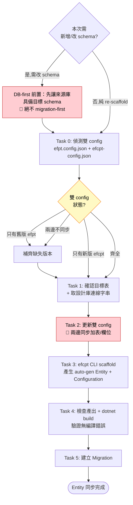

# EF Core Power Tools 實體同步

用 EF Core Power Tools（efcpt）從資料庫 reverse engineer Entity，再建立 EF Core Migration 的完整流程。

**核心原則**：Entity 是資料庫 schema 的鏡射。修 Entity 的 precision / nullable / MaxLength 不要手改 auto-generated 檔（會被下次 scaffold 覆蓋），一律回到 efcpt 重新產生。

## DB-first 順序（🚫 絕不 migration-first）

當本次變更**需要新增/改 schema**（新表、加欄、view 改名、型別變）時，務必照順序：**先讓來源資料庫具備目標 schema → efcpt re-scaffold → 才建 migration**。

**🚫 絕不 migration-first**（先建 migration 再 scaffold 的兩個坑）：

1. efcpt 從**尚未更新的資料庫**讀 → scaffold 出**舊欄位名/型別**（改名沒生效）。
2. efcpt 改名後 model 與「migration-first 當下的 ModelSnapshot」**漂移** → `migrations add` 吸入髒 snapshot。正解：efcpt 改名完成**才** `migrations add`（見 Task 5）。

> 若專案的 reverse-engineer 來源是一個獨立的「設計庫 / 參考庫」（與 runtime/app DB 不同的連線），要先在那個庫套用 schema 變更（並備妥 rollback plan），再 scaffold。設計庫已有目標 schema、只是 re-scaffold → 直接走下方 Task 1–5。

## 重要：雙 Config 機制

CLI 與 GUI 使用**不同的 config 檔案**，兩邊必須同步：

| | GUI | CLI |
|--|-----|-----|
| **Config** | `efpt.config.json` | `efcpt-config.json` |
| **格式** | flat JSON（`UseT4`） | nested JSON（`use-t4`） |
| **表清單** | `Tables[].Name` + `ObjectType` | `tables[].name` + `views[].name`（分開） |

**新增表時必須同時更新兩個 config。**

### Task 0：偵測 config 缺失（進入正式流程前先檢查）

進入 Task 1 之前，先檢查目標專案目錄同時含兩個 config：

```bash
find <project-dir> -name "efpt.config.json" -o -name "efcpt-config.json"
```

- **若只有舊版 `efpt.config.json`**（常見於 legacy 專案）→ 需補新版 CLI config。可手動改寫：JSON key 由 capitalized 轉 kebab-case，`Tables` 按 `ObjectType` 分為 `tables`（0）與 `views`（3）。
- **若只有新版 `efcpt-config.json`** → 本流程僅需新版 CLI config；舊版僅 VS GUI 使用者才需要，可省略。
- **兩個都有但表清單不同步** → 以新版為準補齊舊版（GUI 預設讀舊版，否則 VS 操作會抓不到表）。

## CLI 版本要求

**必須**使用與專案 EF Core 版本對應的 CLI，版本不符會造成 Entity 屬性名稱差異、build 失敗：

```bash
# 專案用 EF Core 8 → CLI 用 8.x
dotnet tool install ErikEJ.EFCorePowerTools.Cli -g --version 8.*

efcpt --version   # 確認顯示 "for EF Core 8"
```

| 專案 EF Core | CLI 版本指令 |
|-------------|-------------|
| 8.x | `--version 8.*` |
| 9.x | `--version 9.*` |
| 10.x | 預設（最新） |

## 流程總覽



**核心原則**：CLI（`efcpt-config.json`）+ GUI（`efpt.config.json`）**雙 config 必須同步表清單**，否則 VS GUI 操作或 CLI scaffold 任一邊會抓不到表。

## Task 1：確認目標表與取得連線資訊

### 確認新增的表 / View

向使用者確認：
- 表名（含 Schema），例如 `[Production].[NewTable]`
- 類型：Table 或 View

### 取得 reverse-engineer 來源連線字串

efcpt 需要一個 live 資料庫連線來讀取 schema。組成標準連線字串：

```
Server=<host>,<port>;Database=<db>;User Id=<user>;Password=<pw>;TrustServerCertificate=True;
```

用你慣用的 DB 查詢工具先確認表存在且結構正確（欄位、型別、nullable）。

> 連線字串**絕對不寫入 config 或 commit**，只在記憶體或 shell 變數內存在。

## Task 2：更新雙 Config

**必須同時更新兩個檔案**，排序規則：按 Schema 分組，Schema 內按名稱字母排序。

### efpt.config.json（GUI 格式）

```json
{
   "Name": "[Schema].[TableName]",
   "ObjectType": 0
}
```

`ObjectType`：0 = Table、3 = View

### efcpt-config.json（CLI 格式）

Table 加在 `"tables"` 陣列，View 加在 `"views"` 陣列：

```json
{
  "name": "[Schema].[TableName]"
}
```

**驗證**：兩個 config 的表清單一致。

## Task 3：執行 efcpt CLI scaffold

```bash
efcpt --version   # 必須顯示對應的 EF Core 版本

cd src/YourApp.Domain
efcpt "<Task 1 組合的連線字串>" mssql
```

CLI 自動讀取 `efcpt-config.json` 和 `CodeTemplates/EFCore/*.t4`（若有）。

### efcpt-config.json 關鍵設定對照

| CLI 設定 | GUI 設定 | 範例值 |
|---------|---------|---|
| `use-t4` | `UseT4` | `true` |
| `use-data-annotations` | `UseFluentApiOnly=false` | `true` |
| `output-path` | `OutputPath` | `"Entities"` |
| `output-dbcontext-path` | `OutputContextPath` | `"Data"` |
| `use-schema-folders-preview` | `UseSchemaFolders` | `true` |
| `split-dbcontext-preview` | `UseDbContextSplitting` | `true` |
| `use-DateOnly-TimeOnly` | `UseDateOnlyTimeOnly` | `false` |
| `dbcontext-name` | `ContextClassName` | `"AppDbContext"` |
| `refresh-object-lists` | N/A | `false`（防止抓全部表） |

**驗證**：scaffold 成功，新 Entity 在 `Entities/{Schema}/` 下。

## Task 4：檢查產出並 build 驗證

### 檢查新增檔案

- `Entities/{Schema}/{Entity}.cs` — Entity
- `Data/Configurations/{Entity}Configuration.cs` — Configuration
- `Data/AppDbContext.cs` — 新增 `DbSet<Entity>`

### 確認既有檔案無變更

```bash
git diff --stat src/YourApp.Domain/
```

除了 `AppDbContext.cs` 和兩個 config 外，**不應有其他既有檔案被修改**。

### Build 驗證

```bash
dotnet build YourApp.sln -c Release --no-restore
```

**驗證**：build 成功，既有檔案零差異。

## Task 5：建立並驗證 EF Core Migration

接 `ef-migration` skill 處理 migration 建立 / 套用 / 失敗修復：

```bash
EF_ARGS="--project src/YourApp.Domain --startup-project src/YourApp.Domain"
dotnet ef migrations add Add{Entity}Table $EF_ARGS --context AppDbContext
dotnet build YourApp.sln -c Release --no-restore
```

**命名慣例**：`Add{Entity}Table`、`Add{Entity}{Field}`、`Alter{Entity}{Field}`。

**驗證**：Migration 的 `Up()` / `Down()` 正確、build 成功。

## Red Flags

| 想法 | 現實 |
|------|------|
| 「用 `dotnet ef dbcontext scaffold` 就好」 | **必須**用 `efcpt` CLI，才能讀取 config 與 T4 模板 |
| 「只改一個 config 就好」 | **必須**同時更新 `efpt.config.json` 和 `efcpt-config.json`（雙 config 同步） |
| 「裝最新版 CLI 就好」 | **必須**與專案 EF Core 版本一致，否則 Entity 差異會破壞 build |
| 「連線字串寫進 config 或 commit」 | **禁止**，僅在記憶體或 shell 變數內使用 |
| 「efcpt 連的就是 runtime DB」 | 若專案用獨立設計庫，efcpt 連的是**設計庫**，不是 app runtime DB |
| 「scaffold 完就好，不用檢查」 | **必須**確認既有檔案 zero-diff 再建 migration（已存在的 Entity/Configuration 會被覆蓋，有手動修改需先備份） |
| 「直接跑 `database update`」 | 先檢查 migration SQL，確認無破壞性變更 |
