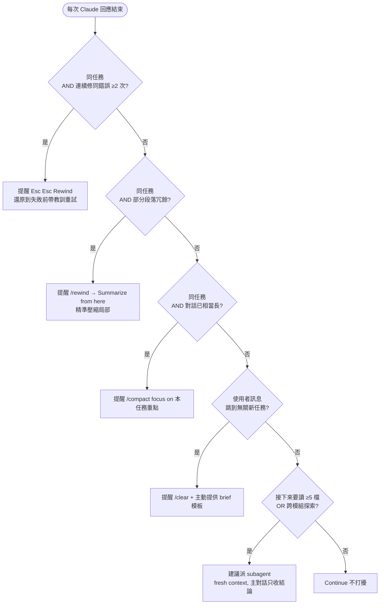

# Context 衛生（Context Hygiene）

> **核心信念**：Context 是 Claude Code 最重要的資源。長對話品質下降不是「Claude 變笨」，而是 context 填滿後注意力被稀釋（官方稱 context degradation）。

## 為什麼

- 官方 best-practices 明確：「Claude's context window fills up fast, and performance degrades as it fills」。
- 即使是大 context window 的模型，也會在填到某個比例（依任務性質，粗估 **總量的三到四成起**）開始明顯降品質。
- Auto-compact 在 context 最滿、模型最笨時才觸發 → 摘要品質最差。
- Proactive（主動）衛生 > Reactive（被動）衛生：在還沒滿之前處理，勝過等系統自動壓縮。

## 六個衛生動作決策樹

每次 Claude 回應結束、收到下一則訊息時，由上而下評估，命中即停：



**判定規則**：

- 由上而下檢查，命中即停，不評估後續條件。
- 同一動作被使用者拒 1 次後，本對話不再重提該動作。
- Claude **永遠以問句**提示，**禁止**擅自執行 `/clear` / `/compact` / `/rewind`。

## 六動作對照（使用者指令與情境）

| 動作 | 使用者指令 | 何時用 | 留下什麼 | 丟掉什麼 |
|------|-----------|--------|---------|---------|
| **Continue** | （繼續打字） | 同任務延續 | 全部 | 無 |
| **Rewind** | `Esc Esc` 或 `/rewind` → Restore | 失敗嘗試要重試 | 選定訊息前 | 選定訊息起全部 |
| **Summarize from here** | `Esc Esc` 或 `/rewind` → Summarize | 部分段落已冗餘 | 選定訊息前全部 | 選定訊息起被壓縮 |
| **Compact** | `/compact focus on {重點}` | 對話長但要繼續 | 摘要 | 原始對話細節 |
| **Clear** | `/clear` + 手寫 brief | 切換無關任務 | 手寫 brief | 整個 session |
| **Subagent** | `Agent` tool（Claude 代召） | 探索/研究/驗證 | 結論 | tool output 細節 |

## 操作手冊

### 1. `/compact focus on ...` 寫法

**官方格式**：`/compact <instructions>` — instructions 指示 compact 後要保留的重點。

| 情境 | 差寫法 | 好寫法 |
|------|-------|-------|
| debug 完成要繼續寫 code | `/compact` | `/compact focus on the root cause found and the fix approach, drop the failed attempts` |
| 多檔案重構中 | `/compact` | `/compact focus on the file list modified so far and the naming convention decided` |
| API 設計討論後要實作 | `/compact` | `/compact focus on the final API contract and rejected alternatives with reasons` |

**原則**：告訴 compact 三件事 — 保留什麼、丟掉什麼、為什麼。

### 2. Rewind 選單 4 動作（官方原文）

按 `Esc Esc` 或打 `/rewind`：

| 選項 | 效果 |
|------|------|
| **Restore code and conversation** | 還原程式碼 + 對話到選定點 |
| **Restore conversation** | 只還原對話，保留當前程式碼 |
| **Restore code** | 只還原程式碼，保留對話 |
| **Summarize from here** | 選定點之前保留，之後壓縮為摘要（可附 instructions） |

**使用時機**：

- 失敗嘗試後 → Restore conversation（保留檔案修改看哪些可用）。
- 想完全重試 → Restore code and conversation。
- 只有部分段落想壓縮 → Summarize from here（比全域 `/compact` 精準）。

### 3. `/clear` + 手寫 brief 模板

`/clear` 後立即貼入：

```
[任務背景]
我正在 {重構 / 實作 / 除錯} {具體目標}。

[已知事實]
- 相關檔案：A, B, C
- 已排除方案：方案 X（原因：...）
- 關鍵限制：{如 runtime 版本鎖定 / 不能改動某個外部相依}

[當前狀態]
{目前做到哪、下一步要做什麼}
```

這段 brief 取代原本整個對話，但品質遠高於 auto-compact 的摘要。

### 4. Subagent 決策 — 心理測試

官方原話：**「Will I need this tool output again, or just the conclusion?」**

| 我之後需要... | 做法 |
|-------------|------|
| 每個檔案的完整 tool output | 主對話做（不能 subagent） |
| 只要結論 / 分析結果 | **派 subagent**（fresh context window） |
| 不確定 | 先假設只要結論，若真的需要細節再用 Read 重讀 |

**明確召喚 subagent 的句法**（官方建議）：

- 「Use a subagent to investigate {題目}」
- 「Spin up a subagent to verify {任務}」
- 「Spin off a subagent to read {範圍} and summarize」

實作上對應到 `Agent` tool，並依任務選擇合適的 subagent 類型（如唯讀探索型、規劃型或審查型）。

### 5. `/btw` — 側邊問題不入 context

官方機制：打 `/btw {問題}` — 答案顯示於可關閉 overlay，**不進入對話歷史**。適合「順便問一下」類問題，避免污染主流程 context。

## 多階段 agent chain 的交接衛生（handoff hygiene）

當工作跨多個階段、由不同 agent 接力（如探索 → 規劃 → 實作 → 驗證），每個交接點都是 context 洩漏與污染的高風險處。原則：**交接的是結論與必要事實，不是過程痕跡。**

- **上游 agent 只回傳結論**：探索/研究 agent 完成後，回主對話的應是「結論 + 佐證出處（檔案路徑、關鍵片段）」，而非完整 tool output。細節留在 subagent 的 context 裡隨其結束一起丟棄。
- **接棒前先清失敗痕跡**：某個方向試錯失敗、要換方向或交下一棒前，先摘要「失敗原因 + 已排除的假設」，再 `/rewind` 或 `/compact` 掉試錯過程，避免污染下一階段。
- **進實作前落 checkpoint**：探索/研究結束、進實作前，先摘要一段可交接的 checkpoint（相關檔案、已定案決策、下一步），這段就是下一棒的 brief。
- **驗證階段別丟即時 context**：驗證/收尾時不要急著壓縮實作過程中的即時 context，否則會失去驗證所需的線索；等驗證完再一起收斂。

## Claude 的提醒觸發清單

本 skill 載入後，Claude 在偵測下列情境時**以問句提醒**（不得擅自執行）：

| 偵測訊號 | Claude 的提問模板 |
|---------|-----------------|
| 對話已累積相當長 | 「對話已累積相當長，要不要 `/compact focus on ...`？若有偏好的保留重點請告訴我」 |
| 同主題連續 2 次修正失敗 | 「這是第 3 次修同問題，context 可能被失敗痕跡污染。要不要 `Esc Esc` rewind 回失敗前再試？」 |
| 使用者訊息語意跳到無關領域 | 「這看起來是新任務（從 {舊任務} 跳到 {新任務}），要不要 `/clear` 重開？我可以先幫你整理一段 brief」 |
| 即將讀 >5 個檔案 | 「這段要讀很多檔案，要不要我派 subagent 處理只回報結論？」 |
| subagent 剛回報、主對話只用到結論 | 「subagent 的 tool output 之後還要用嗎？若只要結論可以 `/compact focus on 結論` 清掉」 |

**提問規矩**：同一提醒被使用者拒 1 次後，本對話中不再重提該動作（避免打擾）。

## 反 pattern（官方命名）

| Pattern | 症狀 | Claude 應做 |
|---------|------|------------|
| **Kitchen sink session** | 一任務混入無關提問後回到原任務 | 偵測到跳主題時提醒 `/clear` 或改用 `/btw` |
| **Correcting over and over** | 反覆糾正同錯誤，failed attempts 堆滿 context | 2 次失敗後提醒 `/rewind` |
| **Infinite exploration** | 未 scope 就叫 Claude 探索整個 codebase | 建議改用 subagent，給明確 scope |
| **Over-specified CLAUDE.md** | CLAUDE.md 過長導致重要規則被淹沒 | 提醒檢視可否精簡或轉為 skill／rule |

## 禁止

- **禁止**擅自執行 `/clear` / `/compact` / `/rewind`（屬於使用者指令）。
- **禁止**在 hook 或自動化機制注入這些指令。
- **禁止**同一提醒被拒後重複提（1 次尊重原則）。
- **禁止**在使用者專注執行任務時打斷提醒（等任務段落結束再問）。

## 參考（官方原始 spec）

- Checkpointing（rewind 與 summarize）：<https://code.claude.com/docs/en/checkpointing.md>
- Best Practices §Manage your session：<https://code.claude.com/docs/en/best-practices.md>
- Context window 互動模擬：<https://code.claude.com/docs/en/context-window.md>
- Skills frontmatter spec：<https://code.claude.com/docs/en/skills.md>
