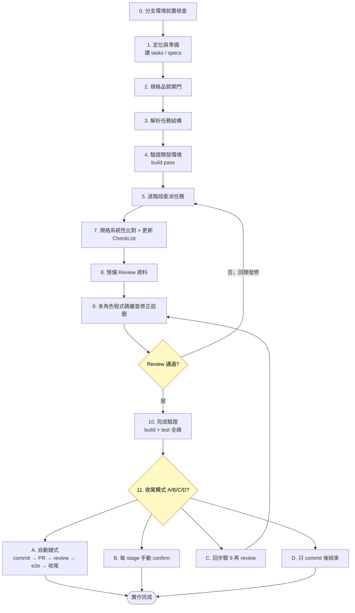

# 執行實作流程

從功能規格書自動跑完整實作：分支檢查 → 規格品質閘門 → 分階段委派 → 規格比對 → 多角色審查迴圈 → 收尾。標準流程位置：`需求 → 規格 → 實作 → commit`。

> **本 skill 為通用骨架**。原始版本強綁特定技術棧（.NET 分層架構、CQRS/MediatR、EF Core migration、特定 CI/議題系統）與專案內部命令，此處已抽離為與語言/框架無關的階段編排。落地時把「委派 agent」「build/test 指令」「分層順序」替換成專案實際的做法即可。

## 使用者輸入

```text
$ARGUMENTS
```

繼續前**必須**先考慮使用者輸入（若不為空）。

## TDD 模式檢測

檢查參數含 `--tdd` 或 tasks 檔含 `[TDD]` 標記：

| 模式 | 執行順序 |
|------|----------|
| 標準模式 | 核心邏輯 → 資料存取 → 應用層 → 測試 |
| TDD 模式 | 核心邏輯 → 資料存取 → **測試（Red）→ 應用層（Green）** |

## 流程總覽



## 執行流程

### 0. 分支與環境前置檢查

```bash
BRANCH=$(git branch --show-current)
echo "分支: $BRANCH | 目錄: $(pwd)"
```

| 檢查項 | 規則 | 失敗處理 |
|--------|------|----------|
| 分支對應此 ticket / 功能 | 分支名應含規格或 tasks 中的識別碼 | 停止，提示切換分支或 cd 到正確 worktree |
| 非主分支 | 不可在 main/develop 上實作 | 停止 |
| Worktree 目錄一致 | 若在 worktree 中，目錄名應含分支識別碼 | 警告使用者確認 |

> 參考 `worktree` skill。

### 1. 定位與準備

找到對應的功能規格書。若 tasks 檔不存在 → 自動從規格書生成；若無架構計畫 → 使用專案預設架構。

### 2. 規格品質閘門（自動觸發）

實作前**必須**先驗證規格書品質（若專案有 verifying-specs 之類的 skill 則呼叫它）：

- ✅ 通過 → 繼續實作。
- ⚠️ 有條件通過（0 critical, >0 warning）→ 警告使用者，繼續。
- ❌ 不通過（>0 critical）→ **阻止實作**，自動修復 → 重新驗證（最多 3 次）。3 次仍不過 → 報告剩餘缺失，請使用者決定。

### 3. 解析任務結構

從 tasks 檔提取任務階段、相依性、檔案路徑、並行標記 `[P]`、使用者故事標籤等。

### 4. 驗證開發環境

跑專案的 build 指令，確認基線可編譯通過再開始。

### 5. 逐階段委派任務

- 編碼委派給開發角色，測試委派給測試角色。
- 逐階段執行，每階段完成才進下一階段。
- 順序任務依序、並行任務 `[P]` 可同時；影響相同檔案的任務必須依序。
- 在 tasks 檔標記完成（如 `- [X] T001`）。

**錯誤處理**：非並行任務失敗 → 暫停；並行任務 `[P]` 失敗 → 繼續成功的、報告失敗的。

## 各階段詳細（依專案架構調整層名與順序）

### 階段 1：核心 / 領域邏輯

實體 / 資料模型、其組態、對外介面。

> 若採 domain design：避免貧血模型（手寫 entity 應含業務邏輯）；命名語意化（依業務概念命名，而非用底層資料表/欄位代碼命名）。

### 階段 2：資料存取層

存取實作、資料庫 schema / migration。

> Schema 變更需同步對應的 schema source（migration 與手寫 SQL / view 定義不能各說各話）。

### 階段 3：應用層

按使用者故事順序實作命令與查詢（含輸入驗證、映射）。

> TDD 模式在此走 Red → Green → Refactor。

### 階段 4：對外介面層

控制器 / route handler。

> **契約對齊**：暴露給端點的輸入模型，其必填 / 長度 / 格式限制應與資料層組態、驗證器一致，讓 API schema（OpenAPI 等）直接反映限制，避免前端送到後端才被擋。

### 階段 5：測試

- **單元測試（必須）**：跑專案單元測試。
- **整合測試（條件觸發）**：涉及資料存取組態、原生 SQL、特殊型別 / 定序、軟刪除、分頁、查詢轉譯等時**必須**跑。
- **失敗處理**：單元測試失敗 → 必須修、阻止繼續；整合測試因環境不可用 → 標 Skip；整合測試邏輯錯 → 必須修。

> 修錯前**必須**三方比對（規格書 + codebase + 真實資料），別靠靜態猜測。

### 階段 6：品質檢查

跑完整 build + test。並做輕量靜態掃描（依專案風險點自訂），常見項目：

| 檢查項 | 判定 |
|--------|------|
| 架構分層違規（上層直接引用下層實作） | ❌ 阻止 |
| 潛在注入（字串串接 SQL/命令） | ❌ 阻止 |
| 阻塞式 async 呼叫 | ⚠️ 警告，列入 review |
| 端點缺授權標記 | ⚠️ 警告，列入 review |
| 對外介面缺型別 / schema 標記（致 API schema 空泛） | ⚠️ 警告，列入 review |

### 7. 規格系統性比對 + 更新 CheckList

實作完成後**必須**三層比對，確認規格書每條都實作：

- **層一 端點比對**：規格書列的端點 vs 實際存在的端點，逐一確認。
- **層二 業務/驗證規則比對**：規格書的規則 ID（BL/VR/BR 之類）vs 實作 + 測試，逐一確認有實作且有測試。
- **層三 更新 CheckList**：比對無缺（無 ❌）後，把規格書 / tasks 的完成項打勾。

| 結果 | 處理 |
|------|------|
| ❌ 有端點或規則未實作 | **阻止**，補實作後重比 |
| ⚠️ 有實作但缺測試 | 委派測試角色補，列入報告 |
| ✅ 全部完成 | 更新 CheckList，進步驟 8 |

### 8. 預備 Review 資料

```bash
git diff --name-only $(git merge-base HEAD develop)..HEAD
```

### 9. 多角色程式碼審查修正迴圈

多個角色**平行審查**，各自產報告後彙整：

| 角色 | 審查焦點 | 不負責 |
|------|---------|--------|
| 程式碼審查者 | 命名風格、測試覆蓋、安全、效能（含 N+1 查詢）、框架用法 | 架構分層（架構者負責） |
| 架構審查者 | 跨模組依賴方向、職責邊界、API 一致性、分層違規 | 程式碼風格（審查者負責） |
| 領域審查者 | 規格 vs 程式碼業務邏輯 vs 真實資料的一致性、領域建模 | 程式碼與架構細節 |

**流程**：平行審查 → 彙整分級（🚫 重大必修 / ⚠️ 主要自動修 / 💡 次要列參考）→ 委派開發角色修 → 修後重跑 build + test → 回到平行審查再一輪（最多 3 輪）。超過 3 輪仍有重大問題 → 停止，報告剩餘，請使用者決定。

### 10. 完成驗證

驗證所有任務完成、功能符合規格、測試通過、多角色審查通過。

### 11. 收尾 — 模式選擇

實作 + review fix loop 完成後，用一次詢問讓使用者選收尾模式：

| 選項 | 說明 |
|------|------|
| **A. 自動鏈式（建議）** | commit → push → 建 draft PR → **對已 commit 最終狀態再跑一次對抗式 review + fix** → 端到端 / 整合測試 + fix → 規格對齊回填 → 提示「解除 Draft」。中途 agent 卡死才停 |
| B. 每 stage 手動 confirm | 每個 stage 跑前都詢問，保留 escape hatch |
| C. 再 review 一次 | 回步驟 9 重跑多角色審查 |
| D. 只 commit 後手動接手 | 結束在 commit，後續使用者主導 |

**選項 A 的關鍵紀律**：
- **完成點 = 走完 review-PR + e2e + 規格對齊**，不是 commit 或步驟 9 的實作期 review 跑完就宣告 done。
- 步驟 9 的實作期 review 與「對已 commit 最終狀態的獨立對抗式 review」**不同**：後者常抓到前者漏的功能缺口（實務教訓：獨立 review 抓到實作期漏掉、完全未實作的某條規則）。auto-flow 必須**自動接續**，不靠使用者手動追問。
- review 後若又產生 fix/refactor commit → 對新 HEAD 再確認，不留「最新 commit 未審」缺口。
- 收尾只**提示**解除 Draft / merge，**不自動 merge**（merge 屬使用者領地）。

**Agent-first 自解**：收尾期間遇技術/業務/資料疑慮，優先派對應 agent 自解（除錯 / 資料探勘 / 領域顧問），真的卡死才升級給使用者。

**長流程心跳**：auto-flow 全跑常 >5 分鐘 → 每個 stage 的 start/done/skip/fail 都 emit 心跳；單一階段 >5 分鐘再補 mid-stage 進度；連續失敗走升級階梯並告知使用者。

## 錯誤恢復

| 問題 | 處理 |
|------|------|
| Migration 失敗 | 走專案 migration 失敗修復流程（直接改後重跑，非硬回退） |
| 建置失敗 | clean → restore → build |
| 測試失敗 | 單獨跑該測試、開詳細輸出定位 |

## 使用的角色（依專案 agent 配置對應）

| 角色 | 用途 | 觸發時機 |
|------|------|----------|
| 開發者 | 編碼實作 | 階段 1-4、步驟 9 自動修正 |
| 測試者 | 撰寫測試 | 階段 5 或 TDD Red Phase |
| 架構審查者 | 分層合規、依賴方向、職責 | 步驟 9 平行審查 |
| 領域審查者 | 規格 vs 業務邏輯 vs 資料事實一致性 | 步驟 9 平行審查 |
| 除錯者 | 建置 / 測試失敗定位 | 失敗時 |
| 程式碼審查者 | 程式碼品質 | 步驟 9 平行審查 |
