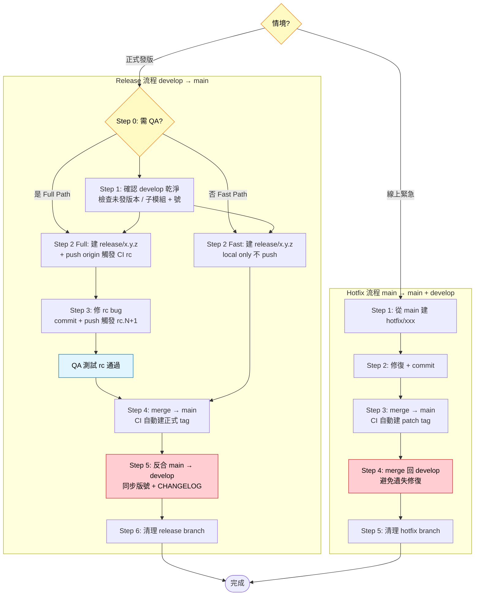

# Git Release 流程

適用於採 **Git Flow + Semantic Release** 的專案：`feature/` → `develop` → `release/` → `main`，外加 `hotfix/`。

## 重要前提

- **禁止手動建立 tag**：tag 由 CI（semantic-release）自動建立。
- **禁止手動 bump 版本號**：版號由 Conventional Commits 自動決定。
- **子模組有改動時**：必須先 commit 子模組並 push，再回主 repo 更新 submodule ref（見下方子模組章節）。
- **長流程紀律**：release / hotfix 含 multi-stage merge + CI poll，常 >5 分鐘。每個 stage（建 branch / merge / push / 等 CI）開始與結束都主動回報進度，CI 等待期間定時 emit 心跳，別讓使用者以為卡死。

## 流程選擇

| 情境 | 流程 |
|------|------|
| 從 develop 準備正式發版 | [Release 流程](#release-流程) |
| 線上緊急 bug 修復 | [Hotfix 流程](#hotfix-流程) |

## 流程總覽



**圖例**：黃菱形 = 分支判斷 | 紅 = 容易遺漏的關鍵步驟（反合避免遺失修復）| 藍 = 等待外部動作

---

## Release 流程

### Step 0：選擇路徑（QA 決策）

進入任何 release 動作前，先問使用者：**本次發版需要 QA 測試 rc 版嗎？**

| 路徑 | 流程 | 何時選 |
|------|------|--------|
| **Fast Path**（預設建議） | `develop → release/x.y.z (local only) → main (CI 正式 tag) → develop` | 不需 QA，直接發版 |
| **Full Path** | `develop → release/x.y.z (push → CI rc，QA 測) → main (CI 正式 tag) → develop` | 需 QA 在 rc 環境測試 |

Full / Fast 差異：

| 項目 | Full Path | Fast Path |
|------|-----------|-----------|
| release branch push 到 origin | ✅ 要 | ❌ 不 push |
| rc 預發版 tag（`vx.y.z-rc.N`）| ✅ 產 | ❌ 不產 |
| QA 測試階段 | ✅ 有 | ❌ 無 |
| Step 3（在 release branch 修 rc bug）| 可能用到 | 跳過 |
| 清理 Step 6 | 刪 local + 遠端 release branch | 僅刪 local |

### Step 1：確認 develop 狀態

```bash
git checkout develop && git pull origin develop
git status
git submodule status
```

**確認最新已發版本（避免重複發版）：**

```bash
git fetch --tags origin
git tag --sort=-creatordate | grep -v "beta\|rc" | head -5
git show origin/main:package.json | grep '"version"'   # 或專案的版號來源檔
```

> ⚠️ 若 main 已有與預計發版相同的正式 tag → **停止，已發版完成**。

**停止條件**：
- `git status` 有未 commit 的變更 → 先 commit 或 stash。
- `git submodule status` 出現 `+` 號 → 依下方規則處理。

**子模組 `+` 號判斷**：

| 情況 | `+` 號意義 | 處理方式 |
|------|-----------|---------|
| 子模組有本次要發的新 commit | 主 repo 記錄的 ref 落後 | **必須**先 commit 子模組，再更新主 repo 的 submodule ref |
| 子模組不納入此次 release | 本地 checkout 與主 repo 記錄不一致 | 詢問使用者是否納入，若否則忽略 |

### Step 2：建立 release branch

**Full Path（需 QA）：**

```bash
git checkout -b release/x.y.z develop
git push origin release/x.y.z
```

推送後 CI 自動建立 rc 預發版（如 `vx.y.z-rc.1`）。**等 QA 在 rc 環境測試通過後再繼續。**

**Fast Path（不需 QA）：**

```bash
git checkout -b release/x.y.z develop
# 不 push！release branch 只在 local → CI 不觸發 rc channel
```

直接跳到 Step 4。

### Step 3：（Full Path 專屬）在 release branch 修復問題

> Fast Path 跳過本步驟（無 QA → 無需修 rc bug）。

```bash
git add <files>          # 逐檔指名 add，勿用 git add -A
git commit -m "fix(scope): 修復 rc 測試發現的問題"
git push origin release/x.y.z
```

CI 會自動建立新的 rc 版本（`rc.2`、`rc.3`…）。

### Step 4：完成 release — merge 到 main

```bash
git checkout main && git pull origin main
git merge --no-ff release/x.y.z -m "chore: merge release/x.y.z to main"
```

> ⚠️ **不加 `[skip ci]`**：此 merge commit 必須讓 CI 執行 semantic-release，才能建立正式 tag。

**版號檔 / CHANGELOG 衝突自動處理**：

merge 遇到版號檔（`package.json` 等）或 `CHANGELOG.md` 衝突時，通用策略是「保留 main 端版號（CI 會覆寫成正確版號）+ 去掉 CHANGELOG 衝突標記兩邊內容都保留」：

```bash
git checkout --ours package.json                                          # 保留 main 版號，CI 會覆寫
sed -i '/^<<<<<<< HEAD$/d; /^=======$/d; /^>>>>>>> release\/x\.y\.z$/d' CHANGELOG.md
git add CHANGELOG.md package.json
git commit --no-edit
```

commit **不加 `[skip ci]`**，除非已知 CI 搶先跑完並已建 tag（見下方情境 A）。

**push main 後等 CI 完成**：

push 後需等 CI 跑完 semantic-release。若你無法後台輪詢，請使用者在 CI 跑完後回報，或附上 `git log origin/main -1 --oneline` 讓你確認是否出現 `chore(release): x.y.z`。

**若 CI 失敗（逾時無 tag / 使用者回報失敗）→ rollback**：

```bash
# 情境 A：push 被拒（protected branch / hook 失敗）→ 還原本地
git reset --hard origin/main

# 情境 B：push 成功但 CI 沒產 tag（semantic-release 未偵測到 triggering commit）
# → 停手告知使用者，選項：
#   1. 在 main 追加觸發 commit（如 empty feat）再重試 CI
#   2. 回滾 main（需 force push → 必須先取得使用者明確授權）
```

> ⚠️ **不主動執行 `git push --force`**，只做 local reset；遠端回滾需使用者明確授權。

**衝突情境判別（A vs B）**：

| 判斷線索 | 情境 A：CI 搶先執行 | 情境 B：main/develop 歷史分叉 |
|---------|-------------------|-----------------------------|
| main 頭部 | 已有 `chore(release): x.y.z`（CI 剛建） | 僅 `merge release/x.y.z`（CI 未跑） |
| 衝突 HEAD 版號 | `x.y.z`（正式） | 上次正式版 |
| commit **是否加 `[skip ci]`** | ✅ **要加**（tag 已建，不需再觸發 CI） | ❌ **不加**（CI 必須跑才會建正式 tag） |

### Step 5：反合回 develop

> ⚠️ **前置條件**：必須等 main 的 CI 完成（`origin/main` 最新 commit 可見 `chore(release): x.y.z`）才做本步驟。否則 `git fetch origin` 拿不到 CI 產生的 release commit，反合後正式版 tag 不在 develop ancestry，**下一輪 beta 會卡在舊序列**（semantic-release 版號異常最常見的根因）。

```bash
git fetch origin --tags
git checkout develop && git pull --ff-only origin develop
git merge --no-ff origin/main -m "chore: sync develop after release/x.y.z [skip ci]"
```

> ⚠️ Merge source **必須是 `origin/main`**，禁止用 `release/x.y.z` 或 local `main`：
> - `release/x.y.z` 缺 CI 產生的 release commit。
> - local `main` 若沒 pull 可能落後。
>
> ⚠️ 加 `[skip ci]`：避免 develop CI 因 main 的 release commit 重複觸發版號跳號。

**事後驗證（根治確認）**：

```bash
git merge-base --is-ancestor vx.y.z origin/develop \
  && echo "✅ vx.y.z 已進入 develop ancestry" \
  || echo "❌ 未進入 ancestry — 檢查是否用 origin/main merge、是否等 CI 完成"
```

**預期 CI 行為**：push develop 後 **CI 不觸發 beta 是正確結果**（sync commit 與反合進來的 release commit 都帶 `[skip ci]`）。下一個 beta 版號會在下一個 feature/bugfix 合回 develop 時才產生。

### Step 6：清理

**Full Path：**

```bash
git branch -d release/x.y.z
git push origin --delete release/x.y.z
# 刪除多餘的 rc tag（若存在）
git tag -d vx.y.z-rc.1
git push origin --delete vx.y.z-rc.1
```

**Fast Path（只清 local）：**

```bash
git branch -d release/x.y.z
# release branch 從未 push，rc tag 也從未產，不需清遠端
```

---

## Hotfix 流程

**Hotfix 預設走 Fast Path，不問 QA**（線上急修，通常不需 rc 測試）。罕見情境需 QA 時才轉 Full。衝突與 CI 完成邏輯同 Release Step 4。

```
main → hotfix/描述 (CI: 正式版 patch tag) → main + develop
```

### Step 1：從 main 建立 hotfix branch

```bash
git checkout main && git pull origin main
git checkout -b hotfix/描述
```

### Step 2：修復並 commit

```bash
git add <files>          # 逐檔指名 add
git commit -m "fix(scope): 修復描述"
git push origin hotfix/描述
```

### Step 3：merge 到 main

```bash
git checkout main
git merge --no-ff hotfix/描述 -m "chore: merge hotfix/描述 to main"
git push origin main
```

CI 自動建立 patch tag（如 `vx.y.z+1`）。

### Step 4：merge 回 develop

```bash
git checkout develop && git pull origin develop
git merge --no-ff hotfix/描述 -m "chore: sync develop after hotfix/描述 [skip ci]"
git push origin develop
```

### Step 5：清理

```bash
git branch -d hotfix/描述
git push origin --delete hotfix/描述
```

---

## 子模組處理

子模組有改動時，**必須先 commit 子模組、再 commit 主 repo**：

```bash
# Step 1：先 commit 並 push 子模組
cd <submodule-path>
git add -u && git commit -m "fix(scope): 修復描述"
git push origin <branch>

# Step 2：回主 repo，更新 submodule ref
cd "$(git rev-parse --show-toplevel)"
git add <submodule-path>          # 逐檔指名，勿 git add -A
git commit -m "chore: 更新 <submodule> submodule ref"
```

---

## Troubleshooting：版號異常 / tag 污染

> 觸發時機：develop 卡在舊 beta 序列、`git merge-base --is-ancestor` 誤判、tag 指向的 commit 看起來不在本 repo 歷史。

**多 remote 共用 tag 命名的污染**：若 repo 設了多個 remote，而它們都用 `vX.Y.Z` 命名 tag，`git fetch --all --tags` 時後 fetch 的 remote 會覆蓋 local tag，導致 local tag 指向別 repo 的 commit → ancestry 查詢誤判。

```bash
# Step 1：看 local tag 指向的 commit
git rev-parse vx.y.z

# Step 2：看該 commit 的內容（若指向他 repo，即被污染）
git show vx.y.z --stat --no-patch | head -10

# Step 3：比對 origin 上 tag 指向的 SHA
git ls-remote --tags origin vx.y.z

# Step 4：若不一致，刪 local 並從 origin 明確 fetch
git tag -d vx.y.z
git fetch origin "refs/tags/vx.y.z:refs/tags/vx.y.z"

# Step 5：重新驗證
git rev-parse vx.y.z
git merge-base --is-ancestor vx.y.z origin/develop && echo "ancestry OK" || echo "ancestry 仍不對"
```

| 症狀 | 可能根因 | 處理 |
|------|---------|------|
| `git rev-parse v{正式版}` 指向他 repo commit | 別的 remote tag 覆寫 local | Step 4 重 fetch |
| Local tag 正確但 `--is-ancestor` 為 false | 上次 release Step 5 用了 release branch 或沒等 CI | 重做一次正確的 Step 5 |
| Develop 持續產 `{上次正式版}-beta.N+1` 而非 `{下一版}-beta.1` | 正式版 tag 不在 develop ancestry | 同上 |

---

## Red Flags — STOP

- 「直接 commit 到 main/develop 就好」→ **STOP**，所有修復與功能**必須**走 Git Flow branch，版號由 CI 從 branch merge 觸發，繞過 branch 會版號錯亂。
- 「快點，直接 merge 到 main，不用等 QA」→ **STOP**，Full Path 的 rc 測試是必要步驟。
- 「我手動建一個 tag 比較快」→ **STOP**，會與 Semantic Release 衝突。
- 「子模組沒改到什麼，不用處理」→ **STOP**，dirty submodule ref 會讓其他人拉 code 出問題。
- 「Step 5 develop sync 不加 `[skip ci]` 也沒差」→ **STOP**，會觸發多餘 CI 產生錯誤 release commit，污染 develop 版號。
- 「Step 4 merge to main 要加 `[skip ci]`」→ **STOP**，Step 4 不加，CI 必須觸發才能建正式 tag；`[skip ci]` 只用於 Step 5 develop sync 與衝突處理 commit。
- 「Step 5 用 release branch 或 local main 反合就好」→ **STOP**，會漏掉 CI 在 origin/main 產生的 `chore(release)` commit，導致正式版 tag 不在 develop ancestry，下一輪 beta 永遠卡舊序列。只能用 `origin/main`。
- 「force push 一下就好」→ **STOP**，force push 任何遠端分支前先列出確切指令與目標分支，取得使用者明確同意才執行。

---

## 快速參考

| 動作 | 指令 |
|------|------|
| 確認最新正式 tag | `git tag --sort=-creatordate \| grep -v "beta\|rc" \| head -5` |
| 查看現有 release branch | `git branch -a \| grep release` |
| 查看 CI 自動建立的 tag | `git tag --sort=-creatordate \| head -5` |
| 查看 submodule 狀態 | `git submodule status` |
| 確認 main 目前版本 | `git show origin/main:package.json \| grep '"version"'` |
