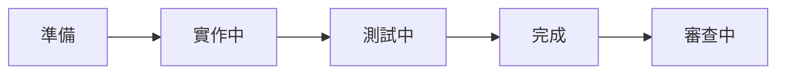

# 功能開發完整流程

從規劃到提交的端到端開發編排。此流程**與你協作**，而非替你獨斷；每個階段都有品質閘門。

## Phase 1：準備與規劃

1. **解析需求** — 從輸入參數取得功能名稱與描述；有規格書則一併讀取需求。
2. **檢查 Git** — `git status` 確認工作目錄乾淨；必要時 `git stash`。
3. **建立/切換分支** — `git checkout -b feature/{name}`（或切換到既有分支）。
4. **檢查規格書** — 找 `docs/{category}/{name}_規格書.md`；不存在則建議先跑 `spec` 建立。
5. **選擇協作角色** — 依功能性質決定要委派哪類 subagent（見下表）。

### 委派角色選擇

依任務性質選用對應的 subagent 角色，而非固定綁某個 agent 名稱：

| 任務性質 | 建議角色 |
|----------|----------|
| 全新功能（從零開始） | 規劃型 → 實作型（先規劃領域邊界，再實作） |
| 涉及外部整合／背景排程／資料存取 | 實作型 +（必要時）架構審查型 |
| 測試／覆蓋率為主 | 實作型 + 測試型 |
| 一般修改 | 實作型 |

> 規劃型應先識別領域邊界、檢視現有模型、搜尋可重用的類似實作、規劃遵循專案慣例的檔案結構，再把計劃回報供你審核。

## Phase 2：實作（協作式）

6. **逐步實作** — 依計劃增量推進，每次重大變更後就地驗證。
7. **增量驗證** — 每次變更後執行建置與相關測試（以 .NET 為例 `dotnet build && dotnet test`，其他工具鏈比照）。
8. **品質檢查** — 段落完成後跑 `quality-check` 做全面驗證，全綠再往下。

## Phase 3：測試

9. **覆蓋率分析** — 複雜功能委派測試型角色分析未覆蓋路徑、補邊緣案例。
10. **測試檢查清單**：
    - [ ] 單元測試通過
    - [ ] 整合測試通過（如適用）
    - [ ] 覆蓋率符合目標
    - [ ] 邊緣案例已驗證（null、邊界值、狀態轉換、錯誤處理）
    - [ ] 未引入回歸

## Phase 4：完成

11. **更新規格書** — 如有，把狀態更新為「已實作」並補變更歷史。
12. **建立提交** — 逐檔指名 `git add` 後用 `commit` 產生語義化提交訊息（禁止 `git add -A`）。
13. **最終摘要** — 總結變更檔案、後續項目；提醒手動 `git push` 與（如需要）開 PR、跑 `review`。

## 實作計劃範例

依 Clean Architecture 分層列出待辦，層名與專案結構對齊：

```markdown
# {功能名稱} 實作計劃

## Domain 層
- [ ] Entities/{Entity}
- [ ] ValueObjects/{ValueObject}
- [ ] Interfaces/I{Repository}

## Application 層
- [ ] Services/{Service}
- [ ] Commands/Queries、DTOs、Validators

## Infrastructure 層
- [ ] Repositories/{Repository}
- [ ] 外部整合（API／訊息／背景排程，如需要）

## Presentation 層
- [ ] Controllers/{Controller}（如需要）
- [ ] 背景工作/{Job}（如需要）

## Tests
- [ ] Domain / Application / Integration 對應測試

## 整合
- [ ] 相依性注入設定
- [ ] 資料庫遷移（如需要）
```

## 狀態轉換



## 重要原則

- **協作流程**：與你一起做，不替你獨斷。
- **增量推進**：小步變更、立即驗證，別一次改一大片。
- **品質閘門**：每階段都過檢查再往下。
- **無自動推送**：push 與開 PR 由你手動執行。

## 與其他 skill 銜接

- `feature` — 建分支並做初步領域規劃
- `spec` — 建立/更新規格書
- `quality-check` — 提交前驗證品質
- `review` — 完成前審查
- `commit` — 建立語義化提交
