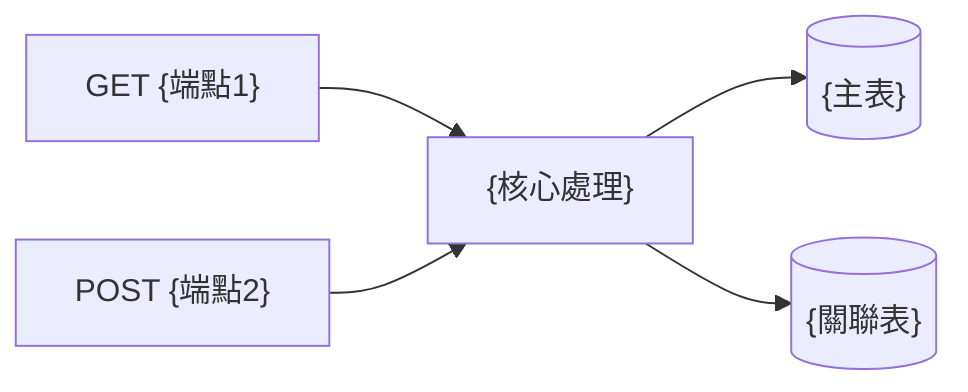
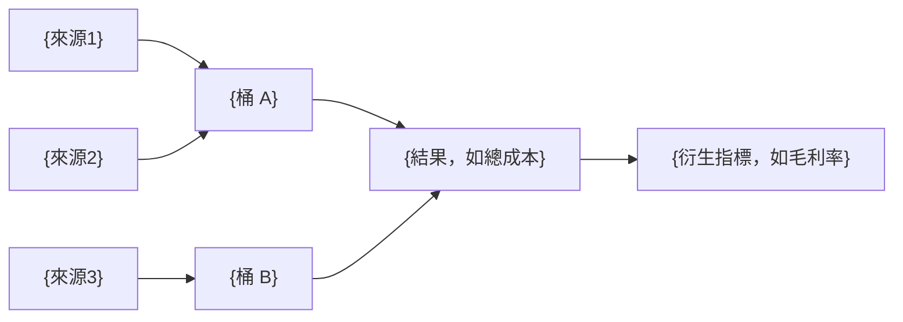

# {功能名稱} 後端功能規格書

<!--
文件定位：後端功能規格書，描述後端**行為契約**（做什麼），實作技術由 RD 決定；前置文件為 FRD／SAD，後續文件為前端功能規格書。
使用說明：1) 將 {佔位符} 替換為實際內容 2) 依功能類型刪除不適用章節 3) 保持章節編號連續。
命名規範：Entity/Request 屬性語意化 PascalCase，Response JSON 輸出 camelCase；巢狀物件優先複用 Light Response，命名範例見 templates/examples/bfs-api.md。
參考標準與範例見附錄 C。
-->

## 0. 一頁摘要

<!--
  ≤12 行正文。第一次讀的人在這一節就要知道：做什麼、給誰、核心契約是什麼。
  元資料（版本、狀態）在「文件資訊」；改版紀錄在檔尾 CHANGELOG——都不放這裡。
-->

- **做什麼**：{一句話：後端提供什麼能力}
- **給誰用**：{呼叫端／角色}
- **核心契約**：{N} 個端點；{核心處理一句話，如「§2.5 多來源金額歸集＋分類匯總」}

**總覽圖**（端點→核心處理→資料表，≤10 節點；sequence 見 §3、匯流圖見 §2.5）



**讀者導覽**

| 你是 | 讀這幾章就夠 | 不用讀 |
|------|-------------|--------|
| Dev 後端 | §6 API、§5 資料模型、§7 驗證、§8 例外；有計算時加 §2.5 | §1（ref FRD）、§D |
| Dev 前端 | §6.1 端點總覽；欄位表以 FFS §2 為準 | 其餘 |
| QA | §12 測試案例；業務情境以 FRD §2 為準 | §5、§6 細節 |
| PO／主管 | 本節 | 其餘 |

**關聯**

| 類型 | 路徑／編號 |
|------|-----------|
| 上游 | [功能需求文件]({FRD 相對路徑}) v{版本}、[系統分析文件]({SAD 相對路徑}) v{版本} |
| 下游 | [前端功能規格書]({FFS 相對路徑}) |
| 決策 | `decisions.md`（本階段 D-{起}~{迄}） |
| 中間產物 | `analysis/db-analysis.yml`、`analysis/reuse-scan.yml` |
| 票／原型 | {票號}；{原型路徑或「無」} |

---

<!-- SPEC-INDEX v1 -->
> **章節索引**（定向讀取用；章節異動時同批更新）
> - §0 一頁摘要 — 總覽圖、讀者導覽、關聯
> - §1 需求概述 — {功能目的、範圍、涉及 N 張表}
> - §2 業務邏輯 — BR-{起}~{迄}；核心＝{一句話}；有計算時 **§2.5 匯流圖＋算例**
> - §3 資料流程 — {CRUD sequence 涵蓋哪些操作}
> - §4 業務流程圖 — 預設 ref FRD §3.1／本文件 §3
> - §5 資料模型 — {主要資料表}；資料契約定義在 §5.5（§5.2 已移除）
> - §6 API — {N} 端點；{熱門端點指路}
> - §7 驗證規則 — VR-{起}~{迄}（錯誤字串事實來源）
> - §8 例外處理 — {錯誤情境數}
> - §9 讀寫操作設計 — {一句；不適用寫「不適用」}
> - §10 資料庫考量 — {索引／清洗／連線等一句}
> - §11 外部服務整合 — {一句；不適用寫「不適用」}
> - §12 測試案例 — TC-{起}~{迄}
> - §13 驗收標準 — 引用 §12 編號
> - §14 規格完整性確認 — 由 verifying-specs 驗，不列清單
> - §A 既有實作結論 — 端點現況、影響範圍、重用結論（明細見 `analysis/reuse-scan.yml`）
> - §15 待澄清事項 — CL-{起}~{迄}；§附錄 — 術語 ref FRD §8.1、參考標準
> - §D 決策紀錄 — 本階段拍板編號（全文在 `decisions.md`）

> **撰寫須知**
> 1. §6 用欄位表，JSON 僅限巢狀／批量（見 references/doc-boundaries.md「BFS §6 表達法」）。
> 2. §4.1／§4.2／§5.4／§13／§14／§A 預設為 ref，只有本文件真有增量時才展開。
> 3. **正文預算 45KB**（§1 起至 §D 前；不含 §0、§D、附錄、CHANGELOG）。超標先過去重閘與 examples 外移；仍超標 → **拆附錄檔** `{功能名稱}_附錄_{主題}.md`（如 API 契約明細、欄位對照全表），主文只留總覽表＋連結並在 SPEC-INDEX 註明。**不放行**；真要放行須在 `decisions.md` 記一列。
> 4. **必畫圖**：§0 總覽、每個寫入端點一張 sequence（§3）、§2.5 匯流圖（有計算時）、規則 >8 條的決策樹（§7／§8）。畫法見 templates/examples/diagrams-and-worked-examples.md。
> 5. **技術手段不定案**：鎖種類、快取、佇列、儲存位置、重試做法、索引策略一律寫成 `decisions.md` 的 TD（約束＋現況＋陷阱），正文只留 `> ⚠ TD-xxx（見 decisions.md）` 提醒段；本文件定的是行為、契約、資料語意。

---

## 文件資訊

| 項目 | 內容 |
|------|------|
| 文件編號 | BFS-{模組代號}-{序號} |
| 功能代碼 | {功能代碼；無則「不需代碼」＋理由} |
| 版本 | 1.0 |
| 狀態 | 草稿 / 審查中 / 已核准 |
| 對應文件 | FRD-{編號} v{版本}、SAD-{編號} v{版本} |
| 關聯票 | {票號} |

> 技術中立：本文件不規範實作技術，選型由 RD 決定；完工後依實作回寫（changelog 註記「完工回寫：實作對齊」）。

---

## 1. 需求概述

### 1.1 功能目的

<!--
說明：從功能需求文件（FRD）延續，簡述此功能的後端實作目的
-->

| 項目 | 說明 |
|------|------|
| 對應需求文件 | FRD-{編號} |
| 功能目的 | {描述此後端功能要達成的目標} |
| 業務價值 | {說明這個功能為業務帶來的價值} |

### 1.2 功能範圍

**後端實作範圍：**
- {功能項目 1}
- {功能項目 2}
- {功能項目 3}

**不在本規格範圍：**
- {排除項目 1}
- {排除項目 2}

### 1.3 涉及系統與資料表

> 📎 資料表清單（讀寫、用途、現有/新建）見《{功能} 系統分析文件》§4.1 涉及資料表，此處不重列。
> 本表僅在無 SAD 時填寫；有 SAD 時改放一行 ref 即可，完整欄位定義見本文件 §5.4。

| 系統 | 角色 | 主要資料表 | 說明 |
|------|------|-----------|------|
| MP | 資料來源/目的 | `{Schema}.{Table1}` | {說明} |
| MP | 資料來源/目的 | `{Schema}.{Table2}` | {說明} |
| MP (Shadow) | 狀態追蹤 | `Erp.{Name}Shadow` | 同步狀態追蹤 |
| 中介資料庫 | 資料交換 | `{中介表}` | 跨系統整合 |
| ERP | 資料目的 | - | 外部系統 |

### 1.4 前置條件與假設

| 類型 | 描述 |
|------|------|
| 前置條件 | {系統或資料必須滿足的條件} |
| 假設 | {開發時的假設條件} |
| 相依性 | {依賴的其他模組或服務} |

---

## 2. 業務邏輯

### 2.1 核心業務規則

<!--
說明：定義此功能的核心業務邏輯，使用結構化方式呈現
-->

| 規則編號 | 規則名稱 | 規則描述 | 觸發時機 | 優先級 |
|----------|----------|----------|----------|--------|
| BL-001 | {規則名稱} | {詳細的業務規則描述} | {新增/修改/刪除/查詢} | 高/中/低 |
| BL-002 | {規則名稱} | {詳細的業務規則描述} | {觸發時機} | 高/中/低 |
| BL-003 | {規則名稱} | {詳細的業務規則描述} | {觸發時機} | 高/中/低 |

### 2.2 業務規則詳細說明

#### BL-001：{規則名稱}

| 項目 | 說明 |
|------|------|
| 規則目的 | {為什麼需要這個規則} |
| 判斷條件 | {詳細的邏輯條件，可使用虛擬碼} |
| 執行動作 | {條件成立時的處理方式} |
| 例外處理 | {條件不成立時的處理方式} |
| 錯誤訊息 | 「{顯示給使用者的訊息}」 |

**判斷邏輯（虛擬碼）：**

```
IF {條件A} AND {條件B} THEN
    {執行動作1}
ELSE IF {條件C} THEN
    {執行動作2}
ELSE
    THROW ERROR "{錯誤訊息}"
END IF
```

### 2.3 共用元件設計（若適用）

<!--
觸發條件：本功能涉及「多入口共用元件」時必填。判別關鍵字：
- 規格描述含「兩個入口」「三入口」「共用 Mapper」「共用驗證」「多處理單元一致性」
- 同一份業務邏輯由多個 API / 處理單元 / 場景呼叫

填法：明確列出每個呼叫場景的輸入差異，避免「共用元件」假設打破各場景既有行為。
-->

**呼叫場景清單：**

| 場景 | 觸發 API / 處理單元 | 輸入差異 | 輸出 |
|---|---|---|---|
| {場景 1} | {API／處理單元名稱} | {該場景的輸入特性，如「有上層單據、需串接」} | {DTO 或寫入目標} |
| {場景 2} | {API／處理單元名稱} | {「無上層單據、直接複製」} | {DTO 或寫入目標} |

**共用 vs 場景專屬規則：**

| 規則 | 適用範圍 | 規則描述 |
|---|---|---|
| **共用規則 F-XX** | 所有場景 | {例：規格鏡像、欄位語意轉換} |
| **場景專屬規則 E-XX** | 僅場景 N | {例：母件編號串接、數量相乘} |

**共用邊界（不是元件設計）：**

| 項目 | 內容 |
|---|---|
| 各場景**共通**的資料與規則 | {哪些欄位／計算在所有場景都一樣} |
| 各場景**自行決定**的部分 | {最終輸出欄位、串接邏輯、數量計算等因場景而異者} |

> ⚠️ **業務要求**：共用的部分不得讓任一場景的既有行為改變。各場景的最終輸出欄位／
> 串接邏輯／數量計算本來就不同，**不可假設能用同一份輸出直接產出**。
>
> 💡 要不要抽共用元件、抽成什麼形狀、介面長怎樣，**由 RD 在開發時決定**——
> 本節只界定「哪些是共通業務規則、哪些是場景專屬」。


> 💡 **實作方式以 RD/PG 最終決定為準**，本處僅為設計階段參考。

### 2.4 狀態轉換邏輯

<!--
說明：如果資料有狀態變化，定義狀態轉換規則
-->

| 當前狀態 | 觸發事件 | 目標狀態 | 前置條件 | 後續動作 |
|----------|----------|----------|----------|----------|
| {狀態A} | {事件1} | {狀態B} | {必須滿足的條件} | {狀態變更後的動作} |
| {狀態B} | {事件2} | {狀態C} | {必須滿足的條件} | {狀態變更後的動作} |

### 2.5 計算邏輯與歸集（有計算時必填）

<!--
說明：有金額／數量／成本歸集／比率計算時必填；純 CRUD 無計算則整節寫「不適用」。
三件事缺一不可：匯流圖（來源→桶→結果）、精度表、算例。
純表格表達加減關係（如「材料＝M1−M2＋M3」）讀者要自己心算——關係用圖，數字用算例。
-->

**匯流圖**（來源→歸集桶→結果；範例見 templates/examples/diagrams-and-worked-examples.md）



**算例**（輸入→輸出，數字取自具代表性的 Staging 資料並註來源；每條公式至少一組）

| 情境 | 輸入 | 計算 | 輸出 | 資料來源 |
|------|------|------|------|---------|
| {正常} | {欄位＝值…} | {套公式} | {結果} | {連線／表／單號} |
| {邊界，如缺匯率} | {欄位＝值…} | {套規則} | {結果} | {來源} |

<!-- User Story 示範（實際計算數值）見 templates/examples/bfs-validation.md -->

| 計算項目 | 計算公式 | 精度（整數.小數位） | 捨入規則 | 中間值是否捨入 | 說明 |
|----------|----------|-------------------|----------|--------------|------|
| {明細小計} | `數量 × 單價` | {N}.2 | 四捨五入（遠離零） | ❌ 不捨入 | 每列明細個別計算後加總 |
| {合計金額} | `SUM(明細小計)` | {N}.2 | 四捨五入 | ❌ 不捨入 | 加總後才捨入 |
| {稅額} | `合計金額 × 稅率` | {N}.2 | 四捨五入 | ❌ 不捨入 | 基於捨入後合計計算 |
| {含稅總額} | `合計金額 + 稅額` | {N}.2 | 四捨五入 | ❌ 不捨入 | 最終顯示值 |

> ⚠️ **精度規格填寫注意**：
> - 捨入規則預設四捨五入（遠離零；2.5 → 3，-2.5 → -3）
> - 若業務需「銀行家捨入」請明確標注（捨入到偶數）
> - **中間值不捨入**原則：先完整計算再捨入，例如 `(150 × 12.6667).Round(2)` 不等於 `150 × 12.67.Round(2)`
> - 若不同欄位精度不同（如成本歸集用 4 位小數），逐行個別標注

---

## 3. 資料流程

### 3.1 整體資料流程圖

{Mermaid flowchart：Client → Controller → 業務邏輯 → 驗證分支（通過/失敗）→ Repository → Database}

<!-- 完整 mermaid 範例見 templates/examples/bfs-flow.md -->

### 3.2 新增資料流程

{Sequence：Client→Controller→Validator→業務邏輯→Repository→DB；驗證失敗回 400、成功回 201}

<!-- 完整 sequence 範例見 templates/examples/bfs-flow.md -->

### 3.3 修改資料流程

{Sequence：Client→Controller→Validator→業務邏輯→Repository→DB；資料不存在回 404、驗證失敗回 400、成功回 200}

<!-- 完整 sequence 範例見 templates/examples/bfs-flow.md -->

### 3.4 刪除資料流程

{Sequence：Client→Controller→業務邏輯→Repository→DB；資料不存在回 404、有關聯資料回 400、成功回 204}

<!-- 完整 sequence 範例見 templates/examples/bfs-flow.md -->

### 3.5 查詢資料流程

{Sequence：Client→Controller→業務邏輯→Repository→DB（分頁查詢）；成功回 200 + PagedResponse}

<!-- 完整 sequence 範例見 templates/examples/bfs-flow.md -->

---

## 4. 業務流程圖

> 📎 **去重提醒**：技術層的請求處理流程已由 §3 資料流程的 sequence diagram 完整表達（驗證→業務規則→DB 操作）。本章**不重畫**相同流程；僅在「業務層決策點」與 §3 sequence 視角不同、且 FRD §3.1 未涵蓋時才填，否則整章 ref FRD §3.1 / 本文件 §3。

### 4.1 主要業務流程

> 📎 見《{功能} 功能需求文件》§3.1 主流程圖，此處不重畫。技術流程以本文件 §3 sequence 為準。

<!-- 若本文件確有業務層增量決策點，範例畫法見 templates/examples/bfs-flow.md -->

### 4.2 狀態流程圖

> 📎 見《{功能} 功能需求文件》§3.2 狀態流程圖。本文件狀態欄位與前後置動作見 §2.4。
> **此處不再重畫 stateDiagram**——§2.4 表已足夠；若團隊慣例需視覺化，直接沿用 FRD §3.2 圖，勿另繪不同步版本。

### 4.3 排程同步流程（若適用）

{Flowchart：第一階段資料同步（排程觸發→查詢待處理→寫入 Shadow 表→轉換寫入目標→更新狀態→註冊回寫 Job）；第二階段狀態回寫（查詢待回寫→讀取目標系統結果→依結果更新 ErpStatus）}

<!-- 完整 flowchart 範例見 templates/examples/bfs-flow.md -->

---

## 5. 資料模型

### 5.1 資料庫關聯圖 (ER Diagram)

> 📎 表間關聯概念見《{功能} 系統分析文件》§4.2。本節是 ER 的**最終事實來源**：在關聯基礎上補齊完整欄位（型態、PK/FK、長度），供開發直接對照。

<!-- 完整 erDiagram 範例見 templates/examples/bfs-data-model.md -->

**關聯說明：**

| 主表 | 關聯 | 從表 | 說明 |
|------|------|------|------|
| `{MAIN_TABLE}` | 1:N | `{DETAIL_TABLE}` | 主檔對明細 |
| `{MAIN_TABLE}` | N:1 | `{MASTER_TABLE}` | 參照主檔 |

<!-- §5.2 Entity 類別關聯圖已移除：ORM 映射關係屬實作產物，
     表間關聯看 §5.1 ER 圖即足夠。後續章節編號維持不變，避免既有文件的 ref 失效。 -->

### 5.3 資料轉換流程

{Flowchart：Database → API Request/Response 契約鏈；含 Light Response、分頁包裝。Entity／ORM 映射層是實作，不畫}

<!-- 完整 flowchart 與命名規則說明見 templates/examples/bfs-data-model.md -->

**欄位對應總覽：**（只保留外部看得見的契約鏈；「Entity 屬性」是 ORM 映射，由 Dev 定，不列）

#### 表頭欄位對應

| DB 欄位 | Request 屬性 | Response 屬性 | 說明 |
|---------|-------------|---------------|------|
| `{DB_COLUMN}` | `{PascalCase}` | `{camelCase}` | {說明} |

#### 明細欄位對應

| DB 欄位 | Request 屬性 | Response 屬性 | 說明 |
|---------|-------------|---------------|------|
| `{DB_COLUMN}` | `{PascalCase}` | `{camelCase}` | {說明} |

<!-- 完整範例（含命名規則、巢狀物件映射）見 templates/examples/bfs-data-model.md -->

### 5.4 來源資料表

> 📎 見《{功能} 系統分析文件》§4.1 涉及資料表，此處不重列。本節僅補充：{需完整欄位定義的表}。

#### {Schema}.{Table1} - {說明}

| 欄位 | 型態 | 長度 | 說明 | 備註 |
|------|------|------|------|------|
| {PK_COLUMN} | char | 10 | {說明} | PK |
| {COLUMN} | varchar | 50 | {說明} | |
| {FK_COLUMN} | char | 10 | {說明} | FK → {關聯表} |
| DELETED_FLAG | char | 1 | 刪除標記 | Y=已刪除 |
| CREATER | varchar | 20 | 建立者 | |
| CREATE_DATE | datetime | - | 建立時間 | |
| MODIFYER | varchar | 20 | 修改者 | |
| MODIFY_DATE | datetime | - | 修改時間 | |

> 索引不在本節定案：既有索引是勘察現況，落 `analysis/reuse-scan.yml`；新查詢對索引的需求
> 寫成 §9 的陷阱欄或 `decisions.md` TD（約束：排序／篩選欄；現況：該欄有無索引、預估筆數；陷阱：大表無索引欄不可排序），命名與建法由 Dev 定。

### 5.5 資料契約定義

<!--
本節定義**契約**：這張表有哪些欄位、什麼型別長度、能不能為空、語意是什麼。
⚠️ 不寫程式語言型別（Guid／string?／ICollection<>）、不寫原始碼檔名、不寫 ORM attribute
   ——那是實作，由 RD 決定，且能從 DB 型別直接推導。
   （verifying-specs/references/existing-resources-check.md 早已載明：
     DB 表已存在時 Entity 定義可自動產生，無需規格書重複定義）
-->

#### {資料表中文名}（`{TABLE_NAME}`）

| 欄位語意 | DB 欄位 | 型別 | 必填 | 說明 |
|---------|---------|------|------|------|
| 系統主鍵 | {DB_COLUMN} | 唯一識別碼 | O | — |
| 業務編號 | {DB_COLUMN} | 文字(10) | O | {編碼規則} |
| 名稱 | {DB_COLUMN} | 文字(50) | O | — |
| {關聯對象} | {DB_COLUMN} | 唯一識別碼 | O | 參照 `{REF_TABLE}` |
| {選填欄位} | {DB_COLUMN} | 文字(20) | X | 可為空，空值語意：{語意} |
| 建立時間／建立者 | {DB_COLUMN} | 日期時間／文字 | O | — |
| 修改時間／修改者 | {DB_COLUMN} | 日期時間／文字 | X | — |

> 明細關聯（1:N、N:1）見 §5.1 ER 圖，此處不重畫。
> 型別寫法：`文字(N)`／`整數`／`數值(p,s)`／`日期`／`日期時間`／`唯一識別碼`／`是否`。

### 5.6 Shadow 表（若適用）

#### Erp.{Name}Shadow

| 欄位 | 型態 | 說明 | 來源 |
|------|------|------|------|
| Id | uniqueidentifier | 主鍵 | 系統產生 (GUID) |
| {業務Id} | nvarchar(10) | 業務主鍵 | `{Table}.{欄位}` |
| MpStatus | nvarchar(1) | MP 處理狀態 | 系統產生 |
| MpMessage | nvarchar(100) | 處理失敗原因 | 系統產生 |
| ErpStatus | nvarchar(1) | ERP 處理狀態 | ERP 回寫 |
| ErpMessage | nvarchar(100) | ERP 錯誤訊息 | ERP 回寫 |
| PayloadHash | char(64) | 資料指紋 | SHA256 Hex |
| IsChanged | bit | 是否有變更 | 比對 PayloadHash |
| CreatedTime | datetime | 建立時間 | 資料庫預設 |

**狀態值定義：**

| 欄位 | 值 | 說明 |
|------|---|------|
| MpStatus | 空白 | 待處理 |
| | P | 已處理，等待回寫 |
| | E | 處理失敗 |
| ErpStatus | 空白 | 待目標系統處理 |
| | S | 處理成功 |
| | E | 處理失敗 |

---

## 6. API 介面規格

<!-- §6.1 為端點總覽表；§6.2 起每端點含說明／Request／Response 欄位表。屬性表用 PascalCase，JSON 範例用 camelCase；關聯實體以巢狀物件呈現，優先複用 Light Response；修改時間用 lastModifiedTime（非 lastModifiedDate）。完整 JSON 範例與命名慣例見 templates/examples/bfs-api.md。 -->

### 6.0 列表／報表端點規格基準（開發就緒度 DoR）

<!--
觸發條件：任何端點回傳集合 / 有篩選排序 / 提供匯出 / 含統計，**必填**；純單筆 CRUD 可填「N/A — 非列表型」。
原則：每維度二擇一——「依循專案既有慣例（附 codebase 路徑）」或「本功能自定義（明確值）」。
禁止「比照既有 / 反查回填 / 對齊報表 / 依需要分頁」等 hand-wave，否則 RD 會卡住或各自臆測。
撰寫方法與探索線索 → specify-backend/references/list-endpoint-dor.md；排序規則 → references/sort-order-standards.md。
維度為常見 baseline，依專案增減。
-->

> 每個列表/報表端點一份（端點多時可合併同型者）。**處理方式**欄填 `依循慣例：{路徑}` 或 `自定義：{明確值}`。

| 維度 | 本端點適用 | 處理方式（依循慣例路徑 / 自定義明確值） |
|------|----------|------------------------------------|
| 分頁策略（預覽分頁 vs 匯出全量、預設/最大每頁、預估資料量） | 是/否 | |
| 排序（可排序欄位白名單、`SortBy 值 → ORDER BY 欄位序`、預設排序） | 是/否 | |
| 排序穩定性（**決勝欄**——排序鍵非唯一時必填；NULL 位置；字串型編號的字面序／數值序） | 是/否 | |
| 匯出排序（與畫面是否一致；分組報表的分組鍵序 + 組內序） | 是/否 | |
| 日期邊界（含端日否、時間部分如何處理、時區） | 是/否 | |
| 1:N 取值（反查/回填遇一對多取哪筆：最新/第一/全部/加總） | 是/否 | |
| 聚合母體（每個 count/小計的母體單位 表頭/明細 + grain） | 是/否 | |
| 匯出規格（欄序/標題/檔名/數字日期格式/每欄來源） | 是/否 | |
| 權限過濾（可見範圍來源表.欄位、legacy/邊界資料歸屬） | 是/否 | |
| 效能（no-tracking / projection / 大資料量保護） | 是/否 | |

> 📎 維度 2-5 同步填 SAD §6.6 邊界清單；分頁/效能對應 SAD §6.5 NFR。前端分頁參數與匯出按鈕見 FFS。

### 6.1 端點總覽

| 方法 | 路由 | 說明 | 權限 | 對應 US |
|------|------|------|------|---------|
| GET | `/api/{module}/{entity}` | 取得所有 {Entity} | Read | US-01 |
| GET | `/api/{module}/{entity}/{id}` | 取得單一 {Entity} | Read | US-02 |
| GET | `/api/{module}/{entity}/Paged` | 分頁查詢 | Read | US-01 |
| GET | `/api/{module}/{entity}/Light` | 輕量列表（選擇器用） | Read | — |
| POST | `/api/{module}/{entity}` | 建立 {Entity} | Create | US-03 |
| PUT | `/api/{module}/{entity}/{id}` | 更新 {Entity} | Update | US-04 |
| DELETE | `/api/{module}/{entity}/{id}` | 刪除 {Entity} | Delete | US-05 |
| POST | `/api/{module}/{entity}/Batch` | 批量建立/更新/刪除（**條件式**，逐項獨立 207） | Create/Update/Delete | US-XX |

> **批量端點為條件式**：功能需「一次送多筆」時才保留此列並撰寫 §6.9；純單筆 CRUD 請刪除本列與 §6.9。
> **成功狀態碼速查**：GET=200、POST=201（+`Location` header）、PUT=200、DELETE=204、BATCH=207。每個端點小節**必須**明寫成功狀態碼（不可只靠 §3 sequence 圖隱含）。完整契約見 `references/response-structure-standards.md`「HTTP 回應契約」。

### 6.2 端點 1：GET /api/{module}/{entity}

**用途**：{一句話}　**對應 US**：{US-XX}　**權限**：Read

**Request：** 無 Body

**Response：** `Get{Entity}Response[]`

| 欄位 | 型別 | 必填 | 來源/規則 |
|------|------|------|----------|
| {欄位} | {型別(長度)} | Y/N | {來源欄位} |

回應：200 + `Get{Entity}Response[]`

<!-- 完整 JSON 範例見 templates/examples/bfs-api.md -->

### 6.3 端點 2：GET /api/{module}/{entity}/{id}

**用途**：{一句話}　**對應 US**：{US-XX}　**權限**：{說明}

<!-- Request 為 Path 參數 {id}（無 Body）；Response 欄位表寫法同 §6.2，但為單筆物件非陣列；巢狀物件寫法見 §6.N；完整範例見 templates/examples/bfs-api.md -->

### 6.4 端點 3：GET /api/{module}/{entity}/Paged

**用途**：分頁查詢　**對應 US**：{US-XX}　**權限**：Read

<!-- Query 分頁參數表（含繼承自 PagedRequest 之固定參數）見 templates/examples/bfs-api.md §6.4；Response 為 PagedResponse 包裝，items 陣列欄位格式同 §6.2，外層另有 totalCount／pagesSize／currentPage／totalPages；完整範例見 templates/examples/bfs-api.md -->

### 6.5 端點 4：GET /api/{module}/{entity}/Light

**用途**：輕量列表（選擇器用）　**對應 US**：—　**權限**：Read

<!-- Light Response 設計原則見 templates/examples/bfs-api.md §6.5；欄位表寫法同 §6.2，但欄位精簡至 3~5 欄（僅 ID + 主要顯示名稱/代碼）；完整範例見 templates/examples/bfs-api.md -->

### 6.6 端點 5：POST /api/{module}/{entity}

**說明：** 建立 {Entity}

**Request：** `Create{Entity}Request`

| 屬性名稱 | 型態 | 必填 | 長度限制 | 說明 | 驗證規則 |
|----------|------|------|----------|------|----------|
| {PropertyName} | string | O | 50 | {說明} | VR-001 |
| {ForeignKeyNo} | string | O | 10 | {說明} | VR-002, BR-001 |
| {Date} | DateTime | O | - | {說明} | VR-003 |
| {NumericField} | decimal | O | 10,2 | {說明} | VR-004 |
| {OptionalProperty} | string? | X | 100 | {說明} | |

<!-- Request/Response JSON 範例（含 User Story 示範）見 templates/examples/bfs-api.md -->

**成功回應：** `201 Created` + `Location: /api/{module}/{entity}/{id}` header（指向新建資源）

**Response body：** `Get{Entity}Response`（建立後完整物件，同端點 2 格式）

### 6.7 端點 6：PUT /api/{module}/{entity}/{id}

**用途**：更新 {Entity}　**對應 US**：{US-XX}　**權限**：Update

<!-- Request 欄位表寫法同 §6.6，但通常只列可更新欄位（子集，不含不可變 FK／系統自動欄位）；完整範例見 templates/examples/bfs-api.md -->

### 6.8 端點 7：DELETE /api/{module}/{entity}/{id}

**用途**：刪除 {Entity}（軟刪除 DELETED_FLAG='Y' 或實體刪除）　**對應 US**：{US-XX}　**權限**：Delete

<!-- 無 Request body（僅 Path 參數 {id}）；Response 僅 204/400，非 §6.2 的完整欄位表；錯誤格式見 §6.N+1；狀態碼與範例見 templates/examples/bfs-api.md §6.8 -->

<!--
若有額外端點（如明細 CRUD、沖轉查詢等），依序新增 §6.9、§6.10...
每個端點都必須包含完整的 Request 模型表格 + JSON 範例 + Response JSON 範例。
-->

### 6.9 端點 8：POST /api/{module}/{entity}/Batch（批量，條件式）

<!--
觸發條件：功能需「一次送多筆建立/更新/刪除」時必填；純單筆 CRUD 整段刪除。
預設語意：逐項獨立處理（非整批交易），任一筆失敗不影響其他筆，回 207 + 逐項結果。
若業務要求「全有全無（整批交易，一筆失敗全 rollback）」，於本節改註明：採交易語意、成功回 200、失敗回 400/409（不用 207），並說明 rollback 範圍。
-->

**說明：** 批量{建立/更新/刪除} {Entity}（**逐項獨立處理**，單筆失敗不影響其他筆）

**Request：** `Batch{Operation}{Entity}Request`

| 屬性名稱 | 型態 | 必填 | 說明 |
|----------|------|------|------|
| items | `Create{Entity}Request[]` | O | 批量項目清單（單批上限 {N} 筆，超過回 400） |

<!-- Request JSON 範例見 templates/examples/bfs-api.md -->

**成功回應：** `207 Multi-Status`（逐項獨立；整批請求格式錯誤才回 400）

**Response body：** `BatchResultResponse`

| 屬性名稱 | 型態 | 說明 |
|----------|------|------|
| successCount | int | 成功筆數 |
| failureCount | int | 失敗筆數 |
| results | `BatchItemResult[]` | 逐項結果（順序對應 Request items） |
| results[].index | int | 對應 Request items 索引（從 0 起） |
| results[].success | bool | 該筆是否成功 |
| results[].id | string? | 成功回新建/異動資源 id，失敗為 null |
| results[].error | object? | 失敗回 `{ code, message }`，成功為 null |

<!-- Response JSON 範例見 templates/examples/bfs-api.md -->

> ⚠️ 批量端點**必須**明確定義「部分成功」行為，二擇一且不可留白：
> - **逐項獨立**（預設）：回 `207`，每筆成功/失敗於 `results` 逐項回報，各筆獨立交易。
> - **整批交易**：回 `200`（全成功）/ `400`/`409`（任一筆失敗全 rollback），須說明 rollback 範圍。

### 6.N 巢狀物件定義

<!--
設計原則：
- 所有關聯實體必須使用巢狀物件，禁止扁平化展開
- 優先複用現有 GetLight{Entity}Response（位於 Application/{Module}/{Entity}Service/Queries/）
- 若無現有 Light Response 可複用，建立 DTO 專屬內部類別（{DtoName}{Entity}Info）
- 巢狀物件最多 2-3 層，避免過深嵌套
-->

**巢狀物件來源判斷：**

| 情境 | 做法 | 命名規則 |
|------|------|----------|
| 現有 Light Response 存在 | 直接複用 | `GetLight{Entity}Response` |
| 現有 Light Response 不存在但通用 | 新建 Light Response | `GetLight{Entity}Response` |
| 僅此 DTO 使用的組合欄位 | 建立內部類別 | `{DtoName}{Entity}Info` |

### 6.N+1 錯誤回應格式

跨端點共通格式，端點內不重列：`{ type, title, status, detail 或 errors }`（驗證失敗用 `errors` 逐欄位陣列，其餘用 `detail` 單一字串）。

| 類型 | HTTP 狀態碼 | 用途 |
|------|-----------|------|
| ValidationResponseModel | 400 | 逐欄位驗證失敗清單（`errors.{fieldName}`） |
| NotFoundResponseModel | 404 | 資源不存在 |
| BusinessExceptionResponseModel | 400 | 業務規則例外 |

<!-- 完整 JSON 範例見 templates/examples/bfs-api.md -->

---

## 7. 驗證規則

> 📎 業務語意層的驗證規則見《{功能} 功能需求文件》§5.2（VR）/§5.3（BR）。本章是 VR/BR 的**技術判斷與錯誤訊息字串**事實來源（FFS §4 反向 ref 本章）。
> **編號一致**：沿用 FRD 的 VR/BR 編號（如 FRD `VR-001` → 本章同樣 `VR-001`），不另起 `VR-01` 編號，確保跨文件可追溯。
> **規則 >8 條、且彼此有互斥或優先序**（如「A 優先於 B」「三結果集互斥」）→ 本章必附一張決策樹（mermaid flowchart），表列只補圖上放不下的訊息與字串。範例見 templates/examples/diagrams-and-worked-examples.md。

### 7.1 輸入驗證

<!-- User Story 示範與完整 VR 範例見 templates/examples/bfs-validation.md -->

| 規則編號 | 欄位 | 欄位代碼 | 驗證類型 | 規則描述 | 錯誤訊息 |
|----------|------|----------|----------|----------|----------|
| VR-{NNN} | {欄位} | `{PropertyName}` | 必填/範圍/格式/位元組長度 | {規則描述} | `{完整中文錯誤訊息，含欄位名稱}` |

> ⚠️ **注意**：DB 欄位長度請從 §5.4 複製，避免長度不一致。

### 7.2 業務驗證

<!-- 完整 BR 範例見 templates/examples/bfs-validation.md -->

| 規則編號 | 規則名稱 | 規則描述 | 驗證時機 | 錯誤訊息 |
|----------|----------|----------|----------|----------|
| BR-{NNN} | {規則名稱} | {規則描述} | 新增/修改/刪除 | `{完整中文錯誤訊息}` |

> ⚠️ **注意**：唯一性檢查務必排除已刪除資料（DELETED_FLAG = 'Y'）。

### 7.3 事件驗證規則

<!--
說明：定義在特定事件（如儲存、送審、核准）時的驗證規則
-->

#### 7.3.1 儲存事件（Create/Update）

| 規則編號 | 檢查項目 | 檢查條件 | 處理方式 |
|----------|----------|----------|----------|
| SE-001 | {檢查項目} | {條件描述} | 阻擋並顯示錯誤 |
| SE-002 | {檢查項目} | {條件描述} | 警示但允許繼續 |

#### 7.3.2 狀態變更事件

| 規則編號 | 事件 | 檢查項目 | 檢查條件 | 處理方式 |
|----------|------|----------|----------|----------|
| ST-001 | 送審 | {檢查項目} | {條件描述} | 阻擋並顯示錯誤 |
| ST-002 | 核准 | {檢查項目} | {條件描述} | 阻擋並顯示錯誤 |

### 7.4 FoxPro 來源驗證（若適用）

| 規則編號 | FoxPro 來源 | 規則描述 | 驗證狀態 |
|----------|------------|----------|----------|
| FP-001 | {檔名}.APP | {業務規則描述} | ✅ 已驗證 |
| FP-002 | {檔名}.APP | {業務規則描述} | ⚠️ 待確認 |

**驗證狀態說明：**
- ✅ 已驗證：已在 FoxPro 原始碼中找到對應程式碼
- ⚠️ 待確認：用戶提供但尚未在原始碼中驗證
- ❌ 未找到：在原始碼中找不到對應邏輯

---

## 8. 例外處理規格

> 錯誤情境 >8 條且有判定順序（先驗什麼、再驗什麼）→ 附決策樹（mermaid），表列只補錯誤代碼與訊息字串。

### 8.1 錯誤情境清單

| 錯誤代碼 | HTTP 狀態碼 | 類型 | 情境說明 | 錯誤訊息 |
|---------|-----------|------|---------|---------|
| E-{模組}-001 | 400 | 業務例外 | {描述} | {訊息} |
| E-{模組}-002 | 404 | 業務例外 | {描述} | {訊息} |
| E-{模組}-003 | 409 | 業務例外 | {描述} | {訊息} |
| E-{模組}-500 | 500 | 系統例外 | 未預期錯誤 | 系統發生錯誤，請聯繫管理員 |

**類型說明：**
- 業務例外：可預期的業務邏輯錯誤（如資料不存在、唯一性衝突、前置條件未滿足）
- 系統例外：不可預期的系統層錯誤（如 DB 連線失敗）

### 8.2 錯誤回應格式

<!--
說明本功能使用的錯誤回應格式。通常統一使用專案 ErrorResponse schema。
請確認並填入對應的文件連結或 schema 定義。
-->

統一使用專案 ErrorResponse schema。參照：[{API 規範文件連結或路徑}]

### 8.3 交易失敗處理

<!--
說明哪些操作為交易單元（Transaction），以及失敗時的處理策略。
例如：新增表頭＋明細為單一交易，任一步驟失敗則 rollback 全部。
-->

{說明}

### 8.4 並發衝突處理

<!--
⚠️ 強制規格：若功能有狀態流轉（§2.3 狀態轉換表存在），此章節**必填**，不可填 N/A。
多人同時操作同一張單據（訂單／採購單等）是高頻場景，必須明確說明保護策略。
若功能無狀態且無共享寫入（如純查詢 API），可填 N/A 並說明理由。
-->

<!-- User Story 示範見 templates/examples/bfs-validation.md -->

**衝突時的契約行為**（SA 定）：

| 情境 | 系統行為 | 回應 |
|------|---------|------|
| 同一筆資料兩人先後儲存 | 擋下後者／後寫覆蓋／合併（三擇一） | {409 ＋訊息｜200} |
| 不處理（無共享寫入） | N/A，理由：{業務上不會並發寫入} | — |

> 用哪種鎖（樂觀／悲觀／版本欄）是手段，寫 `decisions.md` TD（約束：上表行為；現況：既有 Entity 有無時間戳欄；陷阱：…），本章不定案。
> 若契約需要前端回傳比對值（如 `LastModifiedTime`），那是 Request 欄位，寫進 §6 契約——**欄位進契約是 SA 定，比對怎麼做是 Dev 定**。

**比對欄位契約**（若衝突行為需要）：

| 項目 | 規格 |
|------|------|
| 比對欄位 | `{欄位}`（datetime，精度至毫秒） |
| Request 傳入方式 | Request Body 包含 `{欄位}: "{timestamp}"` |
| 衝突判斷 | `entity.{欄位} != request.{欄位}` |
| 衝突回應 | HTTP 409 Conflict |
| 衝突訊息 | `「資料已被他人修改，請重新載入後再試」` |
| 前端行為 | 接收 409 後自動重新讀取最新資料，使用者重新操作 |

<!-- 完整範例見 templates/examples/bfs-validation.md -->

**補充錯誤情境至 §8.1**：

| 錯誤代碼 | HTTP 狀態碼 | 類型 | 情境說明 | 錯誤訊息 |
|---------|-----------|------|---------|---------|
| E-{模組}-409 | 409 | 業務例外 | 並發衝突：資料已被他人修改 | `「資料已被他人修改，請重新載入後再試」` |

---

## 9. 讀寫操作設計

> 本章**不設計存取方法、不指定資料存取技術**——那是 Dev 的事。只寫每類操作的**約束與提醒**；
> 需要手段層決策的項目寫成 `decisions.md` 的 TD，此處留提醒段。無特殊約束的操作填「依專案慣例」。

| 操作 | 約束（必須滿足） | 已知現況 | 陷阱 | TD |
|------|-----------------|---------|------|-----|
| 分頁查詢 | {如：總筆數必回、排序白名單見 §6.0} | {如：同 Controller 既有分頁走 X 慣例} | {如：大表無索引欄不可排序} | — |
| {批次寫入} | {如：整批原子、失敗回 207 逐項} | {如：既有批次端點兩處各自實作} | {如：長交易鎖表} | TD-00X |

> ⚠ TD-00X（見 decisions.md）：約束…；現況…；陷阱…

---

## 10. 資料庫考量

### 10.1 資料庫版本限制

> 說明：依實際使用的資料庫版本，列出不支援的語法或功能限制（現況＋陷阱）；怎麼繞過由 Dev 定。

| 限制項目 | 說明 | 踩到會怎樣 |
|---------|------|-----------|
| {限制語法} | {說明} | {陷阱} |

### 10.2 字串欄位編碼

若資料庫使用非 Unicode 欄位（如 varchar），需說明：

| 欄位 | 長度 | 編碼 | 可容納中文字數 | 說明 |
|------|------|------|--------------|------|
| {欄位名} | {N} | {Big5 / UTF-8} | {N} 個 | {說明} |

### 10.3 交易邊界（約束）

> 只定**哪些操作必須原子**（表頭＋明細＋Shadow 同生共死）與失敗時的可觀察結果（回滾／部分成功回什麼）——這是契約，SA 定。
> 怎麼做到（交易範圍的實作、鎖、重試）由 Dev 定，需要時寫 TD。索引策略同樣不在本章定案，需要時以 TD 提醒。

| 操作 | 必須原子的範圍 | 失敗時可觀察結果 | TD |
|------|---------------|-----------------|-----|
| {多表寫入} | {表頭＋明細} | {整筆回滾，回 409／400 ＋訊息} | — |

---

## 11. 外部服務整合

<!--
  觸發條件：功能涉及外部服務呼叫時填寫，否則整章填「N/A — 本功能不涉及外部服務」。
  外部服務定義：Email 發送（SMTP/SendGrid）、檔案儲存（Azure Blob、S3）、ERP/第三方 API、
  即時通訊（SignalR、WebSocket）、推播通知、OAuth 外部登入等。
  內部共用模組（Logger、共用 Repository、EventBus）不屬於外部服務，不需填寫。
-->

### 11.1 外部服務清單

| 編號 | 服務名稱 | 用途 | 整合方式 | 呼叫時機 |
|------|---------|------|---------|---------|
| ES-01 | {服務名稱，如 SendGrid} | {用途，如 發送審核通知信} | {如 HTTP REST / SDK / SignalR Hub} | {如 狀態變更為「已審核」時} |

### 11.2 資料格式 / 合約

<!--
  每個 ES-XX 一個子節，描述請求 / 回應格式、必要欄位、錯誤碼處理。
  若使用 SDK 封裝，說明 SDK 方法名稱與關鍵參數即可。
-->

#### ES-01：{服務名稱}

**請求（Request）：**

```json
{
  "to": "{收件者信箱}",
  "subject": "{郵件主旨}",
  "templateId": "{範本 ID}"
}
```

**回應（Response）：**

```json
{ "messageId": "{訊息 ID}", "status": "queued" }
```

**錯誤處理：**

| 錯誤情境 | 處理方式 |
|---------|---------|
| 服務不可用（5xx） | {如 寫入重試佇列，不中斷主流程} |
| 驗證失敗（4xx） | {如 記錄錯誤 log，回傳業務失敗} |

---

## 12. 測試案例

### 12.1 測試案例清單

> **測試案例設計原則**：每個 TC 對應一個具體使用者動作，前置條件使用真實資料代號（如 VND-001、WO-001），
> 預期結果包含具體的 HTTP 狀態碼和訊息。避免「有效資料」等模糊描述。

<!-- 完整 TC 範例見 templates/examples/bfs-validation.md -->

| 編號 | 情境類別 | 測試情境 | 前置條件 | 預期結果 |
|------|---------|---------------|---------|---------|
| TC-{NNN} | 新增/修改/刪除/查詢 | {具體使用者動作，含真實資料代號} | {前置條件} | {HTTP 狀態碼 + 具體訊息} |

### 12.2 測試覆蓋重點

| 業務規則 | 測試情境 | 對應測試案例 |
|---------|---------|------------|
| {BL-001 規則名稱} | {情境描述} | TC-{XXX} |
| {VR-001 驗證規則} | {情境描述} | TC-{XXX} |
| {BR-001 防護規則} | {情境描述} | TC-{XXX} |

---

## 13. 驗收標準

> 本節為檢查清單，引用 §12 測試案例編號，不重述情境。

### 13.1 功能驗收

| 編號 | 驗收項目 | 對應測試案例（§12） | 通過 |
|------|----------|------|------|
| FA-01 | {驗收項目，如「新增功能」} | TC-{XXX} | [ ] |
| FA-02 | {驗收項目，如「驗證規則阻擋」} | TC-{XXX} | [ ] |
| FA-03 | {驗收項目，如「業務規則阻擋」} | TC-{XXX} | [ ] |

### 13.2 品質驗收

| 編號 | 驗收項目 | 驗收條件 | 通過 |
|------|----------|----------|------|
| QA-01 | 建置成功 | 程式碼建置無錯誤 | [ ] |
| QA-02 | 測試覆蓋 | 所有業務規則有對應測試案例 | [ ] |
| QA-03 | API 文件 | 所有端點有說明與範例 | [ ] |
| QA-04 | 規格審查 | 規格書已通過審查 | [ ] |

---

## 14. 規格完整性確認

> 完整性由鏈末 `dev-readiness`（獵未寫的）與 `verifying-specs`（驗已寫的）檢查，本章不列清單。

---

## A. 既有實作結論（Codebase 勘察摘要）

> 📎 **勘察明細見 `analysis/reuse-scan.yml`**（既有路由清單、處理單元／Entity 對照、
> 跨處理單元盤點、勘察日期與檔案路徑），本節**只寫結論**，不複製明細。

<!--
觸發條件：所有 BFS 必填。由 specify-backend Step 4.1.5（依 reuse-scan.md）產出。
目的：讓 §6 路由與 §5 欄位有 codebase 實查為據，而不是憑想像寫。

⚠️ 類別名稱、檔案路徑、行號、mapping 逐欄對照一律留在 reuse-scan.yml，不進本文件：
   那是「勘察當下的現況」，變動速度快於規格生命週期，寫進規格只會製造過期資訊，
   而且 Dev 會把它當成實作指示照做——實作方式應由 RD 決定。
   （比照 FFS §A 既有規範：只列到功能層級、不得複製進 Dev 票）
-->

### A.1 端點現況結論

| 端點（§6 編號） | 現況 | 說明 |
|---|---|---|
| §6.2 `GET /api/{module}/{entity}` | 已存在，不變動 | 勘察日 {YYYY-MM-DD}，明細見 reuse-scan.yml |
| §6.6 `POST /api/{module}/{entity}` | 需新增 | — |

### A.2 影響範圍結論（多入口／Bug Fix 時必填）

| 項目 | 結論 |
|---|---|
| 同類寫入路徑數量 | {N} 條（明細見 reuse-scan.yml） |
| 本次修正範圍 | {哪幾條，PM 確認日期} |
| 排除項與原因 | {哪幾條不在範圍、為什麼} |

> ⚠️ 掃出多條同類寫入路徑卻只修其中一條時，**必須**經 PM 確認並在此記錄結論。
> 這是**業務範圍決策**，不是實作細節，所以留在規格書。

### A.3 重用結論

| 能力 | 結論 |
|---|---|
| {查詢／寫入／計算等能力描述} | 既有可用 / 需擴充 / 需新建 |

> 💡 **「用哪個類別、怎麼擴充」由 RD 在開發時決定**，本表只表達「這件事系統已經會做了沒有」。


## 15. 待澄清事項

<!--
記錄規格書撰寫過程中尚未釐清的問題。
所有項目必須在開發前解決（狀態為「已解決」或「N/A」）。
-->

| # | 項目 | 狀態 | 負責人 | 解決方案 |
|---|------|------|--------|---------|
| 1 | {描述待確認的問題} | ⏳ 待解決 | {姓名} | - |
| 2 | {描述已解決的問題} | ✅ 已解決 | {姓名} | {解決方案} |

---

## 附錄

> 相關文件連結見 §0 關聯表，此處不重列。

### B. 術語表

| 術語 | 定義 |
|------|------|
| Shadow 表 | 本地投影表，用於追蹤同步狀態 |
| MpStatus | MP 系統處理狀態 (空白=待處理, P=已處理, E=錯誤) |
| ErpStatus | ERP 系統回寫狀態 (空白=待處理, S=成功, E=錯誤) |
| PayloadHash | 資料指紋，用於偵測變更 (SHA256 Hex 64 字元) |

### C. 參考標準

- [IEEE 830-1998 Software Requirements Specification](https://standards.ieee.org/ieee/830/1222/)
- [ISO/IEC/IEEE 29148:2018 Requirements Engineering](https://www.iso.org/standard/72089.html)
- [ISO/IEC 25010:2023 Software Product Quality Model](https://www.iso.org/standard/78176.html)
- [Functional Specification Document Best Practices](https://www.xenonstack.com/blog/functional-specification-document)

---

## D. 決策紀錄

> 全鏈決策唯一落點是同目錄 `decisions.md`（全鏈連號 D-001 起）。本節只列本階段拍板的編號與一句結論；
> 否決選項／依據／拍板者在 `decisions.md`，此處不重抄。引用上游決策寫 `見 decisions.md D-0xx`。

| # | 決策 | 選定 |
|---|------|------|
| D-{0xx} | {一句話的決策題目} | {拍板的做法一句} |

> 本階段無任何拍板時保留表頭寫一列「無」，不刪整節（下一棒要分得出「沒決策」與「漏做了」）。

---

<!-- CHANGELOG -->
| 版本 | Ticket | 日期 | 修改摘要 |
|------|--------|------|---------|
| v1.0 | 初版 | {建立日期} | 建立文件 |
<!-- /CHANGELOG -->
