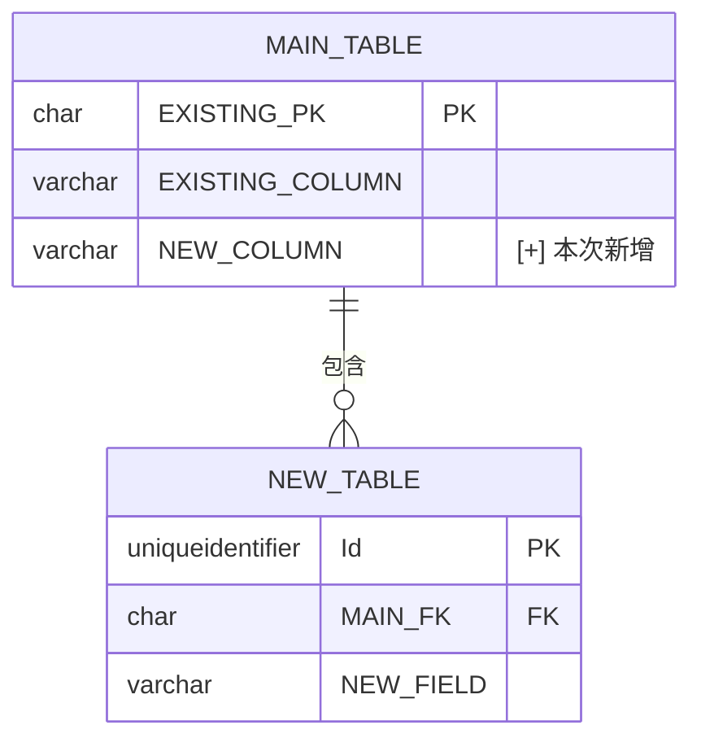

# {功能名稱} 功能調整後端規格書

> ⚠️ **技術中立原則**：本文件僅描述行為異動，**不指定**實作技術。
> **寫契約**（路由、HTTP method、狀態碼、Request/Response 欄位與型別、DB 欄位與長度、
> Migration 需求、錯誤碼與訊息字串）；**不寫實作**（程式語言型別、類別名與路徑、
> ORM 映射、設計模式、元件介面）——實際以 RD 決定為準，開發完成後回寫對齊。

<!--
  文件定位：
  - 本文件為「功能調整後端規格書」，只記錄後端 API 的異動部分
  - 前置文件：功能調整需求文件（CR-FRD）定義了 What 和 Why
  - 本文件定義：後端如何實作需求變更（只寫異動，不重複原始 BFS）
  - 搭配文件：功能調整前端規格書（CR-FFS），同次調整模式產出

  核心原則：
  1. 只寫「新增、修改、移除」的 API 端點、欄位、驗證規則
  2. 明確標記每個項目的類型：[+] 新增 / [~] 修改 / [-] 移除
  3. 標示 Breaking Change（向後不相容的變更）
  4. 不重複原始 BFS 中未變更的內容

  命名規範：
  - 文件編號：CR-BFS-{模組代號}-{序號}
  - 原始文件編號：對應的 BFS-{模組代號}-{序號}
  - 文件路徑：docs/{模組名稱}/{功能名稱}/{功能名稱}_功能調整後端規格書_{ticket}.md
    例：docs/{模組}/{功能}/{功能}_功能調整後端規格書_{票號}.md

  圖示說明：
  - [+] 新增：本次新增的項目
  - [~] 修改：本次修改的項目（需顯示原值 → 新值）
  - [-] 移除：本次移除或停用的項目
  - ⚠️ Breaking Change：此變更不向後相容，前端需同步更新
-->

---

## 文件資訊

| 項目 | 內容 |
|------|------|
| 文件編號 | CR-BFS-{模組代號}-{序號} |
| 版本 | 1.0 |
| 狀態 | 草稿 / 審查中 / 已核准 |
| 建立日期 | YYYY-MM-DD |
| 最後更新 | YYYY-MM-DD |
| 撰寫者 | {姓名} |
| 審核者 | {姓名} |
| Linear Ticket | {票號} |

### 開發狀態追蹤

| 項目 | 狀態 | 說明 |
|------|------|------|
| 開發狀態 | 🔴 未開始 / 🟡 開發中 / 🟢 已完成 | |
| 測試狀態 | 🔴 未測試 / 🟡 測試中 / 🟢 已通過 (X/Y) | |
| 程式碼審查 | 🔴 未審查 / 🟡 審查中 / 🟢 已通過 | |

---

<!-- SPEC-INDEX v1 -->
> **異動摘要**：{票號} — 影響 §{章節清單}；CVR-{起}~{迄}／CBR-{起}~{迄}

## 參照文件

| 項目 | 內容 |
|------|------|
| 原始後端規格書 | `docs/{模組名稱}/{功能名稱}/{功能名稱}後端功能規格書.md`（BFS-{模組代號}-{序號}，版本 {N.M}） |
| 原始前端規格書 | `docs/{模組名稱}/{功能名稱}/{功能名稱}前端功能規格書.md`（FFS-{模組代號}-{序號}，版本 {N.M}） |
| 功能調整需求文件 | `docs/{模組名稱}/{功能名稱}/{功能名稱}_功能調整需求文件_{ticket}.md`（CR-FRD-{模組代號}-{序號}） |
| 功能調整前端規格書 | `docs/{模組名稱}/{功能名稱}/{功能名稱}_功能調整前端規格書_{ticket}.md`（CR-FFS-{模組代號}-{序號}） |

> **重要**：本文件僅記錄「異動部分」。未列出的原始 BFS 端點、欄位、驗證規則維持不變。
<!-- ref 寫法見 references/doc-boundaries.md -->

---

## 1. 變更摘要

### 1.1 變更說明

{一段話說明本次後端變更的整體目的}

### 1.2 異動清單

> **規則**：每筆異動必須**精準連結到原始 BFS 章節編號**（如 BFS §6.4 / §7.1 VR-001），讓 reviewer / RD 可直接定位異動點。

| 類型 | 項目 | 原始 BFS 位置 | 說明 |
|------|------|--------------|------|
| [+] 新增 API | `POST /api/{module}/{entity}/{sub}` | （新增） | {說明} |
| [~] 修改 API Response | `GET /api/{module}/{entity}` | BFS §6.3 | {說明，e.g. 新增回傳欄位 X} |
| [-] 移除 API | `DELETE /api/{module}/{entity}/{id}` | BFS §6.8 | {說明，e.g. 改由軟刪除取代} |
| [~] 修改驗證規則 | VR-001 | BFS §7.1 VR-001 | {原規則 → 新規則} |
| [~] 修改既有寫入邏輯 | {哪個業務動作的寫入行為} | BFS §2.X | 必須附 §C 修改點對照；既有 mapping 逐欄明細見 `analysis/reuse-scan.yml` |

### 1.3 Breaking Change 評估與 Migration 路徑

| 異動項目 | Breaking Change | 影響範圍 | 緩解措施 | **既有資料 / 已部署客戶端 Migration 路徑** |
|---------|----------|---------|---------|-----|
| {項目} | ⚠️ 是 / ✅ 否 | {前端 / 第三方系統} | {版本共存 / 廢棄標記 / 雙寫等} | {如：1) 既有資料不回溯 2) 部署順序：後端先 3) 客戶端兼容期 X 週} |

> **規則**：標 ⚠️ Breaking Change 必須填寫 Migration 路徑，不可留空。

### 1.4 既有實作異動結論（連動 BFS §A）

> 涉及修改既有行為時必填。對應 BFS §A.1～A.3（**結論層**；
> 類別名／路徑／行號／mapping 逐欄明細一律在 `analysis/reuse-scan.yml`，不進本文件）。

| 項目 | 原始 BFS §A | 本次異動 |
|---|---|---|
| 端點現況 | §A.1 | 沿用 / 新增端點 |
| 影響範圍 | §A.2 | 同類寫入路徑幾條、本次修哪幾條、排除項與原因 |
| 既有 mapping | `reuse-scan.yml` | 修改點對照詳見本文件附錄 C |

---

## 2. 影響分析

### 2.1 受影響的原始端點

| 原始端點 | 影響類型 | 變更說明 |
|---------|---------|----------|
| `GET /api/{module}/{entity}` | 無影響 / Response 新增欄位 / 廢棄 | {說明} |
| `POST /api/{module}/{entity}` | 無影響 / Request 新增必填欄位 ⚠️ | {說明} |

### 2.2 向後相容性

- **新增端點**：✅ 向後相容（前端可選擇性使用）
- **修改 Response**：✅ 向後相容（新增欄位，原欄位不變）
- **修改 Request 必填欄位**：⚠️ **Breaking Change**（前端必須同步調整）
- **移除端點**：⚠️ **Breaking Change**（前端必須改用新端點）

---

## 3. 資料模型變更

<!--
只寫有變更的**資料表與欄位**（契約層）。未變更的資料模型請參照原始 BFS。
-->

### 3.1 資料庫變更

| 類型 | 資料表 | 欄位 | 變更說明 |
|------|--------|------|----------|
| [+] 新增欄位 | `{Schema}.{Table}` | `{COLUMN_NAME}` {TYPE}({LEN}) NOT NULL | {說明} |
| [~] 修改欄位 | `{Schema}.{Table}` | `{COLUMN_NAME}` {原型態} → {新型態} | {說明} |
| [+] 新增資料表 | `{Schema}.{NewTable}` | - | {說明} |

> **Migration 提示**：若有新增欄位，需執行 `dotnet ef migrations add {MigrationName}`

### 3.2 ER Diagram 差異

<!--
只畫「有異動」的 Entity 或新增的關聯線。
-->

### 3.3 欄位對應異動

| 類型 | DB 欄位 | Entity 屬性 | Request 屬性 | Response 屬性 | 說明 |
|------|---------|-------------|-------------|---------------|------|
| [+] | `NEW_COLUMN` | `NewProperty` | `NewProperty` | `newProperty` | {說明} |
| [~] | `EXISTING_COL` | `ExistingProp` | `ExistingProp`（原可選 → 必填 ⚠️） | `existingProp` | {說明} |
| [-] | `OLD_COLUMN` | `OldProperty` | - | - | 已廢棄，不再回傳 |

---

## 4. API 異動規格

<!--
每個異動端點都需要完整規格（同原始 BFS 的格式）。
未異動的端點請參照原始 BFS。
-->

### 4.1 新增端點

#### [+] {HTTP Method} /api/{module}/{entity}/{sub-route}

**說明：** {端點用途}

**Request：** `{RequestModel}`

| 屬性名稱 | 型態 | 必填 | 長度限制 | 說明 | 驗證規則 |
|----------|------|------|----------|------|----------|
| {PropertyName} | string | O | 50 | {說明} | CVR-001 |
| {PropertyName} | 唯一識別碼 | O | - | {說明} | CVR-002 |

<!-- Request JSON 範例（僅巢狀／批量結構需要）見 templates/examples/cr-examples.md -->

**Response：** `{ResponseModel}`（欄位表同 Request，或見對應原始 BFS 端點欄位表）

回應：201 + `{ResponseModel}`

<!-- 完整 JSON 範例見 templates/examples/cr-examples.md -->

**錯誤回應：**

| HTTP 狀態碼 | 情境 | 說明 |
|------------|------|------|
| 400 | 驗證失敗 | 欄位驗證錯誤 |
| 404 | 資料不存在 | {Entity} 不存在 |

---

### 4.2 修改端點

#### [~] {HTTP Method} /api/{module}/{entity}/{id}

**說明：** {說明原端點，以及本次變更內容}

**Request 變更（`{RequestModel}`）：**

| 屬性名稱 | 類型 | 變更 | 說明 |
|----------|------|------|------|
| `{NewProperty}` | string | [+] 新增，必填 | {說明} |
| `{ModifiedProperty}` | string? → string | [~] 可選 → 必填 ⚠️ | {說明} |

<!-- 完整 Request（含原有欄位）JSON 範例見 templates/examples/cr-examples.md -->

**Response 變更（`{ResponseModel}`）：**

| 屬性名稱 | 類型 | 變更 | 說明 |
|----------|------|------|------|
| `{newResponseField}` | string | [+] 新增 | {說明} |

<!-- 完整 Response（含原有欄位）JSON 範例見 templates/examples/cr-examples.md -->

---

### 4.3 移除端點

#### [-] {HTTP Method} /api/{module}/{entity}/{old-route}

**說明：** 本端點已移除。

**替代方案：** 請改用 `{HTTP Method} /api/{module}/{entity}/{new-route}`

---

## 5. 驗證規則異動

<!--
只寫新增或修改的 VR/BR。未異動的驗證規則請參照原始 BFS。
-->

### 5.1 輸入驗證

| 規則編號 | 類型 | 欄位 | 驗證類型 | 規則描述 | 錯誤訊息 |
|----------|------|------|----------|----------|----------|
| CVR-001 | [+] 新增 | {欄位} | 必填 | 不可為空 | `{欄位名稱} 為必填欄位` |
| CVR-002 | [~] 修改 | {欄位} | 長度 | {原N} → {新N} | `{欄位名稱} 長度不可超過 {新N} 字元` |

### 5.2 業務驗證

| 規則編號 | 類型 | 規則名稱 | 規則描述 | 驗證時機 | 錯誤訊息 |
|----------|------|----------|----------|----------|----------|
| CBR-001 | [+] 新增 | {規則名稱} | {規則描述} | 新增/修改 | `{錯誤訊息}` |

---

## 6. 外部服務整合異動

<!--
只寫本次有新增或修改的外部服務整合。未異動的外部服務請參照原始 BFS §11。
若本次異動不涉及外部服務，整章填「N/A」。
-->

| 類型 | 服務名稱 | 異動說明 |
|------|---------|---------|
| [+] 新增 | {服務名稱，如 SendGrid} | {說明新增用途與整合方式、呼叫時機} |
| [~] 修改 | {服務名稱} | {說明什麼改變了（呼叫時機 / 資料格式 / 錯誤處理策略）} |
| [-] 移除 | {服務名稱} | {說明為何移除} |

---

## 7. 讀寫操作異動

> 描述本次新增/修改的「讀寫操作能力」（做什麼、輸入輸出、對應端點），**不指定**實作技術——設計模式、類別命名、資料存取元件由 RD 在開發階段決定。

### 7.1 新增操作

| 操作 | 類型 | 輸入 | 輸出 | 對應端點 | 說明 |
|------|------|------|------|----------|------|
| {操作名稱} | 命令（寫入） | {輸入資料} | {寫入結果} | §4.1 {端點} | {說明} |
| {操作名稱} | 查詢（讀取） | {查詢條件} | {回傳資料} | §4.1 {端點} | {說明} |

### 7.2 修改操作

| 操作 | 原行為 | 變更後行為 | 對應端點 |
|------|--------|------------|----------|
| {操作名稱} | {原邏輯} | {新邏輯} | §4.2 {端點} |

### 7.3 新增資料存取需求

> 描述操作需要的「資料存取能力」（語意層），非具體方法簽章。

| 存取需求 | 用途 | 說明 |
|---------|------|------|
| 依 {條件} 查詢 | {供哪個操作使用} | {說明} |
| 唯一性檢查（{欄位}） | {驗證規則 CBR-XX 使用} | 排除已刪除資料 |

---

## 8. 測試案例補充

### 8.1 新增端點測試

> 以「測試情境」描述，不綁定測試框架或類別命名（由 RD 決定）。

| 編號 | 對應端點 | 測試情境 | 前置條件 | 預期結果 |
|------|---------|---------|---------|----------|
| CUT-001 | §4.1 {端點} | 有效資料新增 | {前置} | 成功，回傳 {結果} |
| CUT-002 | §4.1 {端點} | {例外情境} | {前置} | {錯誤碼 + 訊息} |

### 8.2 修改端點迴歸測試

| 編號 | 對應端點 | 測試情境 | 測試目的 |
|------|---------|---------|----------|
| CRT-001 | §4.2 {端點} | 以原有資料呼叫修改後端點 | 確認原有行為不受本次異動影響 |

---

## 9. 驗收標準

### 9.1 功能驗收

| 編號 | 驗收項目 | 驗收條件 | 通過 |
|------|----------|----------|------|
| CFA-01 | 新增端點 | 新端點可正常回應，格式符合規格 | [ ] |
| CFA-02 | 修改端點 | 修改後端點新舊欄位均正確回傳 | [ ] |

### 9.2 向後相容性驗收

| 編號 | 驗收項目 | 驗收條件 | 通過 |
|------|----------|----------|------|
| CBC-01 | 原有端點 | 未異動的端點 Response 格式一致 | [ ] |
| CBC-02 | 建置成功 | `dotnet build` 無錯誤 | [ ] |
| CBC-03 | 測試通過 | `dotnet test` 全部通過 | [ ] |

---

## 附錄

### A. 相關文件

| 文件 | 說明 |
|------|------|
| [原始後端功能規格書](../../{模組名稱}/{功能名稱}/{功能名稱}後端功能規格書.md) | 完整原始規格 |
| [功能調整前端規格書](./{功能名稱}_功能調整前端規格書_{ticket}.md) | 對應前端規格 |
| [功能調整需求文件](./{功能名稱}_功能調整需求文件_{ticket}.md) | 業務需求 |

---

<!-- CHANGELOG -->
| 版本 | Ticket | 日期 | 修改摘要 |
|------|--------|------|---------|
| v1.0 | {票號} | {建立日期} | 建立文件 |
<!-- /CHANGELOG -->
