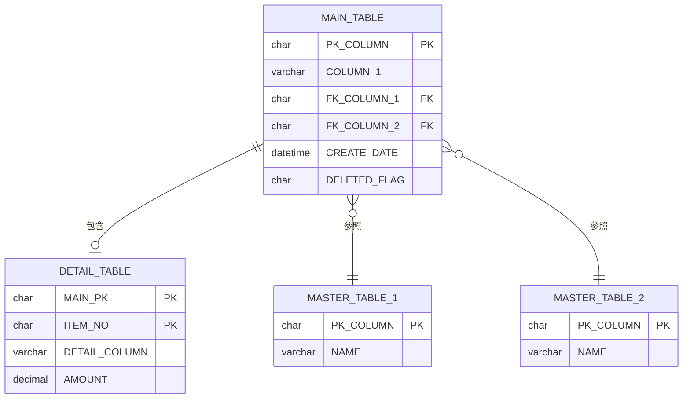
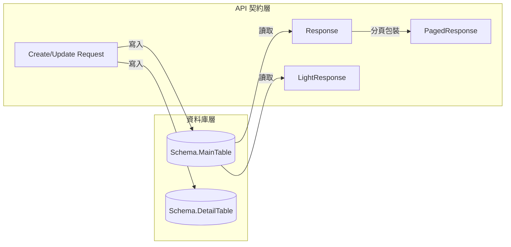

> 本檔是 `templates/bfs.md` 的範例集，**按需讀取**：撰寫該章且不確定寫法時才讀。

# BFS §5 資料模型 — 完整範例

對應 `templates/bfs.md` §5.1、§5.2、§5.3、§5.5 的完整範例（模板內已改為骨架＋指路註解）。

## §5.1 資料庫關聯圖 (ER Diagram) 完整範例

<!--
說明：使用 Mermaid erDiagram 展示資料表之間的關聯關係
-->

> **註**：請將 `MAIN_TABLE`、`DETAIL_TABLE` 等替換為實際資料表名稱

## §5.2（已移除）

> Entity 類別關聯圖已從 BFS 移除——ORM 映射關係屬實作產物，
> 由 RD 決定；表間關聯看 §5.1 ER 圖即足夠。本節保留標題僅為說明，不需撰寫。

## §5.3 資料轉換流程 完整範例

<!--
說明：展示從資料庫到 API Request/Response 的契約鏈（Entity／ORM 映射層是實作，不畫）
-->

> **註**：請將圖中名稱替換為實際的 Schema、Table、Request／Response 名稱

**欄位對應總覽：**

<!--
說明：四欄對應表，展示從 DB 到 API 的完整欄位映射鏈
- DB 欄位：資料庫實際欄位名（UPPER_SNAKE_CASE）
- Request 屬性：API 請求欄位名（語義化）
- Response 屬性：JSON 輸出欄位名（camelCase）

> ⚠️ 已**移除「Entity 屬性」欄**：那是 ORM 實作映射，由 RD 決定。
> 本表只保留契約鏈：DB 欄位 → API Request → API Response。

命名規則：
- Request 屬性：語義化命名，如 CUST_NO → VendorId（參照 CreatePurchaseOrderRequest 慣例）
- Response 屬性：語義化 + 巢狀物件，如 CUST_NO → vendor { vendorId, vendorName }（參照 GetLightVendorResponse）
- 日期欄位：語義化命名，如 DATE1 → receiptDate / purchaseDate（非 date）
- 修改時間：MOD_DATE/UTIME → lastModifiedTime（非 lastModifiedDate，參照 GetPurchaseOrderResponse）
- 沖轉帶入欄位：Request 標示「（沖轉帶入）」，表示由系統自動填入，非使用者輸入
-->

#### 表頭欄位對應

| DB 欄位 | Request 屬性 | Response 屬性 | 說明 |
|---------|-------------|---------------|------|
| `PK_COLUMN` | （自動產生） | `pkId` | 主鍵（語義化） |
| `CUST_NO` | `VendorId` | `vendor.vendorId` + `vendor.vendorName` | 廠商 → 巢狀物件 |
| `DATE1` | `ReceiptDate` | `receiptDate` | 收貨日期（舊欄名無語意） |
| `NAME` | `ItemName` | `itemName` | 名稱（語義化） |

#### 明細欄位對應

| DB 欄位 | Request 屬性 | Response 屬性 | 說明 |
|---------|-------------|---------------|------|
| `MAIN_PK` | （自動帶入） | `mainId` | 主檔 FK |
| `ITEM_NO` | （自動編號） | `itemNo` | 項次 |
| `QTY1` | `Quantity` | `quantity` | 數量 |
| `AMT1` | `UnitPrice` | `unitPrice` | 單價 |
| `AMT2` | （自動計算） | `amount` | 金額 = 單價 × 數量 |

## §5.5 資料契約定義 寫法補充

<!--
本節是**契約**，不是 Entity 實作：
- 欄位語意：用中文業務語意（廠商編號、收貨日期），不用程式屬性名
- DB 欄位：資料庫實際欄位名（UPPER_SNAKE_CASE）
- 型別：中性寫法 文字(N)／整數／數值(p,s)／日期／日期時間／唯一識別碼／是否
  ——不寫 Guid／string?／DateTime?／ICollection<>，那是程式語言型別，由 RD 決定
- 必填：以 DB 可空性與業務規則為準
- 舊表的無意義欄位名（DATE1、AMT2、TYPE1）在「欄位語意」欄寫清楚它實際是什麼
-->

| 欄位語意 | DB 欄位 | 型別 | 必填 | 說明 |
|---------|---------|------|------|------|
| 系統主鍵 | `PK_COLUMN` | 唯一識別碼 | O | — |
| 廠商 | `CUST_NO` | 文字(10) | O | 參照 `廠商主檔` |
| 收貨日期 | `DATE1` | 日期 | O | 舊表欄位名無語意，實為收貨日 |
| 單價 | `AMT1` | 數值(18,4) | O | — |
| 金額 | `AMT2` | 數值(18,4) | O | 系統計算：單價 × 數量 |

> **API 欄位命名**（Request/Response）是**契約**，見本檔「欄位對應總覽」與 `bfs-api.md`；
> **Entity 屬性怎麼命名、要不要下 ORM 映射屬性，是實作**，規格書不寫。
