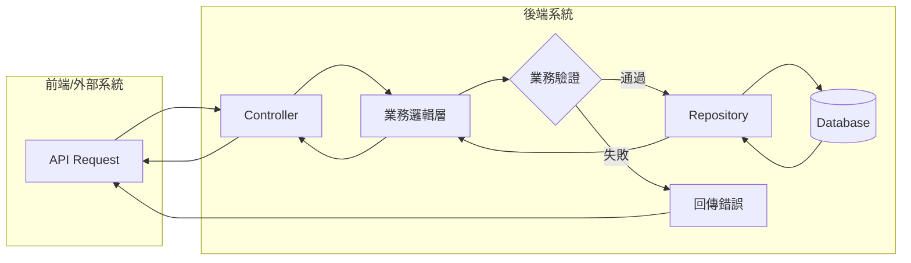
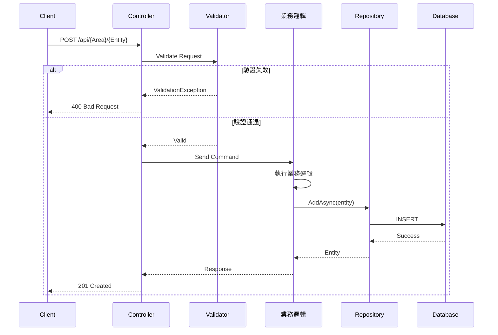
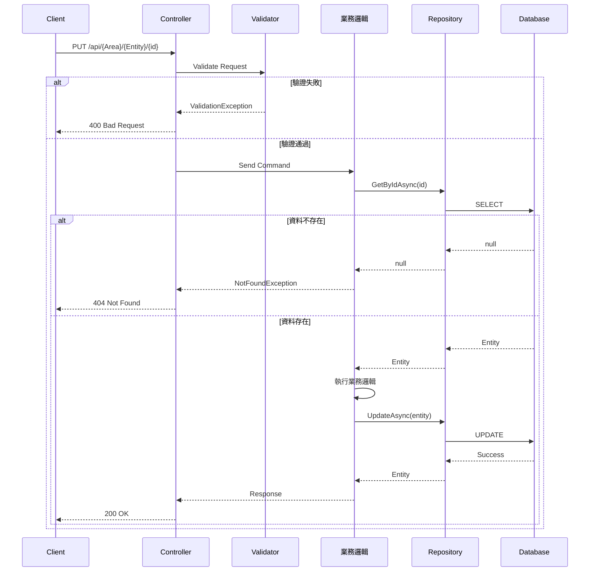
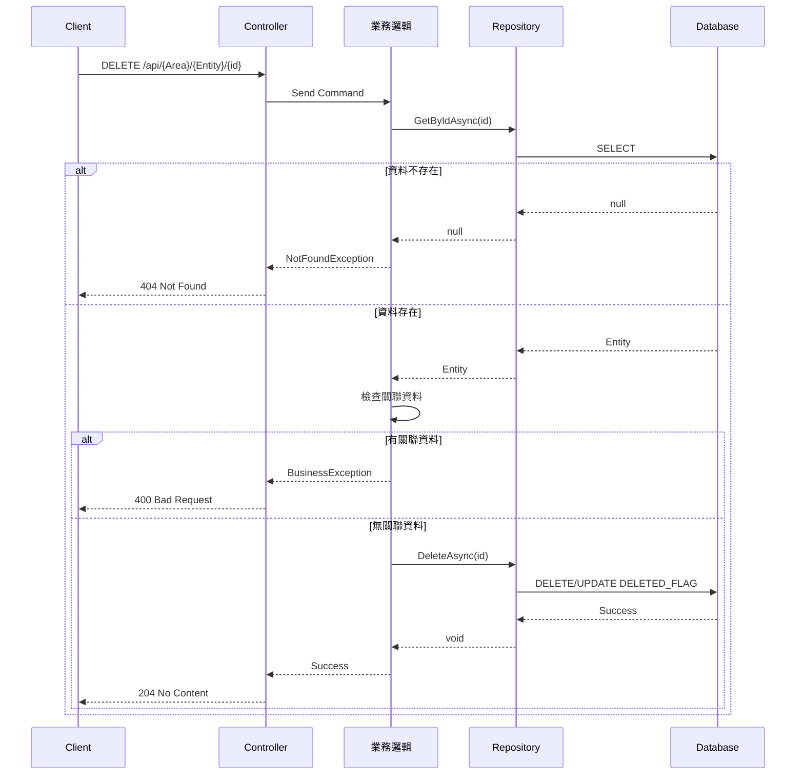
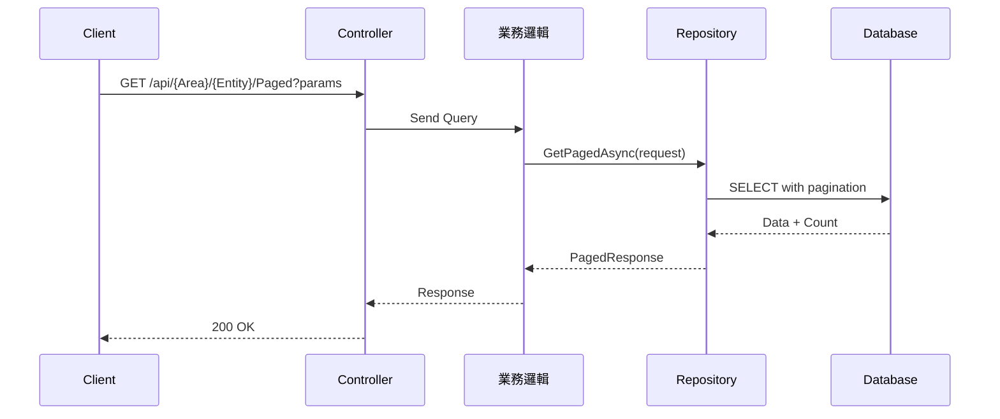
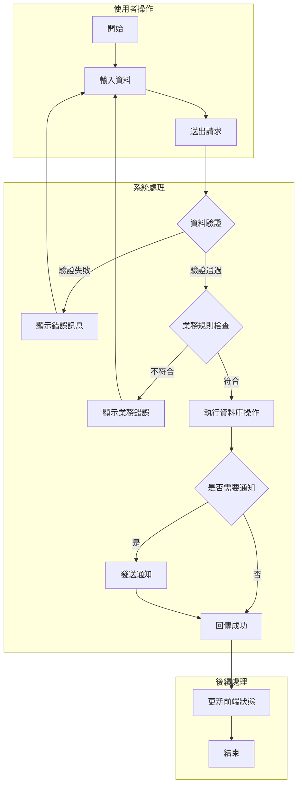
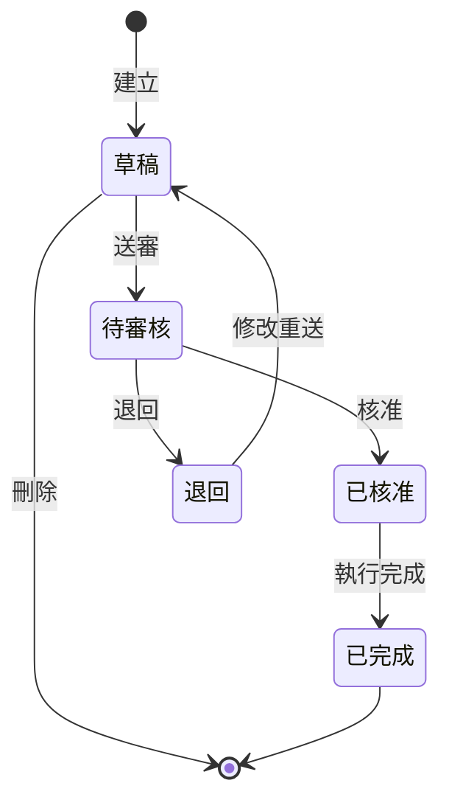
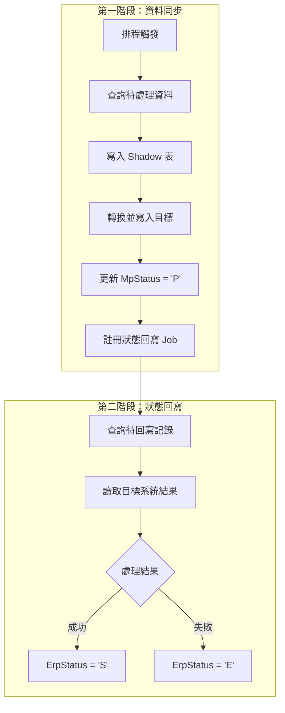

> 本檔是 `templates/bfs.md` 的範例集，**按需讀取**：撰寫該章且不確定寫法時才讀。

# BFS §3／§4 流程圖 — 完整範例

對應 `templates/bfs.md` §3.1～§3.5、§4.1、§4.2、§4.3 的完整範例（模板內已改為骨架＋指路註解）。

## §3.1 整體資料流程圖 完整範例

## §3.2 新增資料流程 完整範例

## §3.3 修改資料流程 完整範例

## §3.4 刪除資料流程 完整範例

## §3.5 查詢資料流程 完整範例

## §4.1 主要業務流程 完整範例

## §4.2 狀態流程圖 完整範例

<!--
說明：如果功能涉及狀態變化，狀態定義以 §2.4 表為準
-->

## §4.3 排程同步流程 完整範例

