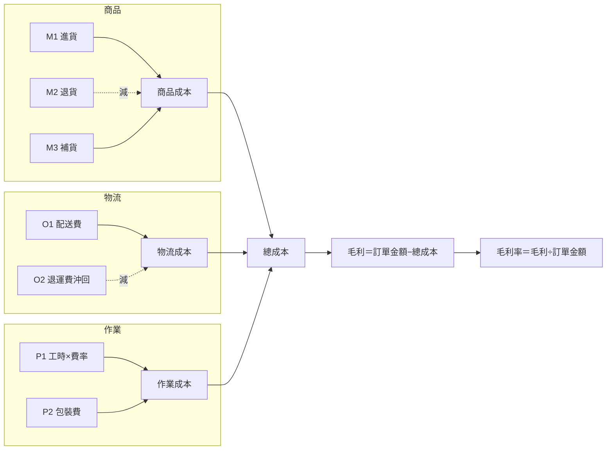
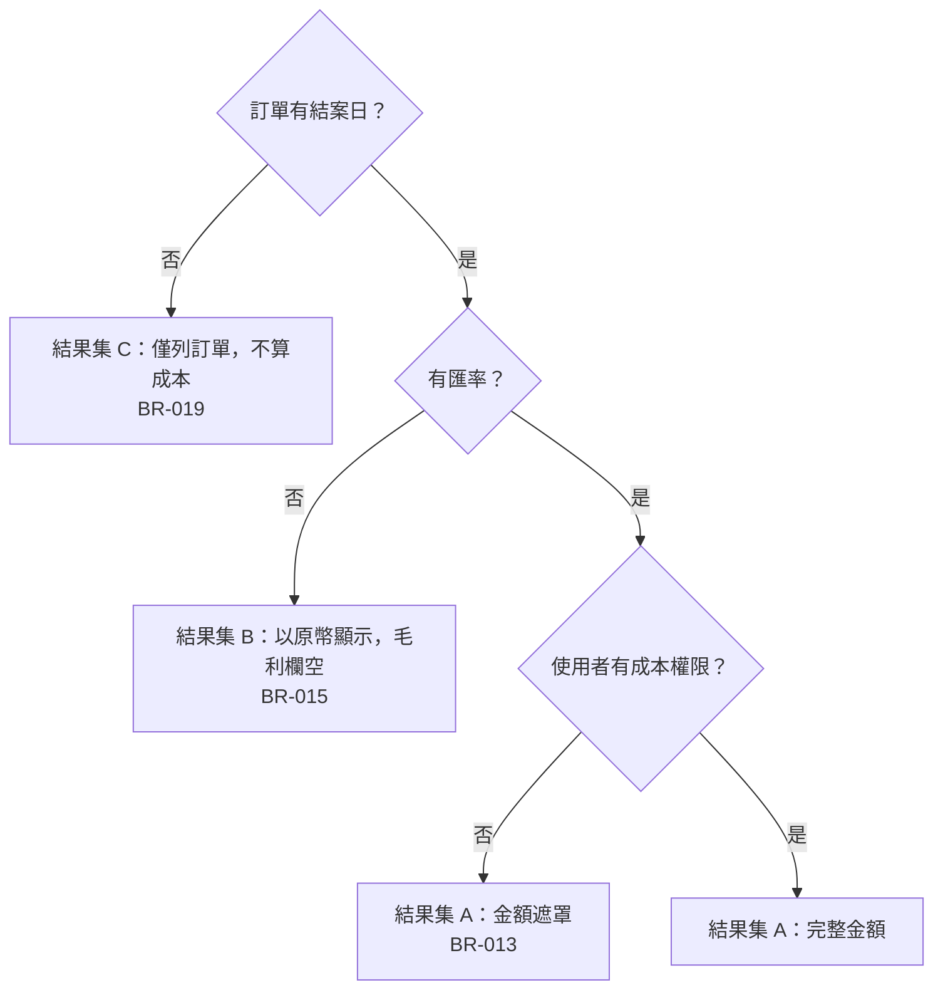

# 圖與算例範例集

> 按需讀取。對應規範：`references/spec-dedup-and-budget.md`「必畫圖清單」與「算例」。
> 原則一句話：**關係用圖、數字用算例**——表格表達順序／關係／條件超過 15 列，讀者要自己心算，就該改圖。
> 下面每個範例都是精簡版，實際文件依功能規模擴充；數字一律取自具代表性的 Staging 資料並註來源。

## 1. 匯流圖（BFS §2.5：來源→歸集桶→結果）

用於成本歸集、金額合計、指標推導這類「多來源加減後匯總」的計算。純表格寫 `材料＝M1−M2＋M3＋M4` 看不出流向，圖一眼看完。

規則：減項用虛線並標「減」；每個桶對應 §2.5 精度表一列；圖上的節點名要能在算例表的「輸入」欄找到。

## 2. 決策樹（BFS §7／§8、SAD §6.6：規則有互斥或優先序時）

用於「先驗什麼、再驗什麼」「A 優先於 B」「三種結果集互斥」。表列超過 8 條又有順序，讀者會漏看優先序。

規則：菱形只放判斷條件，葉節點標對應 BR／VR 編號；表格只補圖放不下的錯誤訊息字串。BR-015 優先於 BR-019 這種優先序，直接由樹的層次表達，不另寫文字。

## 3. 算例表（公式型 BR／VR 必附：輸入→輸出）

| 情境 | 輸入 | 計算 | 輸出 | 資料來源 |
|------|------|------|------|---------|
| 正常 | 訂單金額 4,389,000；商品 1,205,300；物流 680,000；作業 1,287,950 | 總成本 3,173,250；毛利 4,389,000−3,173,250 | 毛利 1,215,750、毛利率 27.7% | Staging，訂單 SO-2025-0412 |
| 負毛利 | 訂單金額 980,000；總成本 1,124,200 | 980,000−1,124,200 | 毛利 −144,200、毛利率 −14.7%，兩欄紅字；總成本% 114.7 轉紅 | Staging，訂單 SO-2025-0388 |
| 缺匯率（BR-015） | 幣別 USD、匯率 NULL | 不換算 | 以原幣顯示，毛利欄空、備註「缺匯率」 | Staging，訂單 SO-2025-1103 |

規則：每條公式至少一組正常算例；有邊界規則（缺值、零、負數、上限）者各補一組；數字要能在來源單據重算出來。

## 4. 口徑對照（同一張單據、多種口徑、各一個數字）

「口徑」「版本」這類詞不給對照表，讀者永遠不知道差在哪。

| 口徑 | 商品成本 | 作業成本 | 毛利率 | 差異來源 |
|------|---------|---------|--------|---------|
| 舊系統報表 | 1,205,300 | 1,301,120 | 27.4% | 作業含包裝費，工時費率取當月 |
| 現行 Web 版 | 1,205,300 | — | 算不出 | 無成本計算服務 |
| 本規格 §2.5 | 1,205,300 | 1,287,950 | 27.7% | 工時費率取訂單日；包裝費另桶 |

規則：至少三列（舊系統、現況、本規格）；「差異來源」欄寫規則差在哪，不寫「口徑不同」。同一張單據（註單號與來源）跑完三口徑。

## 5. 遮罩前後（權限／遮罩類規則）

| 欄位 | 有成本權限 | 無成本權限（BR-013） |
|------|-----------|-------------------|
| 訂單金額 | 4,389,000 | 4,389,000 |
| 商品成本 | 1,205,300 | — |
| 總成本 | 3,173,250 | — |
| 毛利率 | 27.7% | — |
| 匯出 Excel | 全欄 | 遮罩欄整欄不輸出 |

規則：逐欄列「前／後」，遮罩值用實際會顯示的字元（`—`、`***`）；匯出、列印、API 回應若行為不同各補一列。

## 六、TD 技術決策留置的三樣寫法

好的三樣讓 Dev 不用回頭問；空的三樣等於沒留置。

| 欄 | ❌ 空 | ✅ 可用 |
|----|------|--------|
| 約束 | 要能撐多實例 | 兩個 API 實例同時服務同一租戶時，成本快照讀到的版本必須一致；快照過期 ≤5 分鐘；快照不可用時查詢降級為即時計算並回 `costCalibrationVersion=live` |
| 現況 | 專案有用快取 | 應用層 20+ 處用程序內快取（grep 快取相關 API 可得），無跨實例快取；同類報表端點查詢走即時計算 |
| 陷阱 | 注意並發 | 程序內快取在多實例下不共享，沿用會讓兩台算出不同毛利；口徑版本欄是定長字元，比對前要 trim |

`decisions.md` 一列：`| TD-002 | 成本快照放哪裡、怎麼失效 | 待實作定案 | — | 約束：…｜現況：…｜陷阱：…｜候選（非指定）：分散式快取或暫存表 | Dev | 實作 | {日期} |`
