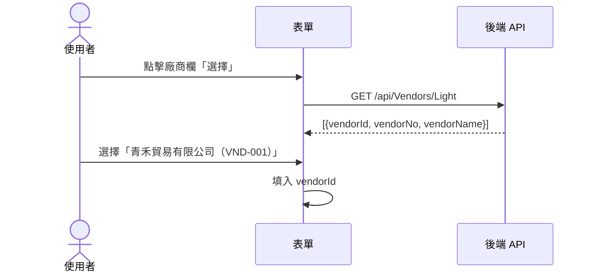
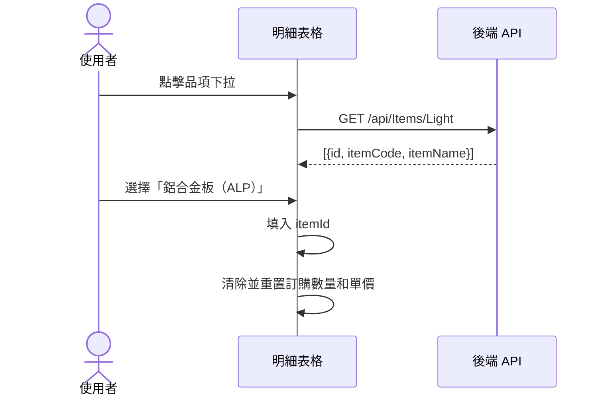

> 本檔是 `templates/ffs.md` 的範例集，**按需讀取**：撰寫該章且不確定寫法時才讀。

# FFS §2／§5／§6／§8／附錄 — 完整範例

對應 `templates/ffs.md` §2.2、§5.0、§5.1、§6.1、§6.2、§6.3、§6.4、§8.2、附錄 A~D，用「採購單（PurchaseOrder）」情境具現化的完整範例
（模板內已改為 `{占位符}` 骨架＋指路註解）。撰寫時請替換為對應功能的真實資料。

## §2.2.1 列表頁面（{功能名稱}List）完整範例

> **User Story**：身為採購人員，我需要查詢特定廠商和日期區間的採購單列表，
> 以便快速掌握採購進度。點擊「新增」可跳至建立頁面。

| 項目 | 內容 |
|------|------|
| 用途 | 依廠商、訂購日期查詢採購單，並可從清單進入新增／編輯 |
| 進入路徑 | 主選單 → 採購管理 → 採購單 |
| 主要使用者 | 採購人員 |

**區塊清單**（依資訊層級由上而下）

| 區塊 | 用途 | 內含欄位或操作 |
|------|------|---------------|
| 查詢條件 | 篩選要顯示的採購單 | 查詢條件欄位群 + 查詢／清除 |
| 查詢結果 | 顯示符合條件的採購單清單 | 查詢結果欄位群 + 新增／匯出／編輯／刪除／核准 |

**查詢條件：**

| 欄位 | 輸入語意 | 必填 | 預設值 | 來源 | 條件關係 |
|------|---------|------|--------|------|---------|
| 廠商 | 單選（可搜尋） | 否 | 全部 | 端點：`/api/Vendors/Light` | AND |
| 訂購日期起迄 | 日期範圍 | 否 | 當月第一天至今日 | 手動輸入 | AND |
| 關鍵字 | 文字（單行） | 否 | 空白 | 手動輸入（模糊比對採購單號） | AND |

**查詢結果：**

| 欄位 | 資料來源 | 顯示格式 | 對齊 | 可排序 | 重要性 |
|------|---------|---------|------|-------|-------|
| 採購單號 | `orderNo` | 原文（格式 PO-YYYYMMDD-NNN） | 置左 | 是 | 主要 |
| 廠商 | `vendor.vendorName` | 原文 | 置左 | 否 | 主要 |
| 訂購日期 | `orderDate` | 日期 yyyy/MM/dd | 置中 | 是 | 主要 |
| 合計金額 | `totalAmount` | 千分位 | 置右 | 是 | 次要 |
| 狀態 | `statusName` | 代碼對應中文（Draft→草稿、Approved→已核准） | 置中 | 否 | 主要 |

**預設排序**：訂購日期 降冪

> 重要性分布說明：單號／廠商／訂購日期／狀態是使用者掃清單時的定位依據，標「主要」；
> 合計金額屬事後核對用途，標「次要」。**不要整欄全填「主要」**——全部都主要等於沒有分級，
> 前端無從決定摺疊順序。

**操作**

| 操作 | 觸發條件 | 執行後行為 | 權限 |
|------|---------|-----------|------|
| 查詢 | 點擊查詢按鈕 | 依條件查詢資料並顯示於清單 | — |
| 清除 | 點擊清除按鈕 | 還原所有查詢條件為預設值 | — |
| 新增 | 點擊新增按鈕 | 開啟新增表單 | 需有新增權限 |
| 編輯 | 點擊該列編輯操作（僅草稿） | 開啟編輯表單並載入既有資料 | 需有編輯權限 |
| 刪除 | 點擊該列刪除操作（僅草稿） | 二次確認後刪除該筆，成功後清單移除該筆 | 需有刪除權限 |
| 核准 | 點擊該列核准操作（僅草稿） | 二次確認後狀態轉為已核准 | 需有核准權限 |
| 匯出 | 點擊匯出按鈕 | 依目前查詢條件與排序匯出試算表檔；欄位同查詢結果欄位群，檔名 `採購單_{查詢起日}-{查詢迄日}` | — |

> 本節定義畫面要承載什麼、怎麼運作；版面配置由前端依同類既有頁面骨架決定。

## §2.2.2 新增/編輯頁面（{功能名稱}Form）完整範例

> **User Story**：身為採購人員，我要建立採購單，選擇廠商（青禾貿易有限公司）
> 和請購單（PR-20240315-001），新增鋁合金板明細（數量 150 片，單價 12.6667 元，顯示 12.67），
> 儲存後系統回算小計 1,900.01。

| 項目 | 內容 |
|------|------|
| 用途 | 建立或修改採購單，包含表頭與採購明細 |
| 進入路徑 | 採購單列表 → 新增按鈕 / 該列編輯操作 |
| 主要使用者 | 採購人員 |

**區塊清單**（依資訊層級由上而下）

| 區塊 | 用途 | 內含欄位或操作 |
|------|------|---------------|
| 基本資訊 | 記錄供應商、訂購日期、對應請購單、備註 | 新增表單欄位群 |
| 採購明細 | 記錄各筆品項、數量、單價 | 新增表單欄位群（明細） |
| 合計 | 顯示明細加總金額 | 合計金額 |

**新增表單：**

| 欄位 | 輸入語意 | 必填 | 預設值 | 來源 | 長度上限 | 所屬區塊 |
|------|---------|------|--------|------|---------|---------|
| 供應商 | 開窗選取（來源：廠商主檔） | 是 | 空白 | 端點：`/api/Vendors/Light` | — | 基本資訊 |
| 訂購日期 | 日期 | 是 | 今日 | 手動輸入 | — | 基本資訊 |
| 請購單 | 開窗選取（來源：請購單主檔） | 是 | 空白 | 端點：`/api/Requisitions/Light` | — | 基本資訊 |
| 備註 | 文字（多行） | 否 | 空白 | 手動輸入 | 100 中文字 | 基本資訊 |
| 明細：品項 | 單選（可搜尋） | 是 | 空白 | 端點：`/api/Items/Light` | — | 採購明細 |
| 明細：訂購數量 | 數值（整數） | 是 | 空白 | 手動輸入 | — | 採購明細 |
| 明細：單價 | 數值（小數 2 位） | 是 | 空白 | 手動輸入 | — | 採購明細 |
| 明細：明細小計 | 唯讀顯示 | - | - | `items[].amount`（後端回傳；編輯中的即時重算見 §5.2） | — | 採購明細 |
| 合計金額 | 唯讀顯示 | - | - | `totalAmount`（後端回傳；編輯中的即時重算見 §5.2） | — | 合計 |

> 小計與合計後端 Response 有回（見 §6.3 `items[].amount`、`totalAmount`），
> 因此來源填 Response 欄位名，**不是**「前端計算」——後端才是這兩個值的權威。
> 表單編輯過程中的即時重算是 UX 預覽，屬 §5.2，儲存後一律以後端回傳值為準。
>
> 另兩個容易寫錯的地方：
> - **驗證條件不寫在「來源」欄**（「不可選未來日期」「大於 0」）——驗證 owner 是 §4，
>   寫兩份會漂移。來源欄只回答「這個值從哪來」。
> - **選項來自主檔（Light 端點）的欄位，輸入語意是「單選（可搜尋）」不是「單選（固定清單）」**。
>   「固定清單」專指程式內建的固定值（Enum），寫錯會讓 system-analysis 漏推導 Light API 需求。

**編輯表單差異：**

> 只寫與新增的差異，其餘同新增表單。

| 欄位 | 與新增的差異 | 條件 |
|------|-------------|------|
| 供應商 | 唯讀 | 狀態為「已核准」時 |
| 請購單 | 唯讀 | 狀態為「已核准」時 |
| 明細（全部欄位） | 唯讀，不可增刪 | 狀態為「已核准」時 |

**操作**

| 操作 | 觸發條件 | 執行後行為 | 權限 |
|------|---------|-----------|------|
| 新增明細 | 點擊新增明細按鈕 | 採購明細表新增一空白列 | 需有編輯權限 |
| 刪除明細 | 點擊該明細列刪除操作 | 移除該筆明細，重新計算合計金額 | 需有編輯權限 |
| 儲存 | 點擊儲存按鈕 | 執行表單驗證後送出，成功後導回列表頁 | 需有新增／編輯權限 |
| 取消 | 點擊取消按鈕 | 返回列表頁；未儲存變更需二次確認 | — |

> 本節定義畫面要承載什麼、怎麼運作；版面配置由前端依同類既有頁面骨架決定。

## §5.0 連動欄位程式碼層對照表 完整範例

| 觸發欄位 | 觸發事件 | 影響欄位 / 行為 | 規則 |
|---|---|---|---|
| `vendorId` | onChange | 重置 `itemId`、`unitPrice` | 廠商變更後重新選品項 |
| `quantity` | onChange | 即時計算 `amount = quantity × unitPrice` | 千分位顯示 |
| `category` | onChange（Excel 解析時） | 觸發 API: `GET Items/ByCategories` | 結果存入記憶體待展開 |

## §5.1.1 廠商選擇連動 完整範例

廠商選擇不自動帶入其他欄位（僅確認廠商有效），前端在選擇器開窗時呼叫 Light API：



> **連動說明**：廠商選擇後不帶入其他欄位（此為示範，若你的功能有連動，請在下方連動欄位表說明）

| 觸發欄位 | 連動欄位 | 連動規則 |
| --- | --- | --- |
| 廠商 | （無連動） | 僅記錄 vendorId，不觸發其他欄位自動填入 |

## §5.1.2 品項選擇連動 完整範例



| 觸發欄位 | 連動欄位 | 連動規則 |
| --- | --- | --- |
| 品項 | 訂購數量 | 重置為空（不同品項單位不同） |
| 品項 | 單價 | 重置為空（不預帶建議價） |

## §6.1 API 端點對應 完整範例

| 操作 | HTTP 方法 | API 端點 | 前端觸發時機 | 對應 US |
| --- | --- | --- | --- | --- |
| 載入列表 | GET | `/api/PurchaseOrders/Paged` | 頁面載入、搜尋條件變更 | US-01 |
| 取得單筆 | GET | `/api/PurchaseOrders/{id}` | 點擊「編輯」或「查看」 | US-02 |
| 新增 | POST | `/api/PurchaseOrders` | 表單儲存（新增模式） | US-03 |
| 修改 | PUT | `/api/PurchaseOrders/{id}` | 表單儲存（編輯模式） | US-04 |
| 刪除 | DELETE | `/api/PurchaseOrders/{id}` | 確認刪除對話框按下確認 | US-05 |
| 廠商選擇器 | GET | `/api/Vendors/Light` | 廠商欄位開窗選取時 | — |
| 品項選擇器 | GET | `/api/Items/Light` | 明細行品項下拉開啟時 | — |

## §6.2 Request 格式 完整範例

#### 新增/修改 Request

```json
{
  "{dateField}": "2024-01-15",
  "customerId": "guid",
  "employeeId": "guid",
  "remark": "備註說明",
  "items": [
    {
      "productId": "guid",
      "quantity": 10,
      "unitPrice": 100
    }
  ]
}
```

#### 分頁查詢 Request

```
GET /api/{area}/{entity}/paged?
  dateFrom=2024-01-01&
  dateTo=2024-01-31&
  customerId=guid&
  keywords=關鍵字&
  pageNumber=1&
  pageSize=20&
  sortBy=date&
  sortDirection=desc
```

## §6.3 Response 格式 完整範例

#### 成功回應

```json
{
  "id": "guid",
  "{entityNo}": "SO-20240115-001",
  "{dateField}": "2024-01-15",
  "customer": {
    "customerId": "guid",
    "customerName": "客戶名稱"
  },
  "items": [
    {
      "itemId": "guid",
      "product": {
        "productId": "guid",
        "productName": "品項名稱"
      },
      "quantity": 10,
      "unitPrice": 100,
      "amount": 1000
    }
  ],
  "totalAmount": 1000
}
```

## §6.4 i18n key 對照 完整範例

| 後端錯誤訊息（BFS §7 / §8） | 前端 i18n key | 顯示位置 |
| --- | --- | --- |
| `產品類別代碼長度不可超過 20 字元` | `validation.dieType.maxLength` | 欄位下紅字 |
| `訂單編號為必填欄位` | `validation.salesOrderId.required` | 欄位下紅字 |
| `品項 {0} 已存在於採購單中` | `error.item.duplicate` | 頂部錯誤條 |

## §8.2 新增功能驗收 完整範例

| 編號 | 驗收項目 | 預期結果 | 優先級 | 對應 US |
| --- | --- | --- | --- | --- |
| TC-C-001 | 點擊「新增」，表單開啟 | 廠商、請購單欄為空，訂購日期預設今日，無單號欄（系統產生） | 高 | US-03 |
| TC-C-002 | 廠商欄未填，點擊儲存 | 廠商欄下方顯示「請選擇供應商」，表單不送出 | 高 | US-03 |
| TC-C-003 | 明細訂購數量填 0，點擊儲存 | 數量欄顯示「訂購數量必須大於 0」，表單不送出 | 高 | US-03 |
| TC-C-004 | 填入廠商 VND-001、請購單 PR-20240315-001、鋁合金板 150 片 12.6667 元，點擊儲存 | 呼叫 POST API 成功，顯示「新增成功」，導回列表頁 | 高 | US-03 |
| TC-C-005 | 儲存後確認列表頁 | 新建的採購單出現在列表，狀態欄顯示「草稿」 | 高 | US-03 |
| TC-C-006 | 明細小計顯示 | 數量 150 × 單價 12.6667，小計欄顯示「1,900.01」（四捨五入 2 位，同 BFS §7 規則） | 高 | US-03 |

## 附錄 A：輸入語意對照

> 完整對照見 `references/screen-spec-format.md` §輸入語意（取代元件名）

| 寫這個 | 不要寫 |
|--------|-------|
| 單選（可搜尋） | 可搜尋的下拉選單元件 |
| 單選（固定清單） | Radio、Select |
| 多筆選取 | MultiSelect、Checkbox Group |
| 日期 / 日期範圍 | DatePicker、q-date |
| 數值（整數／小數 N 位） | NumberInput |
| 文字（單行／多行） | Input、Textarea |
| 開關（是／否） | Switch、Toggle |
| 唯讀顯示 | disabled Input、Text |
| 開窗選取（來源：{主檔名稱}） | Dialog + Table |

## 附錄 B：錯誤訊息格式

```json
{
  "type": "https://tools.ietf.org/html/rfc7231#section-6.5.1",
  "title": "Bad Request",
  "status": 400,
  "errors": {
    "CustomerId": ["請選擇客戶"],
    "Items": ["請至少新增一筆明細"]
  }
}
```

## 附錄 C：鍵盤操作支援

| 快捷鍵 | 功能 |
| --- | --- |
| Enter | 表格內移至下一欄 |
| Tab | 移至下一個輸入欄位 |
| Esc | 取消編輯/關閉對話框 |
| Ctrl+S | 儲存 (如支援) |

## 附錄 D：圖示說明

| 圖示 | 說明 |
| --- | --- |
| ✅ | 已實作/必填 |
| ❌ | 未實作/非必填/停用 |
| ⚠️ | 需特別注意 |
| 🔍 | 開窗搜尋 |
| 📅 | 日期選擇 |
| 🗑️ | 刪除 |
