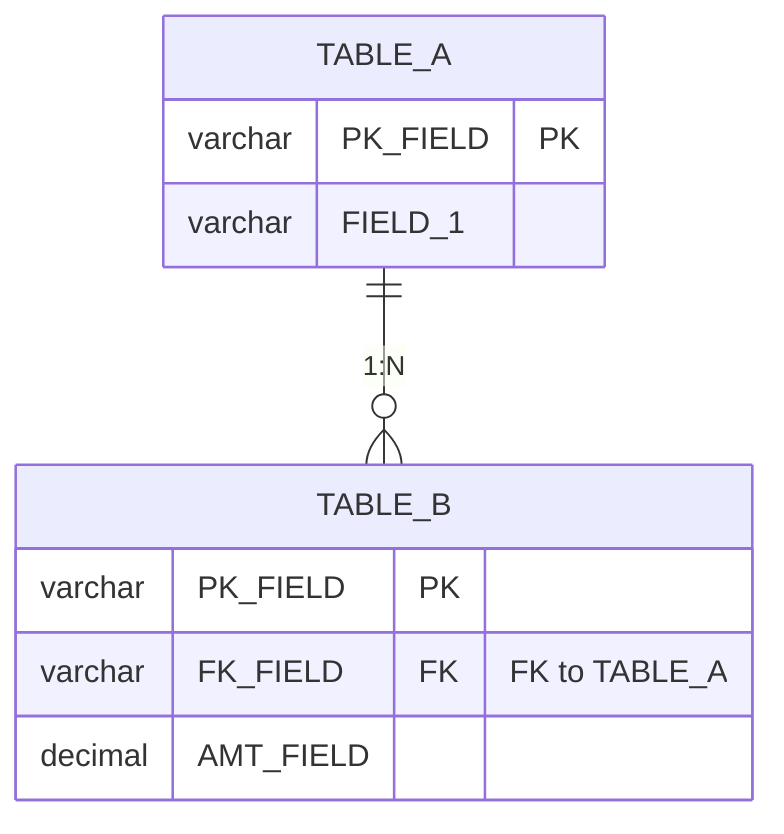

> 本檔是 `templates/frd.md` 與 `templates/sad.md` 的範例集／撰寫指南集，**按需讀取**：撰寫該章且不確定寫法時才讀。

# FRD 撰寫指南與範例

對應 `templates/frd.md` 檔尾撰寫指南 A~D，以及 §4.2 畫面詳細規格的完整畫面內容規格範例
（模板內已改為 `{占位符}` 骨架＋指路註解）。

## §4.2 畫面詳細規格 完整範例

> 本範例示範 `references/screen-spec-format.md` 的四類欄位群寫法。
> **不再提供 ASCII wireframe 範例**——SA 產出不含版面。
>
> ⚠️ 這是 **FRD 階段**的範例，「來源／資料來源」欄一律寫**業務語意**，
> 不出現 API 路徑與 Response 欄位名（見 `screen-spec-format.md` §來源欄的兩階段寫法）。
> 同一張表到 FFS §2 會把來源欄升級為前端契約層，範例見 `templates/examples/ffs-ui.md`。

### SCR-01 訂單查詢

| 項目 | 內容 |
|------|------|
| 用途 | 依條件查詢訂單清單，並可從清單進入新增／編輯訂單 |
| 進入路徑 | 主選單 → 訂單管理 → 訂單查詢 |
| 主要使用者 | 業務員、業務主管 |

**區塊清單**（依資訊層級由上而下）

| 區塊 | 用途 | 內含欄位或操作 |
|------|------|---------------|
| 查詢條件 | 篩選要顯示的訂單 | 查詢條件欄位群 + 查詢／清除 |
| 查詢結果 | 顯示符合條件的訂單清單 | 查詢結果欄位群 + 新增／匯出／編輯／刪除 |

**查詢條件：**

| 欄位 | 輸入語意 | 必填 | 預設值 | 來源 | 條件關係 |
|------|---------|------|--------|------|---------|
| 訂單編號 | 文字（單行） | 否 | 空白 | 手動輸入 | AND |
| 客戶 | 單選（可搜尋） | 否 | 全部 | 參照客戶主檔 | AND |
| 訂單狀態 | 單選（固定清單） | 否 | 全部 | 固定清單：待確認／生產中／已出貨／已結案 | AND |
| 訂單日期起迄 | 日期範圍 | 否 | 近 30 天 | 手動輸入 | AND |

**查詢結果：**

| 欄位 | 資料來源 | 顯示格式 | 對齊 | 可排序 | 重要性 |
|------|---------|---------|------|-------|-------|
| 訂單編號 | 訂單自身欄位 | 原文 | 置左 | 是 | 主要 |
| 客戶名稱 | 參照客戶主檔 | 原文 | 置左 | 是 | 主要 |
| 訂單金額 | 系統計算：Σ(訂單明細小計) | 千分位 | 置右 | 是 | 次要 |
| 訂單日期 | 訂單自身欄位 | 日期 yyyy/MM/dd | 置中 | 是 | 次要 |
| 訂單狀態 | 訂單自身欄位 | 代碼對應中文 | 置中 | 否 | 主要 |

**預設排序**：訂單日期 降冪

> 重要性分布說明：訂單編號／客戶名稱／狀態是掃清單時的定位依據，標「主要」；
> 金額與日期供核對，標「次要」。**整欄全填「主要」等於沒有分級**，前端無從決定摺疊順序。

**新增表單：**

| 欄位 | 輸入語意 | 必填 | 預設值 | 來源 | 長度上限 | 所屬區塊 |
|------|---------|------|--------|------|---------|---------|
| 客戶 | 單選（可搜尋） | 是 | 空白 | 參照客戶主檔 | — | 基本資料 |
| 訂單日期 | 日期 | 是 | 今天 | 手動輸入 | — | 基本資料 |
| 交期 | 日期 | 是 | 空白 | 手動輸入 | — | 基本資料 |
| 備註 | 文字（多行） | 否 | 空白 | 手動輸入 | 200 | 基本資料 |

**編輯表單差異：**

> 只寫與新增的差異，其餘同新增表單。

| 欄位 | 與新增的差異 | 條件 |
|------|-------------|------|
| 訂單編號 | 新增時不出現（系統產生），編輯時唯讀顯示 | 一律 |
| 客戶 | 唯讀 | 訂單狀態為「已出貨」或「已結案」時 |

**操作**

| 操作 | 觸發條件 | 執行後行為 | 權限 |
|------|---------|-----------|------|
| 查詢 | 點擊查詢按鈕 | 依條件查詢資料並顯示於清單 | — |
| 清除 | 點擊清除按鈕 | 還原所有查詢條件為預設值 | — |
| 新增 | 點擊新增按鈕 | 開啟新增表單 | 需有新增權限 |
| 編輯 | 點擊該列編輯按鈕 | 開啟編輯表單並載入既有資料 | 需有編輯權限 |
| 刪除 | 點擊該列刪除按鈕 | 二次確認後刪除該筆訂單，成功後清單移除該筆 | 需有刪除權限 |
| 匯出 | 點擊匯出按鈕 | 依目前查詢條件與排序匯出試算表檔；欄位同查詢結果欄位群，檔名 `訂單查詢_{查詢起日}-{查詢迄日}` | — |

> 本節定義畫面要承載什麼、怎麼運作；版面配置由前端依同類既有頁面骨架決定。

## 撰寫指南 A：文件核心原則

1. **清楚（Clear）**：每個需求只有一種解讀方式
2. **完整（Complete）**：涵蓋所有正常和例外情況
3. **可驗證（Verifiable）**：每個需求都能被測試
4. **可追溯（Traceable）**：需求可追溯到業務目標

## 撰寫指南 B：流程圖使用時機

| 圖形類型 | 使用時機 | 適合呈現 |
|----------|----------|----------|
| 流程圖（Flowchart） | 呈現業務步驟和決策點 | 使用者操作流程 |
| 狀態圖（State Diagram） | 資料有多種狀態轉換 | 訂單狀態、審核流程 |

## 撰寫指南 C：UI 設計原則

1. **一致性**：相同功能沿用相同輸入語意與操作命名（版面與元件由前端統一，SA 不指定）
2. **最少輸入**：提供預設值、以固定清單或參照主檔取代自由輸入，降低輸入負擔
3. **即時回饋**：驗證錯誤立即顯示（呈現形式由前端決定）
4. **防呆設計**：不可逆或影響下游的操作需二次確認

## 撰寫指南 D：驗證規則撰寫要點

1. 明確指出「欄位名稱」而非顯示名稱
2. 錯誤訊息要能幫助使用者修正
3. 區分「阻擋」和「警示」的處理方式
4. 跨欄位規則要說明完整的判斷邏輯

---

# SAD 撰寫指南與範例

對應 `templates/sad.md` 檔尾撰寫指南 A~C，以及 §4.2 資料模型關聯圖的完整 erDiagram 範例
（模板內已改為 `{占位符}` 骨架＋指路註解）。

## §4.2 資料模型關聯圖 完整 erDiagram 範例

## 撰寫指南 A：三流分析核心問題

| 分析維度 | 核心問題 |
|---------|---------|
| 工作流 | 誰在什麼時候做什麼？系統如何支撐？狀態如何流轉？ |
| 資訊流 | 資料從哪來？經過什麼處理？到哪去？ |
| 資料流 | 涉及哪些 DB 表？讀寫關係？表間關聯？ |

## 撰寫指南 B：分析深度指引

| 功能複雜度 | 工作流 | 資訊流 | 資料流 | 重用分析 |
|-----------|--------|--------|--------|---------|
| 簡單 CRUD | 簡化 | 簡化 | 必填 | 必填 |
| 多步驟流程 | 完整 | 完整 | 必填 | 必填 |
| 跨模組整合 | 完整 | 完整 | 完整 | 完整 |

## 撰寫指南 C：圖表使用時機

| 圖形類型 | 使用時機 |
|---------|---------|
| 流程圖 (Flowchart) | 呈現業務步驟與系統處理的對應 |
| 狀態圖 (State Diagram) | 資料有多種狀態轉換時 |
| 資訊流向圖 (Flowchart LR) | 呈現資料來源→處理→目標 |
| ER 圖 (erDiagram) | 呈現資料表關聯 |
| 時序圖 (Sequence Diagram) | 多系統互動時（系統整合場景） |
