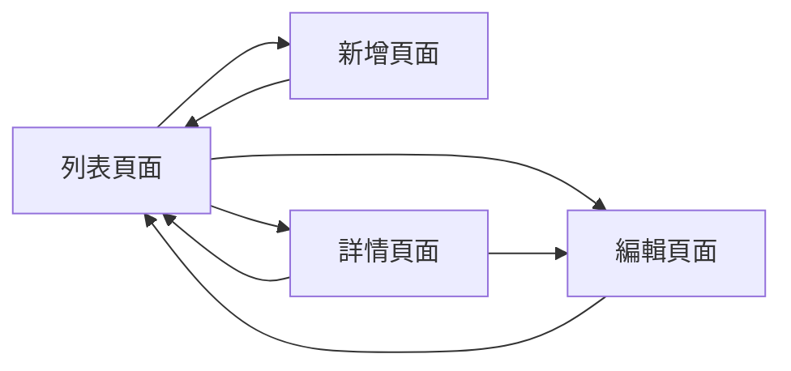

# {功能名稱} 前端功能規格書

<!--
  使用說明：
  1. 將 {佔位符} 替換為實際內容
  2. 根據功能類型刪除不適用的章節
  3. 此範本依據 ISO/IEC 25010:2023 軟體品質模型及前端設計最佳實踐
  4. 需搭配功能需求文件範本與後端功能規格書範本使用
-->

## 0. 一頁摘要

<!--
  ≤12 行正文。第一次讀的人在這一節就要知道：畫面做什麼、給誰、核心互動是什麼。
  元資料在「文件資訊」；改版紀錄在檔尾 CHANGELOG——都不放這裡。
-->

- **做什麼**：{一句話：使用者在這些畫面完成什麼}
- **給誰用**：{角色}
- **核心互動**：{N} 個畫面；{一句話，如「查詢→明細→調整金額並即時重算毛利」}

**總覽圖**（畫面轉移，≤10 節點；含條件分支的操作流程見 §3）


**讀者導覽**

| 你是 | 讀這幾章就夠 | 不用讀 |
|------|-------------|--------|
| Dev 前端 | §2 畫面內容規格（唯一取材處）、§3 特有流程、§5 連動與狀態、§6 對接端點 | §1、§7、§D |
| Dev 後端 | §6 對接端點（核對 BFS §6 契約） | 其餘 |
| QA | §8 驗收標準；業務情境以 FRD §2 為準 | §5 細節 |
| PO／主管 | 本節 | 其餘 |

**關聯**

| 類型 | 路徑／編號 |
|------|-----------|
| 上游 | [功能需求文件]({FRD 相對路徑}) v{版本}、[系統分析文件]({SAD 相對路徑}) v{版本}、[後端功能規格書]({BFS 相對路徑}) v{版本} |
| 決策 | `decisions.md`（本階段 D-{起}~{迄}） |
| 中間產物 | `analysis/ui-survey.md`、`analysis/db-analysis.yml` |
| 票／原型 | {票號}；{原型路徑或「無」} |

---

<!-- SPEC-INDEX v1 -->
> **章節索引**（定向讀取用；章節異動時同批更新）
> - §0 一頁摘要 — 畫面轉移總覽圖、讀者導覽、關聯
> - §1 文件概述 — 目的、適用範圍、術語
> - §2 使用者介面設計 — 頁面總覽與畫面內容規格（四類欄位群完整；格式見 references/screen-spec-format.md）
> - §3 使用者操作流程 — 查詢／新增／編輯／刪除（例外導向，標準 CRUD 動線不重畫）
> - §4 欄位驗證規則 — 對應 BFS VR 全對照（強制欄）
> - §5 使用者操作業務邏輯 — 連動欄位、即時計算、狀態控制
> - §6 API 對接規格 — 端點對應；Request/Response 範例見 templates/examples/ffs-ui.md
> - §A 重用線索 — 同類既有頁面參考，不得複製進 Dev 票
> - §7 畫面與舊系統對應 — 條件式（舊系統遷移／FoxPro 對應時必填）
> - §8 驗收標準 — TC-Q/C/U/D/E 系列
> - §附錄 — 輸入語意對照等見 templates/examples/ffs-ui.md
> - §D 決策紀錄 — 本階段拍板編號（全文在 `decisions.md`）

> **撰寫須知**
> 1. 本檔是**骨架**：§2／§5／§6／§8 的具現化寫法範例放在 `templates/examples/ffs-ui.md`，撰寫時按需讀取。
>    ⚠️ 這是「範例外移」不是「內容外移」——實際產出的 FFS §2 必須把四類欄位群逐欄填實，不得只留 ref。
> 2. §4「對應 BFS VR」欄為強制欄，不得留空（前端特有規則填「前端特有」並說明差異）。
> 3. **正文預算 30KB**（§1 起至 §D 前；不含 §0、§D、附錄、CHANGELOG）。§2 四類欄位群是唯一 owner **不得為了體積移出**；超標先過去重閘與 examples 外移；仍超標 → **拆附錄檔** `{功能名稱}_附錄_{主題}.md`（如多畫面的欄位表全表），主文只留頁面總覽＋連結並在 SPEC-INDEX 註明。**不放行**；真要放行須在 `decisions.md` 記一列。
> 4. **必畫圖**：§0 畫面轉移總覽；§3 有條件分支的操作流程一張 flowchart。畫法見 templates/examples/diagrams-and-worked-examples.md。

---

## 文件資訊

| 項目 | 內容 |
|------|------|
| 文件編號 | FFS-{模組代號}-{序號} |
| 功能代碼 | {功能代碼；無則「不需代碼」＋理由} |
| 版本 | 1.0 |
| 狀態 | 草稿 / 審查中 / 已核准 |
| 對應文件 | FRD-{編號} v{版本}、SAD-{編號} v{版本}、BFS-{編號} v{版本} |
| 關聯票 | {票號} |

> 技術中立：本文件不規範實作技術（framework／library／元件名稱／檔案路徑），一律以輸入語意描述欄位行為，選型由 PG 決定；完工後依實作回寫（changelog 註記「完工回寫：實作對齊」）。

---

## 1. 文件概述

### 1.1 目的

本文件定義 **{功能名稱}** 功能的前端規格，作為前端開發與測試的依據。

### 1.2 適用範圍

- **目標使用者**：{使用者角色，如：業務人員、倉管人員}
- **使用情境**：{簡述使用情境}
- **涵蓋範圍**：{列出涵蓋的功能項目}

### 1.3 相關文件

> 見 §0 關聯表，此處不重列。

### 1.4 術語定義

| 術語 | 定義 |
| --- | --- |
| {術語1} | {定義} |
| {術語2} | {定義} |

---

## 2. 使用者介面設計

> 撰寫格式見 `references/screen-spec-format.md`。
>
> **本章是完整畫面欄位表的唯一 owner**（不採雙 owner 分層）——四類欄位群齊備，
> 來源欄填 BFS §6 的 Response 欄位名或 `前端計算：{公式}`，外加輸入語意細節、欄位連動、
> 各狀態行為與文案。
>
> ⚠️ FRD §4 **不含**完整欄位群（只寫畫面清單、業務目的、操作表、業務層有話要說的欄位），
> 所以本章**沒有上游可以 ref**，也不存在「FRD 已寫過」這回事。
> FFS §2 是 Dev 前端票的**唯一取材處**，缺一欄就等於 Dev 票缺一欄。
> 取材來源：`analysis/ui-survey.md`（既有畫面現況）、原型 HTML、BFS §6 Response 欄位表、
> `analysis/db-analysis.yml`（表結構）。
>
> 本章不畫版面——版面配置由前端依同類既有頁面骨架決定。

### 2.1 頁面總覽



### 2.2 畫面內容規格

<!-- 完整具現化範例見 templates/examples/ffs-ui.md；每個畫面一節；四類欄位群齊備要求在本功能層級把關，單一畫面不適用者寫「無」或註明由同功能其他畫面承載，不得整段省略 -->

#### 2.2.1 列表頁面（{功能名稱}List）

| 項目 | 內容 |
|------|------|
| 用途 | {這個畫面解決什麼} |
| 進入路徑 | {主選單 → 子選單} |
| 主要使用者 | {角色} |

**區塊清單**（依資訊層級由上而下）

| 區塊 | 用途 | 內含欄位或操作 |
|------|------|---------------|
| {區塊名} | {用途} | {欄位群名稱或操作清單} |

**查詢條件：**

| 欄位 | 輸入語意 | 必填 | 預設值 | 來源 | 條件關係 |
|------|---------|------|--------|------|---------|
| {欄位} | {輸入語意} | 是/否 | {值} | 手動輸入／固定清單：{值列舉}／端點：{路由} | AND / 互斥 |

**查詢結果：**

| 欄位 | 資料來源 | 顯示格式 | 對齊 | 可排序 | 重要性 |
|------|---------|---------|------|-------|-------|
| {欄位} | `{responseField}` 或 前端計算：{公式} | {格式} | 置左/置中/置右 | 是/否 | 主要/次要/可摺疊 |

**預設排序**：{欄位} {升冪／降冪}，{決勝欄} {升冪／降冪}

| 排序要素 | 本畫面 |
|---------|--------|
| 決勝欄（排序鍵非唯一時**必填**） | {唯一欄位；排序鍵已唯一則寫「排序鍵唯一，不需要」} |
| NULL 位置（排序欄可為空時必填） | 最前／最後／不適用（NOT NULL） |
| 序語意（字串型編號必填） | 字面序／數值序：{轉型規則與非數值列處理}／不適用 |
| 使用者可排序欄位 | {白名單}；重新查詢後{回到預設／保留} |

<!-- 排序由誰做：有分頁的清單一律後端全量排序（點欄位標題重打 API），此為產品預設立場，
     符合者不必說明；偏離才寫理由。完整規則見 references/sort-order-standards.md。
     ⚠ 排序鍵非唯一而缺決勝欄，接上分頁會跨頁重複／漏筆，且每次查詢結果不同。 -->

**操作**

| 操作 | 觸發條件 | 執行後行為 | 權限 |
|------|---------|-----------|------|
| {操作名} | {何時可用／何時停用} | {系統做什麼、結束在哪個狀態} | {權限項；無則寫 —} |

> 本節定義畫面要承載什麼、怎麼運作；版面配置由前端依同類既有頁面骨架決定。

#### 2.2.2 新增/編輯頁面（{功能名稱}Form）

| 項目 | 內容 |
|------|------|
| 用途 | {這個畫面解決什麼} |
| 進入路徑 | {從哪個畫面的哪個操作進入} |
| 主要使用者 | {角色} |

**區塊清單**（依資訊層級由上而下）

| 區塊 | 用途 | 內含欄位或操作 |
|------|------|---------------|
| {區塊名} | {用途} | {欄位群名稱或操作清單} |

**新增表單：**

| 欄位 | 輸入語意 | 必填 | 預設值 | 來源 | 長度上限 | 所屬區塊 |
|------|---------|------|--------|------|---------|---------|
| {欄位} | {輸入語意} | 是/否 | {值} | 手動輸入／固定清單：{值列舉}／端點：{路由} | {N} | {區塊名} |
| {明細：欄位} | {輸入語意} | 是/否 | {值} | {來源} | {N} | {明細區塊名} |
| {計算欄位} | 唯讀顯示 | - | - | `{responseField}`（後端回傳）或 前端計算：{公式} | — | {區塊名} |

> ⚠️ 唯讀計算欄位（小計、合計、稅額…）：**後端 Response 有回該值就填 Response 欄位名**，
> 只有後端完全不回傳時才寫 `前端計算：{公式}`。送出前的即時重算屬 §5.2 即時計算邏輯，
> 不是「來源」——寫成「前端計算」會把計算職責靜默畫給前端，造成前後端各算一套。

**明細預設排序**（有明細區時必填）：{欄位} {升冪／降冪}，採{顯示序號／建檔序／業務鍵}
新列插入位置：{末端／游標處}；插入後項次{重編並回寫／不重編}

<!-- 明細有無中途插入能力決定要不要重編項次。序語意三選一要指名，別混談。
     字串型編號欄位另需標字面序／數值序。見 references/sort-order-standards.md §5 -->

**編輯表單差異：**

> 只寫與新增的差異，其餘同新增表單。

| 欄位 | 與新增的差異 | 條件 |
|------|-------------|------|
| {欄位} | 唯讀 / 依狀態鎖定 / 新增時不出現 | {何種狀態下} |

**操作**

| 操作 | 觸發條件 | 執行後行為 | 權限 |
|------|---------|-----------|------|
| {操作名} | {何時可用／何時停用} | {系統做什麼、結束在哪個狀態} | {權限項；無則寫 —} |

> 本節定義畫面要承載什麼、怎麼運作；版面配置由前端依同類既有頁面骨架決定。

---

## 3. 使用者操作流程

> 📎 **例外導向**：專案標準 CRUD 動線（查詢／新增／編輯／刪除／通用失敗）見
> `references/screen-spec-format.md` §專案標準 CRUD 動線，本章**不重畫**。
> 本章只寫兩種東西：
> 1. **功能特有流程**——跨畫面接力、匯入、批次、狀態流轉、與其他單據連動
> 2. **偏離標準動線之處**——並註明業務理由
>
> 無特有流程時，本章一句「依專案標準 CRUD 動線」即可。
>
> 流程只寫「狀態與決策」層：觸發 → 系統行為 → 結束狀態、業務判斷分支、
> 失敗後停留位置與資料保留、需二次確認的操作。
> **不寫**彈窗或新頁、Toast 或錯誤條、載入指示形式、API 呼叫時機。

### 3.1 {功能特有流程名稱}

**業務理由**：{為什麼不能用標準動線}

```mermaid
flowchart TD
    A[{使用者動作}] --> B{{業務判斷條件}}
    B -->|{條件成立}| C[{系統行為}]
    B -->|{條件不成立}| D[{系統行為}]
    C --> E([{結束狀態}])
    D --> E
```

### 3.2 偏離標準動線之處

| 標準動線 | 本功能的差異 | 業務理由 |
|---------|-------------|---------|
| {動線名} | {差異} | {理由} |

---

## 4. 欄位驗證規則

### 4.1 主檔欄位驗證

> **對齊規則**：「對應 BFS VR」欄必須填入後端規格書（BFS）§7.1 的驗證規則編號。
> 若 BFS 中無對應 VR（例如前端特有的 UX 驗證），填「前端特有」並說明差異。
> 欄位代碼使用 camelCase（對應 API Response/Request JSON key）。

| 欄位名稱 | 欄位代碼 | 必填 | 驗證規則 | 對應 BFS VR | 錯誤訊息 |
| --- | --- | --- | --- | --- | --- |
| {欄位} | `{fieldCode}` | ✅/❌ | {規則描述} | VR-{NNN} | {錯誤訊息} |

> ⚠️ **注意**：錯誤訊息需與 BFS VR 的訊息語意一致，前端可更友善但不可更寬鬆或更嚴格（例如 BFS 是必填，前端不可標選填）。

### 4.2 明細欄位驗證

| 欄位名稱 | 欄位代碼 | 必填 | 驗證規則 | 對應 BFS VR | 錯誤訊息 |
| --- | --- | --- | --- | --- | --- |
| {欄位} | `{fieldCode}` | ✅/❌ | {規則描述} | VR-{NNN} | {錯誤訊息} |
| {自動計算欄位} | `{fieldCode}` | - | 自動計算：{公式} | - | - |

### 4.3 表單層級驗證

| 驗證項目 | 驗證規則 | 錯誤訊息 |
| --- | --- | --- |
| 明細筆數 | 至少一筆明細 | 請至少新增一筆明細 |
| 重複品項 | 不允許重複品項 | 品項 {品項名稱} 已存在，請修改數量 |
| 金額上限 | 總金額不超過 {上限} | 訂單金額超過上限 |

### 4.4 驗證時機

| 時機 | 說明 |
| --- | --- |
| 欄位離焦 (onBlur) | 單一欄位即時驗證 |
| 欄位變更 (onChange) | 清除該欄位錯誤訊息 |
| 表單送出 (onSubmit) | 完整表單驗證 |
| 明細新增 | 驗證新增的明細列 |

---

## 5. 使用者操作業務邏輯

### 5.0 連動欄位程式碼層對照表（強制必填）

> 列出「觸發欄位 → 影響欄位 / 行為」的明確對應，PG 不用憑 sequence diagram 推導。完整範例見 templates/examples/ffs-ui.md。

| 觸發欄位 | 觸發事件 | 影響欄位 / 行為 | 規則 |
|---|---|---|---|
| `{fieldCode}` | onChange | {影響欄位} | {規則描述} |

### 5.1 選擇器連動邏輯

<!-- 完整 sequence diagram 與連動規則範例見 templates/examples/ffs-ui.md -->

#### 5.1.1 {選擇器名稱} 選擇連動

{Sequence：使用者開窗 → 前端呼叫 Light API → 選擇項目 → 填入欄位（並視需要連動重置其他欄位）}

| 觸發欄位 | 連動欄位 | 連動規則 |
| --- | --- | --- |
| {觸發欄位} | {連動欄位} | {連動規則，或「無連動」} |

### 5.2 即時計算邏輯

#### 5.2.1 明細小計計算

```
小計 = 數量 × 單價
```

**觸發時機**：數量或單價變更時

#### 5.2.2 合計金額計算

```
合計金額 = Σ(各明細小計)
稅額 = 合計金額 × 稅率
總金額 = 合計金額 + 稅額
```

**顯示格式**：千分位，保留小數點後 2 位

### 5.3 狀態控制邏輯

#### 5.3.1 欄位啟用/停用

| 條件 | 欄位狀態 |
| --- | --- |
| 新增模式 | 單號停用，其他啟用 |
| 編輯模式 | 單號停用，日期可改 |
| 已審核 | 全部欄位停用 |
| 已結案 | 全部欄位停用 |

#### 5.3.2 按鈕顯示控制

| 狀態 | 編輯按鈕 | 刪除按鈕 | 審核按鈕 |
| --- | --- | --- | --- |
| 草稿 | ✅ 顯示 | ✅ 顯示 | ✅ 顯示 |
| 已審核 | ❌ 隱藏 | ❌ 隱藏 | ❌ 隱藏 |
| 已結案 | ❌ 隱藏 | ❌ 隱藏 | ❌ 隱藏 |

---

## 6. API 對接規格

### 6.1 API 端點對應

> **API 對接說明**：以下引用 BFS 中定義的端點，前端不重複定義，只說明「前端如何呼叫與展示」。

| 操作 | HTTP 方法 | API 端點 | 前端觸發時機 | 對應 US |
| --- | --- | --- | --- | --- |
| 載入列表 | GET | `/api/{module}/{entity}/Paged` | 頁面載入、搜尋條件變更 | US-01 |
| 取得單筆 | GET | `/api/{module}/{entity}/{id}` | 點擊「編輯」或「查看」 | US-02 |
| 新增 | POST | `/api/{module}/{entity}` | 表單儲存（新增模式） | US-03 |
| 修改 | PUT | `/api/{module}/{entity}/{id}` | 表單儲存（編輯模式） | US-04 |
| 刪除 | DELETE | `/api/{module}/{entity}/{id}` | 確認刪除對話框按下確認 | US-05 |
| {選擇器} | GET | `/api/{module}/{entity}/Light` | {選擇器開窗時} | — |

### 6.2 Request 格式

> 📎 見《{功能} 後端功能規格書》§6，此處不重列 Request 欄位定義。本節僅補充：前端組裝差異（如日期格式、空值送出策略、分頁參數命名）。

<!-- 完整 Request JSON 範例見 templates/examples/ffs-ui.md -->

### 6.3 Response 格式

> 📎 見《{功能} 後端功能規格書》§6，此處不重列 Response 欄位定義。本節僅補充：前端如何取用巢狀物件、Light Response 精簡欄位對照。

<!-- 完整 Response JSON 範例見 templates/examples/ffs-ui.md -->

#### 錯誤回應處理

| HTTP 狀態碼 | 處理方式 |
| --- | --- |
| 400 | 顯示欄位驗證錯誤訊息（依下方 §6.4 對應 i18n key） |
| 401 | 導向登入頁面 |
| 403 | 顯示權限不足訊息 |
| 404 | 顯示資料不存在訊息 |
| 409 | 顯示資料衝突訊息 (如：已被他人修改) |
| 500 | 顯示系統錯誤訊息 |

### 6.4 後端錯誤訊息 → 前端 i18n key 對照（強制必填，當有 §400 業務錯誤時）

> 列出後端可能回的 `errors.{Field}` 或 `detail` 訊息，對應前端 i18n key。避免 PG 自行翻譯造成訊息不一致。完整範例見 templates/examples/ffs-ui.md。

| 後端錯誤訊息（BFS §7 / §8） | 前端 i18n key | 顯示位置 |
| --- | --- | --- |
| {後端 detail 文字} | {i18n key} | {欄位下紅字 / 頂部錯誤條} |

---

## A. 重用線索（Reuse Hints）

> 供 SA 判斷本功能是否已有同類實作，避免重工。
> **勘察日期：{YYYY-MM-DD}** — 快照僅代表當下，開工前須由開發者複驗。
>
> ⚠️ **本節不得複製進 Dev 票**。技術路徑與選型的變動速度快於票的生命週期，
> 寫進票面只會多一道「辨識哪幾條已過期」的成本。

| 同類既有頁面 | 相似之處 | 本功能處理方式 |
|------------|---------|--------------|
| {既有功能名稱與其 FFS 路徑} | {哪部分可參照} | 延用 / 擴充 / 新建 |

> 💡 「延用 / 擴充 / 新建」為**設計階段建議**，最終判定由開發者決定。
> 本節**只列到頁面層級**，不列元件、composable、store、套件與檔案路徑。

## 7. 畫面與舊系統對應

> **觸發條件（與 `verifying-specs` Task 5 對齊）**：
>
> 下列任一情況成立時，本章節**必填**，不可省略：
> 1. 功能屬於舊系統遷移（CHANGELOG 提及「FoxPro」、「舊系統」、「遷移」）
> 2. 需求文件（FRD）有舊系統對應章節
> 3. `system-analysis` SAD 文件有舊系統欄位對應分析
>
> 以上均不符合時，填入：「N/A — 全新功能，無舊系統對應」即可。

### 7.1 欄位對應表

| 畫面標籤 | 舊系統欄位 | API 欄位 | 型態 | 備註 |
| --- | --- | --- | --- | --- |
| {標籤1} | {COLUMN1} | `{apiField1}` | {Type} | {備註} |
| {標籤2} | {COLUMN2} | `{apiField2}` | {Type}? | {備註} |
| {標籤3} | {COLUMN3} | 系統自動產生 | 自動 | 格式: {格式說明} |

### 7.2 狀態碼對應

| 舊系統代碼 | 新系統狀態 | 說明 |
| --- | --- | --- |
| {code1} | `{status1}` | {說明1} |
| {code2} | `{status2}` | {說明2} |

---

## 8. 驗收標準

### 8.1 查詢功能驗收

| 編號 | 驗收項目 | 預期結果 | 優先級 | 對應 US |
| --- | --- | --- | --- | --- |
| TC-Q-001 | 列表頁面載入 | 顯示預設查詢結果，分頁正確 | 高 | US-01 |
| TC-Q-002 | 日期範圍查詢 | 僅顯示範圍內資料 | 高 | US-01 |
| TC-Q-003 | 關鍵字搜尋 | 支援 {搜尋欄位} 模糊比對 | 中 | US-01 |
| TC-Q-004 | 排序功能 | 點擊欄位標題正確排序 | 中 | US-01 |
| TC-Q-005 | 無資料處理 | 顯示「查無資料」訊息 | 中 | US-01 |

### 8.2 新增功能驗收

<!-- 完整 TC 範例（含真實資料代號）見 templates/examples/ffs-ui.md -->

| 編號 | 驗收項目 | 預期結果 | 優先級 | 對應 US |
| --- | --- | --- | --- | --- |
| TC-C-001 | 點擊「新增」，表單開啟 | {初始欄位狀態} | 高 | US-03 |
| TC-C-002 | {必填欄位} 未填，點擊儲存 | 顯示對應錯誤訊息，表單不送出 | 高 | US-03 |
| TC-C-003 | 填入完整有效資料，點擊儲存 | 呼叫 POST API 成功，顯示「新增成功」，導回列表頁 | 高 | US-03 |
| TC-C-004 | 儲存後確認列表頁 | 新建資料出現在列表 | 高 | US-03 |

### 8.3 編輯功能驗收

| 編號 | 驗收項目 | 預期結果 | 優先級 | 對應 US |
| --- | --- | --- | --- | --- |
| TC-U-001 | 資料載入 | 正確顯示現有資料 | 高 | US-04 |
| TC-U-002 | 欄位修改 | 可修改允許的欄位 | 高 | US-04 |
| TC-U-003 | 明細增刪改 | 可增刪改明細，正確重新計算 | 高 | US-04 |
| TC-U-004 | 更新成功 | 顯示成功訊息，導回列表 | 高 | US-04 |

### 8.4 刪除功能驗收

| 編號 | 驗收項目 | 預期結果 | 優先級 | 對應 US |
| --- | --- | --- | --- | --- |
| TC-D-001 | 刪除確認 | 顯示確認對話框 | 高 | US-05 |
| TC-D-002 | 取消刪除 | 關閉對話框，資料保留 | 中 | US-05 |
| TC-D-003 | 確認刪除 | 刪除成功，列表更新 | 高 | US-05 |

### 8.5 例外處理驗收

| 編號 | 驗收項目 | 預期結果 | 優先級 | 對應 US |
| --- | --- | --- | --- | --- |
| TC-E-001 | 網路中斷 | 顯示網路錯誤提示 | 高 | — |
| TC-E-002 | 資料被他人刪除 | 顯示資料不存在訊息 | 中 | — |
| TC-E-003 | 權限不足 | 顯示權限不足訊息 | 高 | — |
| TC-E-004 | 伺服器錯誤 | 顯示系統錯誤訊息 | 高 | — |

---

## 附錄

<!-- 輸入語意對照、錯誤訊息格式、鍵盤操作支援、圖示說明見 templates/examples/ffs-ui.md -->

---

## D. 決策紀錄

> 全鏈決策唯一落點是同目錄 `decisions.md`（全鏈連號 D-001 起）。本節只列本階段拍板的編號與一句結論；
> 否決選項／依據／拍板者在 `decisions.md`，此處不重抄。引用上游決策寫 `見 decisions.md D-0xx`。

| # | 決策 | 選定 |
|---|------|------|
| D-{0xx} | {一句話的決策題目} | {拍板的做法一句} |

> 本階段無任何拍板時保留表頭寫一列「無」，不刪整節（下一棒要分得出「沒決策」與「漏做了」）。

---

<!-- CHANGELOG -->
| 版本 | Ticket | 日期 | 修改摘要 |
|------|--------|------|---------|
| v1.0 | 初版 | {建立日期} | 建立文件 |
<!-- /CHANGELOG -->
