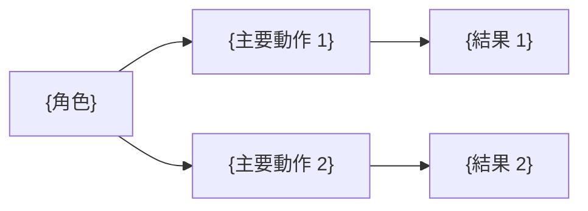
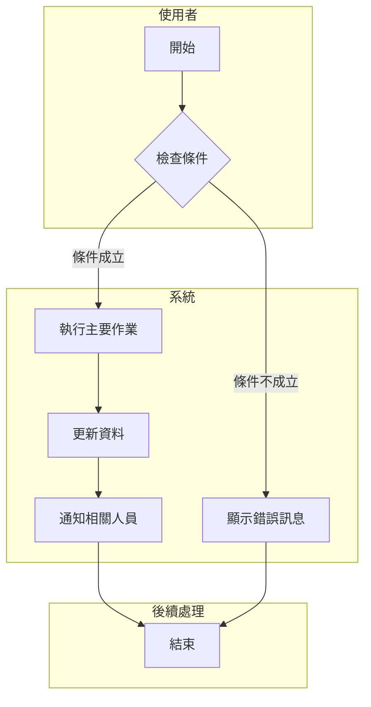
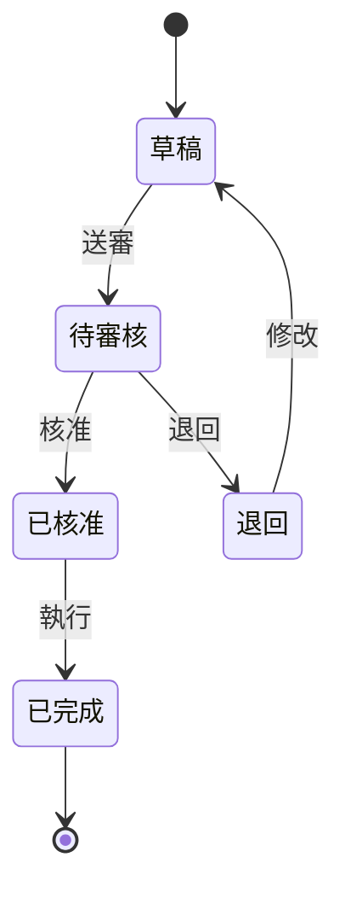

# {功能名稱} 功能需求文件

<!--
  文件用途：定義功能需求的「What」和「Why」，不涉及「How」
  適用階段：需求分析、客戶溝通、開發前確認
  後續文件：系統分析文件 (SAD) 分析「How to Realize」

  核心原則：
  1. 以 PM 視角清楚表達業務價值和使用者需求
  2. 多角度呈現（文字 + 業務流程圖 + UI 原型）
  3. 明確的驗收標準
  4. 可追溯、可測試
  5. 不涉及系統互動、系統整合等技術分析（由 SAD 負責）

  文件形狀：交付內容在前、過程紀錄在後。§0 一頁摘要置頂，
  版本紀錄（CHANGELOG）在檔尾，決策明細在同目錄 decisions.md。

  參考標準：
  - IEEE 830-1998 Software Requirements Specification
  - ISO/IEC/IEEE 29148:2018 Requirements Engineering
-->

## 0. 一頁摘要

<!--
  ≤12 行正文。讀者 60 行內要能知道：這功能做什麼、給誰用、業務目標與範圍。
  總覽圖 ≤10 節點，只畫「角色 → 主要動作 → 結果」；詳細流程圖仍在 §3.1，本圖不取代它。
-->

**做什麼**：{一句話：本功能讓使用者能夠……}
**給誰用**：{角色清單}
**業務目標與範圍**：{一句話：目標是……；本次涵蓋……，不含……}

**讀者導覽**

| 你是 | 讀這幾章 | 不用讀 |
|------|---------|--------|
| PO／主管 | §0、§1.1～§1.3 | 其餘 |
| QA | §2 使用者故事（E2E 情境取材處）、§5.3 | §4、§6 |
| SA（下一棒） | §2.1、§3、§4、§5、§D | — |
| Dev 後端／前端 | 不讀本文件；後端讀 BFS、前端讀 FFS §2 | — |

**關聯**

| 項目 | 路徑／編號 |
|------|-----------|
| 下游文件 | SAD：`{路徑}`／BFS：`{路徑}`／FFS：`{路徑}` |
| 決策明細 | `decisions.md`（同目錄，全鏈連號） |
| 中間產物 | `analysis/_context.yml`、`analysis/ui-survey.md`（若有） |
| 原型 | `{功能名稱}_prototype.html`（若有） |
| Linear 票 | {票號} |
| 舊系統分析 | {FoxPro 分析報告路徑}（若有） |

---

<!-- SPEC-INDEX v1 -->
> **章節索引**（定向讀取用；章節異動時同批更新）
> - §0 一頁摘要 — 總覽圖、讀者導覽、關聯
> - §1 需求概述 — 業務背景與證據強度 §1.1.1、目標、範圍（§1.5 已移除，章號留空）
> - §2 使用者故事 — US-{起}~{迄}（全鏈追溯鍵，含角色）；AC 用 Given-When-Then，只展開 Must
> - §3 業務流程 — 主流程圖 §3.1、狀態流程圖 §3.2（多狀態時必填）
> - §4 畫面設計 — 畫面總覽 §4.1；業務層規格 §4.2（**不含完整欄位群**，owner 為 FFS §2）
> - §5 欄位規格與驗證規則 — VR/BR 編號事實來源，BFS §7／FFS §4 沿用同編號；公式型 BR 附算例
> - §6 非功能性需求 — 效能／安全性／可用性
> - §7 驗收標準 — 業務驗收＝§2 AC；非功能驗收 §7.2
> - §8 附錄 — 術語（含實例）、參考文獻、開放議題 OI-{起}~{迄}
> - §D 決策紀錄 — 本階段拍板編號；明細在 decisions.md

> **撰寫須知**
> 1. §4.2 畫面詳細規格僅保留單一代表性範例；完整畫面內容規格範例見 templates/examples/frd-sad-guides.md。
> 2. 撰寫指南（原文件核心原則／流程圖時機／UI 設計原則／驗證規則要點）見 templates/examples/frd-sad-guides.md；圖與算例寫法見 templates/examples/diagrams-and-worked-examples.md。
> 3. **正文預算 ≤30KB**（§1～§8，不含 §0／§D／CHANGELOG）。超標先過去重閘與範例外移；仍超標→拆附錄檔 `{功能名稱}_附錄_{主題}.md`，主文只留總覽表＋連結。**不得以「照現況放行」結案**。

---

## 文件資訊

| 項目 | 內容 |
|------|------|
| 文件編號 | FRD-{模組代號}-{序號} |
| 功能代碼 | {功能代碼}（無則寫「不需代碼」＋理由） |
| 版本 | 1.0 |
| 狀態 | 草稿 / 審查中 / 已核准 |
| 對應文件 | 探索摘要 v{版本}（若有）／FoxPro 分析報告 v{版本}（若有） |
| 關聯票 | {票號} |

---

## 1. 需求概述

### 1.1 業務背景

<!--
說明：用 2-3 段話描述這個需求的業務背景
- 目前的業務痛點是什麼？
- 為什麼需要這個功能？
- 不做會有什麼影響？
-->

{描述目前的業務現況、遇到的問題或痛點，以及為什麼需要這個功能}

#### 1.1.1 需求來源與證據強度

<!--
說明：每一條需求主張都要能回答「誰說的、有多確定」。
證據強度：confirmed（原始碼／DB 實資料／實機雙重證實）、PO 轉述、推論（SA 依現況推導，未經確認）。
「親口提及」欄區分利害關係人真正提出的項目與 SA 延伸出來的項目，避免範圍靜默膨脹。
-->

| 需求主張 | 來源 | 親口提及 | 證據強度 | 出處 |
|---------|------|:-------:|---------|------|
| {主張 1} | {PO／使用者／FoxPro 現況} | 是 | confirmed | {會議日期／FoxPro 程式名／DB 表欄／票號} |
| {主張 2} | {來源} | 否 | 推論 | {推導依據} |

### 1.2 功能目標

<!-- 說明：列出 3-5 個具體、可衡量的目標 -->

| 編號 | 目標 | 成功指標 |
|------|------|----------|
| G-01 | {目標描述} | {如何判斷目標達成} |
| G-02 | {目標描述} | {如何判斷目標達成} |
| G-03 | {目標描述} | {如何判斷目標達成} |

### 1.3 功能範圍

**包含（In Scope）：**
- {功能項目 1}
- {功能項目 2}
- {功能項目 3}

**不包含（Out of Scope）：**
- {排除項目 1}
- {排除項目 2}

### 1.4 利害關係人

| 角色 | 代表人 | 關注重點 | 參與程度 |
|------|--------|----------|----------|
| 業務需求方 | {姓名/部門} | {主要關注的面向} | 高/中/低 |
| 最終使用者 | {角色描述} | {使用時的關注點} | 高/中/低 |
| 系統維護者 | {姓名/部門} | {技術或維運考量} | 高/中/低 |

<!-- §1.5 章號留空不重排（Use Case 圖已移除：UC 與 US 一對一重複、不帶行為資訊）；
     追溯鍵統一為 US-XX（角色見 §2.1）。 -->

---

## 2. 使用者故事

<!--
使用者故事格式：As a <角色>, I want to <功能>, so that <效益>

US-XX 是全鏈唯一追溯鍵：SAD §6.4 US→API、BFS §6.1、FFS §6.1／§8 TC 都以 US-XX 引用，
故事句一行即可——它是錨點，不是 payload。
payload 是 AC：本章是 QA 票 E2E 情境的唯一取材處，也是 BFS §7／FFS §4 規則的上游，
AC 要寫到 QA 能直接照做、數字直接代入。
-->

### 2.1 故事清單

<!-- 「角色」欄必填：SAD 據此識別參與角色與系統互動（原 §1.5 UC 清單的角色資訊移到此處）。 -->

| 編號 | 角色 | 使用者故事 | 優先級 |
|------|------|-----------|--------|
| US-01 | {角色} | 身為 {角色}，我想要 {功能描述}，以便 {業務價值} | Must |
| US-02 | {角色} | 身為 {角色}，我想要 {功能描述}，以便 {業務價值} | Should |
| US-03 | {角色} | 身為 {角色}，我想要 {功能描述}，以便 {業務價值} | Could |

**優先級說明：**
- **Must**：核心功能，必須實作
- **Should**：重要功能，應該實作
- **Could**：加值功能，可以實作
- **Won't**：本次不做

### 2.2 故事詳述

<!-- 只展開 Must；Should／Could 停在 §2.1 清單，升級為 Must 時再補詳述。 -->

#### US-01：{故事標題}

**故事描述：**
> 身為 {角色}，我想要 {功能描述}，以便 {業務價值}

**情境說明：**
{描述使用者會在什麼情況下使用這個功能，解決什麼問題}

**驗收條件（Given-When-Then，支援多分支）：**

> 簡單情境只需一條 Given-When-Then；**情境有多種分支**（如「查無 / 已存在 / 正常」）時，列多條，每條獨立編號。
> Then 裡有數字就**直接代實際數字**（如「毛利顯示 1,215,750、毛利率 27.7%」），不寫「正確顯示」。

| 分支 # | 條件 | 描述 |
|------|------|------|
| AC-1（正常） | **Given** | {初始狀態} |
| | **When** | {操作} |
| | **Then** | {正常結果} |
| AC-2（{分支 2 情境}） | **Given** | {不同初始狀態} |
| | **When** | {相同操作} |
| | **Then** | {分支 2 結果} |

**例外情境：**

| 情境 | 處理方式 |
|------|----------|
| {例外情況 1} | {系統如何回應} |
| {例外情況 2} | {系統如何回應} |

---

## 3. 業務流程

### 3.1 主流程圖

<!--
說明：使用 Mermaid 語法繪製「業務層面」的流程圖（必畫）
- 呈現使用者的操作步驟與決策點
- 聚焦「人做什麼」而非「系統做什麼」
- 系統互動、資料流向等技術分析由系統分析文件 (SAD) 負責
- 此圖與 SAD 泳道圖／BFS sequence 是不同視角，不算重複，下游不得以 ref 取代自己的圖
-->

### 3.2 狀態流程圖

<!--
說明：功能涉及多個狀態（如審核流、訂單狀態、單據生命週期）時【必填】；純 CRUD 無狀態轉換時可省略。
SA 依賴此圖進行工作流分析，缺少時需自行推導，容易遺漏狀態。
-->

### 3.3 作業流程說明

| 步驟 | 執行者 | 作業內容 | 輸入 | 輸出 | 備註 |
|------|--------|----------|------|------|------|
| 1 | {角色} | {作業描述} | {需要的資料} | {產出的結果} | {補充說明} |
| 2 | 系統 | {作業描述} | {需要的資料} | {產出的結果} | {補充說明} |
| 3 | {角色} | {作業描述} | {需要的資料} | {產出的結果} | {補充說明} |

---

## 4. 畫面設計

### 4.1 畫面總覽

<!--
說明：列出本功能涉及的所有畫面
-->

| 畫面編號 | 畫面名稱 | 用途說明 | 進入方式 |
|----------|----------|----------|----------|
| SCR-01 | {畫面名稱} | {用途} | {從哪裡進入} |
| SCR-02 | {畫面名稱} | {用途} | {從哪裡進入} |

### 4.2 畫面詳細規格

#### SCR-01：{畫面名稱}

**畫面路徑：** {主選單} > {子選單} > {功能名稱}

> 📎 撰寫格式見 `references/screen-spec-format.md`。本節**不畫版面**，
> 只定義畫面承載什麼、怎麼運作；版面由前端依同類既有頁面骨架決定。
>
> ⚠️ **本節不列完整四類欄位群**。完整欄位表的唯一 owner 是 **FFS §2**——
> 那裡才是 Dev 前端票的取材處。在此重寫一次只會製造兩份會不同步的表，而且沒有下游讀者。
>
> 本節只寫四樣：**區塊清單**、**業務層有話要說的欄位**、**預設排序（業務語意）**、**操作表**。
> 來源欄若要寫，只填業務語意（`手動輸入`／`固定清單：{值列舉}`／`參照{主檔名稱}`），
> **不寫 API 路徑、不寫 Response 欄位名**——本文件寫在 SAD／BFS 之前，那些此時尚不存在。

**區塊清單**（依資訊層級由上而下）

| 區塊 | 用途 | 內含欄位或操作 |
|------|------|---------------|
| {區塊名} | {用途} | {欄位群或操作} |

**業務層有話要說的欄位**

<!--
只列「業務上需要交代」的欄位，不是全部欄位：
  - 必填與否有業務理由（如「客戶未結案不可空白」）
  - 有計算規則或連動語意（如「單價 × 數量，折扣後四捨五入到元」）
  - 有權限或角色差異（如「成本欄僅主管可見」）
  - 有非顯然的預設值或取值來源
純粹「照畫面填」的欄位不必列——FFS §2 會完整承載四類欄位群。
-->

| 欄位 | 業務語意／規則 | 必填 | 來源 | 對應 VR/BR |
|------|--------------|------|------|-----------|
| {欄位} | {為什麼這樣、算法或連動條件} | 是 | 參照{主檔名稱} | VR-00X |

**預設排序**：{業務語意，如「最新的訂單優先」「明細依建檔順序」}

<!-- FRD 階段只寫業務語意，不寫欄位名與升降冪——那是 FFS／BFS 的層次。
     若清單有明細區，明細也要各自寫一句。規則見 references/sort-order-standards.md -->

**操作：**

| 操作 | 觸發條件 | 執行後行為 | 權限 |
|------|---------|-----------|------|
| 查詢 | 點擊 | 依條件查詢資料並顯示於清單 | — |
| 清除 | 點擊 | 還原所有查詢條件為預設值 | — |
| 新增 | 點擊 | 開啟新增視窗 | 需有新增權限 |
| 編輯 | 點擊該列 | 開啟編輯視窗 | 需有編輯權限 |
| 刪除 | 點擊該列 | 顯示確認對話框後刪除 | 需有刪除權限 |

> 本節定義畫面要承載什麼、怎麼運作；版面配置由前端依同類既有頁面骨架決定。

---

## 5. 欄位規格與驗證規則

> 📎 本章的 VR（輸入驗證）/ BR（業務規則）編號是**全鏈共用的事實來源**：BFS §7 與 FFS §4 會以相同編號 ref 回本章。請保持編號穩定（如 `VR-001`），調整規則時沿用既有編號而非重排。

### 5.1 資料欄位定義

<!--
說明：定義輸入欄位的規格

⚠️ 只列「輸入欄位」與「有業務規則的欄位」。純顯示的衍生欄位（清單上算出來給人看的）不列——
   它們的 owner 是 BFS §6 Response 欄位表與 FFS §2，在此列一次只會多一份沒有下游讀者的表。

「DB 欄位」欄填寫規則：
- 寫入 DB → 填 `{資料表}.{欄位名}`
- 暫態欄位（僅匯入時用、不寫入 DB） → 填 `（暫態，不寫入 DB）` + 用途簡述
- 有業務規則的衍生欄位（由其他欄位計算） → 填 `（衍生：{計算公式}）`
-->

| 欄位編號 | 欄位名稱 | 資料型態 | 長度 | 必填 | 預設值 | DB 欄位 | 說明 |
|----------|----------|----------|------|------|--------|---------|------|
| F-01 | {欄位名稱} | 文字 | 50 | O | - | `{Table}.{Column}` | {說明} |
| F-02 | {欄位名稱} | 數字 | 10,2 | O | 0 | `{Table}.{Column}` | {說明} |
| F-03 | {暫態欄位範例} | 文字 | 20 | X | - | （暫態，不寫入 DB） | 用於匯入時查詢用，不寫入主檔 |
| F-04 | {有規則的衍生欄位範例} | 數字 | 10,2 | - | - | （衍生：`數量 × 單價`） | 規則見 BR-00X |

### 5.2 輸入驗證規則

<!--
說明：定義欄位層級的驗證規則
-->

| 規則編號 | 欄位 | 驗證類型 | 規則描述 | 錯誤訊息 |
|----------|------|----------|----------|----------|
| VR-001 | {欄位} | 必填 | 不可為空 | 「{欄位名稱}」為必填欄位 |
| VR-002 | {欄位} | 格式 | 符合 Email 格式 | 「{欄位名稱}」格式不正確 |
| VR-003 | {欄位} | 長度 | 最多 {N} 個字元 | 「{欄位名稱}」長度不可超過 {N} 個字元 |
| VR-004 | {欄位} | 範圍 | 數值須介於 {A} ~ {B} | 「{欄位名稱}」須介於 {A} ~ {B} 之間 |
| VR-005 | {欄位} | 唯一性 | 不可重複 | 「{欄位名稱}」已存在，請重新輸入 |

### 5.3 業務規則

<!--
說明：定義跨欄位或業務邏輯層級的規則
-->

| 規則編號 | 規則名稱 | 規則描述 | 觸發時機 | 處理方式 |
|----------|----------|----------|----------|----------|
| BR-001 | {規則名稱} | {詳細描述規則的判斷條件} | 新增/修改 | 阻擋並顯示訊息 |
| BR-002 | {規則名稱} | {詳細描述規則的判斷條件} | 刪除 | 阻擋並顯示訊息 |
| BR-003 | {規則名稱} | {詳細描述規則的判斷條件} | 狀態變更 | 警示但允許繼續 |

**規則詳細說明：**

#### BR-001：{規則名稱}

| 項目 | 說明 |
|------|------|
| 觸發時機 | {新增/修改/刪除/查詢/狀態變更} |
| 判斷條件 | {詳細的邏輯條件描述} |
| 處理方式 | {阻擋/警示/自動處理} |
| 錯誤訊息 | 「{顯示給使用者的訊息}」 |
| **算例** | {輸入 → 輸出。帶公式／比率／分攤／遮罩／優先序的規則**必填**：如「單價 1,250 × 數量 8 → 10,000；折扣 3% → 9,700」，數字取自測試環境或實際單據並註來源（如訂單 `{單號}`）。非公式型規則填「不適用」} |
| 補充說明 | {額外說明，如歷史原因、例外情況等} |

> 算例格式與口徑對照範例見 `templates/examples/diagrams-and-worked-examples.md`。

---

<!--
  §6 系統整合已移至系統分析文件 (SAD) — 由 SA 角色分析系統間互動與介面規格
-->

## 6. 非功能性需求

### 6.1 效能需求

| 項目 | 需求描述 | 目標值 |
|------|----------|--------|
| 回應時間 | 畫面查詢回應時間 | < 3 秒 |
| 並行使用者 | 同時上線人數 | 100 人 |
| 資料量 | 單次查詢最大筆數 | 10,000 筆 |

### 6.2 安全性需求

| 項目 | 需求描述 |
|------|----------|
| 權限控管 | {描述需要的權限控制機制} |
| 資料保護 | {描述敏感資料的處理方式} |
| 稽核軌跡 | {描述需要記錄的操作軌跡} |

### 6.3 可用性需求

| 項目 | 需求描述 |
|------|----------|
| 服務時段 | {例：24x7 或 營業時間} |
| 容錯機制 | {描述異常時的處理方式} |

---

## 7. 驗收標準

> 業務驗收以 **§2 各使用者故事的 AC** 為準，本章**不另列測試案例**——
> 端到端測試案例的 owner 是 QA 票（取材 §2），API 層 TC 見 BFS §12，UI 層 TC 見 FFS §8。
> 同一情境只在對應層出現一次。

### 7.2 非功能驗收

| 測試編號 | 測試項目 | 驗收標準 | 測試方法 | 通過 |
|----------|----------|----------|----------|------|
| NFT-01 | 效能測試 | 回應時間 < 3 秒 | 使用 {工具} 測試 | [ ] |
| NFT-02 | 安全性測試 | 無權限者無法存取 | 角色測試 | [ ] |

---

## 8. 附錄

### 8.1 術語定義

<!-- 每個 domain 詞附一行實例（實際數字或實際單據），讓第一次接手的人不必猜 -->

| 術語 | 定義 | 實例 |
|------|------|------|
| {術語1} | {解釋} | {例：毛利率＝(售價−總成本)÷售價；訂單 SO-2026-0001 售價 100,000、總成本 72,300 → 27.7%} |
| {術語2} | {解釋} | {實例} |

### 8.2 參考文獻

<!-- 只放外部標準與文獻；內部文件、中間產物、票號一律在 §0 關聯表 -->

| 文件名稱 | 版本 | 說明 |
|----------|------|------|
| {文件名稱} | {版本} | {與本文件的關係} |

### 8.3 開放議題

<!--
說明：記錄尚未確定的事項，避免遺忘
-->

| 編號 | 議題描述 | 負責人 | 預計確認日 | 狀態 |
|------|----------|--------|------------|------|
| OI-01 | {尚未確定的事項} | {姓名} | YYYY-MM-DD | 待確認 |
| OI-02 | {尚未確定的事項} | {姓名} | YYYY-MM-DD | 已確認 |

---

## D. 決策紀錄

> 全鏈決策唯一落點是同目錄 `decisions.md`（全鏈連號 D-001 起，格式見 `references/decision-record.md`）。
> 本節只列**本階段（FRD）拍板**的編號與一句結論；否決選項／依據／拍板者在 decisions.md，不在此重抄。
> 引用上游決策寫 `見 decisions.md D-0xx`。本階段無任何拍板時保留表頭寫一列「無」。

| # | 決策 | 選定 |
|---|------|------|
| D-00X | {一句話的決策題目} | {結論一句} |

---

## 撰寫指南

<!-- 撰寫指南 A~D（文件核心原則／流程圖使用時機／UI 設計原則／驗證規則撰寫要點）見 templates/examples/frd-sad-guides.md -->

---

**參考標準：**
- [IEEE 830-1998 Software Requirements Specification](https://standards.ieee.org/ieee/830/1222/)
- [ISO/IEC/IEEE 29148:2018 Requirements Engineering](https://www.iso.org/standard/72089.html)
- [Functional Requirements Best Practices](https://intellisoft.io/functional-requirements/)
- [User Stories Template - Atlassian](https://www.atlassian.com/agile/project-management/user-stories)

---

<!-- CHANGELOG -->
| 版本 | Ticket | 日期 | 修改摘要 |
|------|--------|------|---------|
| v1.0 | 初版 | {建立日期} | 建立文件 |
<!-- /CHANGELOG -->
