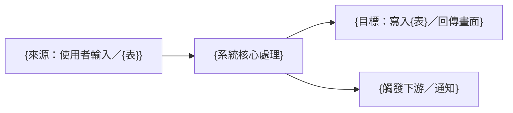

# {功能名稱} 系統分析文件

<!--
  文件定位：
  - 本文件為「系統分析文件」(SAD - System Analysis Document)
  - 前置文件：功能需求文件 (FRD) 定義了 What 和 Why
  - 本文件定義：How to Realize — 從工作流、資訊流、資料流角度分析如何實現需求
  - 後續文件：後端功能規格書 (BFS) 定義技術實作細節

  核心原則：
  1. 以系統分析師視角，橋接「業務需求」與「技術實作」
  2. 深入理解現有系統邏輯與流程，找出可重用資源
  3. 從三流（工作流、資訊流、資料流）角度完整分析——三流各一張圖是必畫件
  4. 方案取捨只列有分歧者；實作優先順序與技術選型由 RD 決定，不在本文件

  文件形狀：交付內容在前、過程紀錄在後。§0 一頁摘要置頂，
  版本紀錄（CHANGELOG）在檔尾，決策明細在同目錄 decisions.md。
-->

## 0. 一頁摘要

<!--
  ≤12 行正文。讀者 60 行內要能知道：這功能做什麼、可不可行、選了什麼方案。
  總覽圖 ≤10 節點，畫「來源 → 系統處理 → 目標」的三流總覽；詳細圖在 §2～§4，本圖不取代它們。
-->

**做什麼**：{一句話：本功能……}
**給誰用**：{角色清單}
**可行性與方案**：{一句話：可行／有條件可行；選方案 {A}，因為……；最大風險是……}



**讀者導覽**

| 你是 | 讀這幾章 | 不用讀 |
|------|---------|--------|
| PO／主管 | §0、§1.2、§6.1 | 其餘 |
| BFS 撰寫者（下一棒） | §4.1、§6.4、§6.6、§A、§D | §2.1／§2.3（已 ref FRD） |
| FFS 撰寫者 | §6.6、§6.4 | §4、§5 |
| Dev 後端 | 不讀本文件；讀 BFS | — |
| QA | 不讀本文件；讀 FRD §2 | — |

**關聯**

| 項目 | 路徑／編號 |
|------|-----------|
| 上游文件 | FRD：`{路徑}` v{版本} |
| 下游文件 | BFS：`{路徑}`／FFS：`{路徑}` |
| 決策明細 | `decisions.md`（同目錄，全鏈連號） |
| 中間產物 | `analysis/_context.yml`、`analysis/db-analysis.yml`、`analysis/reuse-scan.yml`、`analysis/consultant-notes.md`（若有） |
| Linear 票 | {票號} |
| 舊系統分析 | {FoxPro 分析報告路徑}（若有） |

---

<!-- SPEC-INDEX v1 -->
> **章節索引**（定向讀取用；章節異動時同批更新）
> - §0 一頁摘要 — 總覽圖、讀者導覽、關聯
> - §1 分析摘要 — 功能概述、技術可行性結論
> - §2 工作流分析 — 泳道工作流 §2.1、角色互動 §2.2；狀態流轉見 §2.3（若適用）
> - §3 資訊流分析 — 資料來源→處理→目標（處理節點掛 BR 編號）；系統整合介面見 §3.3（若適用）
> - §4 資料流分析 — 涉及資料表 §4.1；ER 關聯概念圖 §4.2（完整欄位以 BFS §5.1 為準）
> - §5 現有系統重用分析 — 能力層級結論表（明細在 analysis/reuse-scan.yml）
> - §6 實現策略建議 — 方案取捨 §6.1、風險 §6.3、US→API 對應 §6.4、NFR 約束與風險 §6.5、邊界清單 §6.6（>8 條附決策樹）
> - §A 既有架構盤點（Codebase Snapshot） — 路由／元件實際路徑
> - §D 決策紀錄 — 本階段拍板編號；明細在 decisions.md

> **撰寫須知**
> 1. §4.2 僅畫關聯概念圖（不列完整欄位），避免與 BFS §5.1 的 ER 圖不同步。
> 2. 撰寫指南（三流分析核心問題／分析深度指引／圖表使用時機）見 templates/examples/frd-sad-guides.md；決策樹與匯流圖寫法見 templates/examples/diagrams-and-worked-examples.md。
> 3. **正文預算 ≤30KB**（§1～§A，不含 §0／§D／CHANGELOG）。超標先過去重閘與範例外移；仍超標→拆附錄檔 `{功能名稱}_附錄_{主題}.md`，主文只留總覽表＋連結。**不得以「照現況放行」結案**。

---

## 文件資訊

| 項目 | 內容 |
|------|------|
| 文件編號 | SAD-{模組代號}-{序號} |
| 功能代碼 | {功能代碼；每個頁面的沿用／新編／不需代碼判定} |
| 版本 | 1.0 |
| 狀態 | 草稿 / 審查中 / 已核准 |
| 對應文件 | FRD-{編號} v{版本} |
| 關聯票 | {票號} |

---

## 1. 分析摘要

### 1.1 功能概述

| 項目 | 說明 |
|------|------|
| 功能名稱 | {功能名稱} |
| 所屬模組 | {模組} |
| 對應需求 | FRD-{編號} |

### 1.2 分析結論

<!--
  SA 的核心結論：這個需求可行嗎？難度在哪？關鍵決策是什麼？
-->

| 項目 | 評估 |
|------|------|
| 技術可行性 | ✅ 可行 / ⚠️ 有條件可行 / ❌ 不可行 |
| 實現複雜度 | 低 / 中 / 高 |
| 與現有系統整合度 | 高（大量重用）/ 中（部分重用）/ 低（幾乎全新） |
| 關鍵風險 | {一句話描述最大風險} |

---

## 2. 工作流分析

<!--
  工作流 = 「誰」在「什麼時候」做「什麼事」，系統如何支撐
  重點：角色互動、狀態流轉、系統自動化邊界
-->

### 2.1 業務流程與系統支撐

> 📎 業務層流程（人做什麼）見《{功能} 功能需求文件》§3.1 主流程圖，此處不重畫業務決策。
> 本節**必畫泳道圖**：以角色與系統為泳道，標出哪些步驟由系統自動處理、各步驟系統提供什麼（API/驗證/計算）。
> 這與 FRD §3.1 是不同視角，不算重複。

```mermaid
flowchart TD
    subgraph 使用者操作
        A[{步驟1}] --> B{決策點}
    end

    subgraph 系統處理
        B -->|條件A| C[系統動作1]
        B -->|條件B| D[系統動作2]
        C --> E[更新資料]
    end

    subgraph 後續流程
        E --> F[通知/觸發下游]
    end
```

### 2.2 角色與系統互動

| 步驟 | 角色 | 操作 | 系統支撐 | 前置條件 | 產出 | 對應 US |
|------|------|------|---------|---------|------|--------|
| 1 | {角色} | {操作描述} | {系統提供什麼} | {需要什麼才能開始} | {完成後產出什麼} | US-0X |
| 2 | 系統 | {自動處理} | — | {觸發條件} | {處理結果} | — |

### 2.3 狀態流轉（若適用）

> 📎 業務狀態語意（狀態清單、轉換條件）見《{功能} 功能需求文件》§3.2 狀態流程圖，此處沿用同一組狀態名稱，不重新定義、不重畫狀態圖。
> 本節僅補充**系統面增量**：各狀態的允許操作、進入狀態的系統觸發條件。

| 狀態 | 說明 | 允許操作 | 觸發條件 |
|------|------|---------|---------|
| {狀態} | {說明} | {可執行的操作} | {進入此狀態的條件} |

---

## 3. 資訊流分析

<!--
  資訊流 = 資料「從哪來」→「經過什麼處理」→「到哪去」
  重點：資料來源、轉換邏輯、輸出目標
-->

### 3.1 資訊流向圖

<!-- 必畫。每個「處理」節點掛上它落實的 BR 編號（如 P2[轉換/計算 BR-003]），追溯性靠這個 -->

```mermaid
flowchart LR
    subgraph 資料來源
        S1[{來源1: 使用者輸入}]
        S2[{來源2: 現有資料表}]
        S3[{來源3: 外部系統}]
    end

    subgraph 處理邏輯
        P1[驗證 VR-001~00X]
        P2[轉換/計算 BR-00X]
        P3[業務規則 BR-00Y]
    end

    subgraph 資料目標
        T1[{目標1: 寫入資料表}]
        T2[{目標2: 回傳前端}]
        T3[{目標3: 觸發通知}]
    end

    S1 --> P1 --> P2
    S2 --> P2
    P2 --> P3
    S3 --> P3
    P3 --> T1
    P3 --> T2
    P3 --> T3
```

### 3.2 資訊處理明細

| 編號 | 資訊項目 | 來源 | 處理邏輯 | 目標 | 備註 |
|------|---------|------|---------|------|------|
| IF-01 | {資訊項目} | {來源} | {如何處理/轉換} | {儲存或輸出到哪} | {補充} |

### 3.3 系統整合介面（若適用）

| 編號 | 來源系統 | 目標系統 | 傳輸方式 | 資料內容 | 頻率 |
|------|---------|---------|---------|---------|------|
| INT-01 | {系統A} | 本系統 | REST API / 批次 | {資料描述} | 即時/定時 |

---

## 4. 資料流分析

<!--
  資料流 = 涉及哪些 DB 表、讀寫關係、表間關聯
  重點：資料模型、表關聯、CRUD 操作對應
-->

### 4.1 涉及資料表

| 資料表 | Schema | 讀/寫 | 用途說明 | 現有/新建 |
|--------|--------|-------|---------|----------|
| {表名} | {Schema／資料庫} | R / W / RW | {在本功能中的用途} | 現有 / 新建 |

### 4.2 資料模型關聯圖

> 📎 本圖為**分析用關聯概念圖**（必畫，ER 或 CRUD 資料流擇一），只呈現表間 FK 關係即可。完整欄位定義是後端規格書（BFS）§5.1 的職責，**此處不列完整欄位**，避免兩份 ER 圖不同步。

{ER 關聯概念圖：{主表} 1:N {明細表}，僅標示 PK/FK，不列其餘欄位}

<!-- 完整 erDiagram 範例見 templates/examples/frd-sad-guides.md -->

### 4.3 CRUD 操作對應

| 操作 | 主資料表 | 關聯資料表 | 業務規則 | 備註 |
|------|---------|-----------|---------|------|
| Create | {表} | {關聯表} | {新增時的規則} | |
| Read | {表} | {JOIN 的表} | {查詢條件} | |
| Update | {表} | {連動更新的表} | {更新時的規則} | |
| Delete | {表} | {級聯影響的表} | {刪除限制} | |

### 4.4 資料影響評估

| 變更項目 | 影響範圍 | 現有資料量 | 遷移需求 | 風險等級 |
|---------|---------|-----------|---------|---------|
| {新增表/欄位/FK} | {影響哪些模組} | {筆數} | 是/否 | 低/中/高 |

---

## 5. 現有系統重用分析

> 📎 只寫**能力層級的結論**。路由、Entity／Repository 路徑、Light API 現況等明細一律在
> `analysis/reuse-scan.yml`（勘察證據，變動快於規格生命週期），本節不複製。
> 「用哪個類別、怎麼擴充」由 RD 開發時決定。

| 能力 | 結論 | 備註 |
|------|------|------|
| {查詢／寫入／計算／下拉選單等能力描述} | 既有可用 / 需擴充 / 需新建 | {一句話：既有落點在哪一支 API 或哪張表；需擴充時擴什麼} |
| {下拉選單：{選單名稱}} | 既有可用 / 需新建 | 選項順序：常用在前（依{欄位}）／代碼序／名稱序；停用項目：不出現／排最後（規則見 `references/sort-order-standards.md` §7） |

---

## 6. 實現策略建議

<!--
  給規格書撰寫的技術方向建議，降低規格書撰寫的不確定性。
  只列有分歧、要人拍板的取捨；實作優先順序與技術選型由 RD 決定，不在本文件。
-->

### 6.1 方案取捨（僅列有分歧的業務／契約取捨）

<!-- 每一列都應對應 decisions.md 的一筆（Step 8.5 確認門呈現過的方案比較）。沒有分歧的事實陳述不列。
     只列會被外面看見的取捨（是否新表、資料語意、降級或停用、Migration 先後）；
     快取／鎖／佇列／儲存位置等實作手段不在此選方案，寫 decisions.md 的 TD（約束＋現況＋陷阱），見 references/decision-record.md -->

| 取捨項目 | 選定方案 | 理由 | 否決方案 | decisions.md |
|---------|---------|------|---------|-------------|
| {取捨1: 例如是否需要新表} | {方案} | {為什麼選這個} | {方案 B——為何不選} | D-00X |

### 6.3 風險與待決事項

| 編號 | 風險/議題 | 影響程度 | 建議處理方式 | 狀態 |
|------|---------|---------|-------------|------|
| R-01 | {風險描述} | 高/中/低 | {建議} | 待確認 / 已確認 |

### 6.4 使用者故事 → API 對應

<!--
說明：將 FRD §2.1 的每個 US-XX 對應到本功能的 API 端點（US-XX 是全鏈追溯鍵；舊文件的 UC-XX 為 legacy，不回溯改寫）
用途：BFS 作者可依此表確認每支 API 的業務需求來源；PM 可確認 FRD 所有使用者故事都有技術實作

⚠️ 路由來源必須明確標示（避免憑想像）：
- ✅ 既有：從 codebase grep 出的實際路由（SAD §A.1 路由清單）
- 💡 設計建議：本次新增端點，路由命名 RD 可調整
-->

| US 編號 | 使用者故事（一句） | HTTP 方法 | API 路由 | 路由來源 | 說明 |
|--------|------------|---------|---------|---------|------|
| US-01 | {既有功能} | POST | /api/{module}/{entity}/{action} | ✅ 既有（{檔案} L{N}） | {說明} |
| US-02 | {新增功能} | GET | /api/{module}/{entity}/{NewAction} | 💡 設計建議 | {說明} |

> 若一個 US 需多支 API（例如查詢後才能操作），列多列並標注主要/輔助。
> 「既有」路由必須能在 §A.1 路由清單找到匹配。

### 6.5 NFR → 約束與風險

> 📎 非功能性需求（效能/安全/可用性）的業務目標見 FRD §6，此處不重抄。本節只寫**約束（必須滿足什麼）、已知現況、陷阱**；
> 用什麼手段達成（索引／鎖／連線池／快取／查詢寫法）由 Dev 定，需要留痕時寫 `decisions.md` TD。

| FRD §6 需求 | 目標值（約束） | 已知現況 | 陷阱 |
|------------|--------------|---------|------|
| 查詢回應時間 | < 3 秒 | {預估筆數、既有同類端點實測} | {大表無索引欄不可排序（列入 §6.3 風險）} |
| 並行 / 並發寫入 | {N} 人；衝突行為見 §6.6 並發邊界 | {既有 Entity 有無時間戳欄} | {…} |
| 資料量 | {筆數}；分頁上限 {N} | {…} | {…} |
| 權限控管 | {角色 / 欄位級 / 租戶隔離}（呼應 §6.6 權限邊界） | {既有權限機制} | {…} |
| 稽核軌跡 | {必須留痕的異動範圍} | {…} | {…} |

### 6.6 邊界與例外清單

> SA 對系統層邊界的盤點結果，供 BFS §7（驗證）/ §8（例外）/ §8.4（並發）承接。業務層例外見 FRD §2，此處只補系統層邊界。
> 維度編號依 `references/boundary-dimensions.md`（B1–B10、B13、M1–M4；B11／B12 屬規格階段，不在此列）。
> **每個維度都要有結論，標「不適用」也是結論**——留白代表沒盤點過，dev-readiness 會退回。
> **邊界或優先序規則超過 8 條、或規則之間有互斥／優先序關係時，必附一張決策樹（mermaid flowchart）**放在本表之前，
> 讓讀者不必在腦中自己建樹。畫法見 `templates/examples/diagrams-and-worked-examples.md`。

| 邊界類型 | 維度 | 情境 | 預期系統行為 | 下游落點 |
|---------|------|------|------------|---------|
| 資料 | B1/B2/B3 | {空 / 極值 / 重複 / 精度} | {回應 / 阻擋訊息} | BFS §7 VR、FFS §4 |
| 狀態 | B4 | {非法轉換} | {阻擋 + 訊息} | §2.3、BFS §2.4 |
| 並發 | B5 | {多人同時編輯} | {HTTP 409 / 鎖策略} | BFS §8.4 |
| 主從 | B6 | {明細增刪後表頭重算 / 級聯刪除 / 孤兒} | {何時算、由誰算 / 連鎖或擋下} | BFS §8.3、FFS §5.2 |
| 權限 | B7 | {越權存取} | {HTTP 403} | BFS §8 |
| 一致性 | B8 | {交易 / 外部失敗 / 部分成功} | {rollback / 補償 / 降級} | BFS §8.3 |
| 既有資料 | B9 | {歷史髒資料 / 新必填欄位回填} | {顯示 / 阻擋 / 回填策略} | §4.4、BFS §7 |
| 排序 | B10 | {排序鍵是否唯一 / 排序欄可否為空 / 字串型編號} | {決勝欄 / NULL 位置 / 字面序或數值序} | BFS §6.0、FFS §2 |
| 領域 | M1~M4 | {領域特有維度：單據狀態流轉 / 流程步驟依賴 / 金額歸集 / 階層結構} | {行為} | BFS §2.4、§7 |

> **排序策略**（有多筆查詢時必填，無則寫「不適用」）：由{後端全量／前端}排序、
> 使用者{可／不可}切換、白名單 {欄位清單}。**有分頁一律後端排序**為產品預設立場，
> 偏離才需理由。判定基準見 `references/sort-order-standards.md`。

---

## A. 既有架構盤點（Codebase Snapshot）

> 與 BFS §A 銜接，避免 SAD 推導出的路由 / 元件憑想像。**所有 §5 重用分析涉及的既有元件，必須在此列出實際路徑。**

### A.1 既有路由清單（涉及 Controller）

| Controller | 既有路由（grep 行號） | 與本功能關係 |
|---|---|---|
| `{既有 API 檔}` | `POST /api/{module}/{entity}/{action}` (L{N}) | 本功能新增 Action 將沿用此前綴 |

### A.2 既有 Entity / Repository / Handler

| 元件 | 路徑 | 與本功能關係 |
|---|---|---|
| `{Entity}` | `01.Core/Domain/Entities/.../{Entity}.cs` | 直接使用，不擴充 |
| `I{Repository}` | `01.Core/Domain/Repositories/.../I{Repository}.cs` | 需新增方法 |
| `{Handler}` | `01.Core/Application/.../{Handler}.cs` | 既有，本次修正 mapping |

### A.3 跨模組影響盤點

| 模組 | 影響 | 處理方式 |
|---|---|---|
| {Module} | 引用本功能 Entity / API | 評估向後相容性 |

> 💡 路徑與處理方式為**設計階段參考**，最終以 RD 開發時決定為準。

---

## D. 決策紀錄

> 全鏈決策唯一落點是同目錄 `decisions.md`（全鏈連號 D-001 起，格式見 `references/decision-record.md`）。
> 本節只列**本階段（SAD）拍板**的編號與一句結論；否決選項／依據／拍板者在 decisions.md，不在此重抄。
> 引用上游決策寫 `見 decisions.md D-0xx`。本階段無任何拍板時保留表頭寫一列「無」。

| # | 決策 | 選定 |
|---|------|------|
| D-00X | {一句話的決策題目} | {結論一句} |

---

## 撰寫指南

<!-- 撰寫指南 A~C（三流分析核心問題／分析深度指引／圖表使用時機）見 templates/examples/frd-sad-guides.md -->

---

<!-- CHANGELOG -->
| 版本 | Ticket | 日期 | 修改摘要 |
|------|--------|------|---------|
| v1.0 | 初版 | {建立日期} | 建立文件 |
<!-- /CHANGELOG -->
